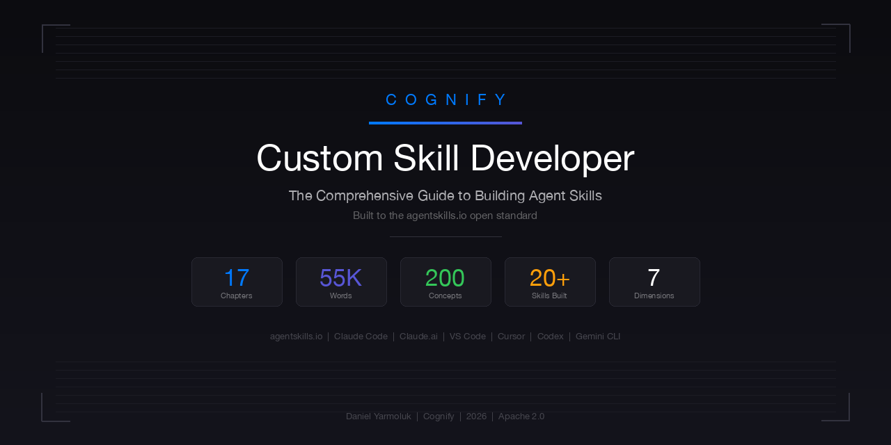

  

  
  
  
  

# Custom Skill Developer Guide

**The comprehensive guide to building Agent Skills for the [agentskills.io](https://agentskills.io) open standard.**

17 chapters. 55,000+ words. From your first skill to meta-skill routers, quality scoring systems, and multi-skill pipeline orchestration.

> Skills work across Claude Code, Claude.ai, VS Code, Cursor, OpenAI Codex, Gemini CLI, and 20+ AI agent platforms.

---

## Read the Guide

**[yarmoluk.github.io/custom-skill-developer](https://yarmoluk.github.io/custom-skill-developer/)**

---

## What You'll Learn

| Section | Chapters | What You'll Build |
|---------|----------|-------------------|
| **Foundations** | 1-3 | Your first working skill — from zero to production |
| **Skill Anatomy** | 4-7 | SKILL.md structure, YAML frontmatter, workflows, quality scoring rubrics |
| **Advanced Patterns** | 8-11 | Meta-skill routers, token efficiency, session logging, pipeline orchestration |
| **Specialized Skills** | 12-14 | Data transformation, code generation, and analysis/validation skills |
| **Deployment** | 15-17 | Installation, testing, debugging, publishing, and distribution |

## Why This Guide Exists

Anthropic launched Agent Skills as an open standard. The format is simple — a folder with a `SKILL.md` file. But building *production-quality* skills that handle edge cases, score output quality, manage tokens efficiently, and chain together in pipelines requires patterns that aren't documented anywhere else.

This guide documents those patterns. Built from the experience of creating 20+ production Agent Skills for business operations.

## Key Topics

- **SKILL.md anatomy** — Every section, why it exists, what breaks without it
- **Quality scoring systems** — 100-point rubrics with weighted categories and threshold gates
- **Meta-skill routers** — Consolidating 14+ sub-skills under one entry point with keyword-based routing
- **Token efficiency** — Progressive disclosure, lazy loading, skip-if-complete detection
- **Pipeline orchestration** — Chaining skills in dependency order with checkpoint patterns
- **The 30-skill limit** — Strategies for working within Claude Code's constraint

## The Cognify Ecosystem

This guide is part of a three-layer stack for the Agent Skills ecosystem:

| Layer | Project | Purpose |
|-------|---------|---------|
| **Education** | [Custom Skill Developer](https://yarmoluk.github.io/custom-skill-developer/) | Teaches how to build production skills |
| **Tooling** | [Skill Quality Analyzer](https://github.com/Yarmoluk/skill-quality-analyzer) | Audits skills against the spec (100-point rubric) |
| **Product** | [Cognify Skills](https://github.com/Yarmoluk/cognify-skills) | 19 production business operations skills |

## Related

| Resource | Description |
|----------|-------------|
| [agentskills.io](https://agentskills.io) | The open standard specification |
| [anthropics/skills](https://github.com/anthropics/skills) | Anthropic's official example skills |
| [Cognify Skills](https://github.com/Yarmoluk/cognify-skills) | 19 production business skills built to the standard |
| [Skill Quality Analyzer](https://github.com/Yarmoluk/skill-quality-analyzer) | Audit skills with a 100-point scoring rubric |

## License

Apache 2.0
