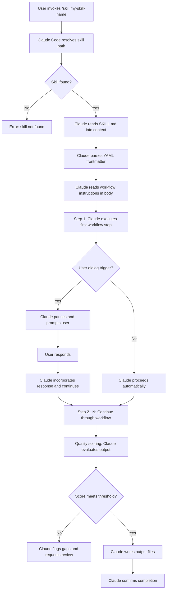

# Chapter 1: What Are Claude Code Skills?

Before you can build effective skills, you need a precise mental model of what they are and how they work. The word "skill" gets used loosely in AI conversations to mean anything from a prompt template to a fine-tuned model. In Claude Code, a skill has a specific, technical meaning — and that specificity is what makes skills powerful.

This guide teaches skill development primarily for Claude Code, producing skills that are also compatible with the open [agentskills.io](https://agentskills.io) specification. This chapter defines skills from first principles, explains how they execute, and establishes the conceptual vocabulary you will use throughout this guide.

---

## 1.1 The Precise Definition

A **Claude Code skill** is a markdown file named `SKILL.md` that defines an autonomous workflow for Claude to execute. When you invoke a skill, Claude reads the file, interprets the workflow instructions, and executes them step by step — making decisions, reading files, writing files, running commands, and prompting you for input at defined checkpoints.

Three properties distinguish a skill from any other text you might send to Claude:

**1. Persistence.** A skill lives in the filesystem at a known path. You write it once and invoke it repeatedly. The instructions do not disappear when the conversation ends. You can version it, share it, and iterate on it over time.

**2. Structure.** A skill defines a numbered workflow with explicit steps, prerequisites, decision points, and output specifications. Claude does not improvise the approach on each invocation — it follows the workflow you defined.

**3. Quality gates.** A well-designed skill includes scoring rubrics, validation checklists, and output format specifications. Before completing, Claude evaluates its own output against those criteria. This means every execution meets the same baseline standard, whether Claude runs it today or six months from now.

A skill is not:

- A saved chat prompt (those are stateless and unstructured)
- A fine-tuned model (those alter weights; skills alter behavior through instruction)
- A plugin or API integration (those require code; skills are pure markdown)
- A system prompt (those are global; skills are targeted, invocable, and composable)

---

## 1.2 The Standard Operating Procedure Analogy

The clearest real-world analogy for a Claude Code skill is a **Standard Operating Procedure (SOP)**. A hospital SOP does not say "do surgery well" — it specifies exactly what to do, in what order, with explicit checkpoints. Claude Code skills work the same way: the skill definition is the SOP, Claude is the executor, and the numbered steps ensure each invocation follows the same sequence. The key difference is that Claude brings reasoning capability to each step — the skill constrains the workflow; Claude applies judgment within it.

---

## 1.3 The Skill Execution Model

Understanding what happens when you invoke a skill is essential for designing skills that work correctly.

When you type `/skill my-skill-name` in Claude Code, the following sequence occurs:



Several points in this diagram are worth examining closely.

**Path resolution.** Claude Code looks for skills in two locations: `~/.claude/skills/` (global, available in all projects) and `.claude/skills/` (project-local, available only in the current project). For cross-platform compatibility with the agentskills.io open standard, skills can also live at `.github/skills/my-skill/SKILL.md` in a repository, making them accessible to any compatible agent runtime. Project-local skills take precedence over global skills with the same name. The skill directory must be named to match the skill's `name` field in the YAML frontmatter.

**YAML frontmatter parsing.** The frontmatter at the top of `SKILL.md` tells Claude Code that this file is a skill definition. Without valid frontmatter, the file will not be recognized as a skill. Claude Code uses the `description` field from the frontmatter when generating the list of available skills for its own reference.

**Sequential execution.** Claude executes workflow steps in the order they are numbered. This is not automatic parallelism — it is intentional sequential processing. Some skills explicitly instruct Claude to run tasks in parallel when the steps are independent. But the default is sequential, which makes behavior predictable and debuggable.

**User dialog triggers.** Skills pause execution and prompt the user at defined points. A well-designed skill uses dialog triggers strategically: before taking irreversible actions (like overwriting files), when requiring information only the user can provide, and after presenting a plan that requires approval. Dialog triggers are how skills remain collaborative rather than fully autonomous.

**Quality scoring.** At the end of execution, the skill instructs Claude to evaluate its own output against a rubric. This self-assessment catches obvious gaps and ensures the output matches the skill's stated purpose. Skills that score below a threshold produce a gap report rather than silently delivering substandard output.

---

## 1.4 The SKILL.md File Format

Every skill is defined by a single file named `SKILL.md`. The file has two sections: a YAML frontmatter block and a markdown body.

### YAML Frontmatter

The frontmatter occupies the top of the file, delimited by `---` markers. It contains metadata that Claude Code uses to register and describe the skill.

```yaml
---
name: my-skill-name
description: >
  One to three sentences describing what this skill does and when to use it.
  This description appears in Claude's system prompt as part of the skill registry.
  Write it from Claude's perspective: "Use this skill when..."
license: MIT
allowed-tools: Bash(git:*) Read Write
compatibility:
  claude-code: ">=1.0"
metadata:
  version: "1.0.0"
  author: your-github-username
---
```

The `name` field must match the directory name exactly. The `description` field is the most important — it is what appears in the skill registry that Claude sees at the start of every session. A poorly written description causes Claude to invoke the wrong skill or miss opportunities to use the right one.

The `allowed-tools` field is optional and uses space-delimited format per the agentskills.io spec (e.g., `Bash(git:*) Read Write`). Omitting it grants the skill access to all available tools. Specifying it provides an explicit contract about what the skill will and will not do.

The `compatibility` and `metadata` fields are also optional. `compatibility` specifies minimum runtime versions; `metadata` carries arbitrary key-value pairs like version numbers and author attribution. Both follow the agentskills.io open standard and are ignored by runtimes that do not recognize them.

### The Markdown Body

The body follows the frontmatter and contains the actual skill definition. A production-quality skill body includes these sections in this order:

```markdown
# Skill Name

## Overview
One paragraph describing the skill's purpose and the output it produces.

## When to Use This Skill
Explicit conditions that trigger this skill. Include:
- Positive conditions (when TO use it)
- Negative conditions (when NOT to use it)
- Prerequisites that must exist before invocation

## Workflow

### Step 1: [Action Name]
Detailed instructions for what Claude should do in this step.

### Step 2: [Action Name]
...

## Output Files
What files the skill creates, their paths, and their formats.

## Quality Scoring
A rubric Claude uses to evaluate its own output before completing.

## Example Session
A sample invocation showing user input and expected behavior.

## Common Pitfalls
What goes wrong and how to prevent it.
```

The agentskills.io spec places no format restrictions on the body — any markdown structure is valid. This 10-section layout is a best practice convention, not a hard requirement enforced by Claude Code or the spec. Following it consistently makes skills easier to read, debug, and extend, especially when you are working with skills written by others.

---

## 1.5 Ad-Hoc Prompting vs. Skill-Based Execution

| Dimension | Ad-Hoc Prompting | Skill-Based Execution |
|---|---|---|
| **Persistence** | Instructions exist only in the current conversation | Instructions live in the filesystem, permanent until changed |
| **Consistency** | Output varies with each conversation and phrasing | Output follows the same workflow every time |
| **Quality control** | Depends on the human to catch gaps | Built-in scoring rubrics catch gaps before delivery |
| **Reusability** | Prompt must be rewritten or copy-pasted each time | Invoked with a single command |
| **Shareability** | Must share the full prompt text | Share the skill directory; others install and invoke it |
| **Iteration** | Improve by rephrasing the prompt each session | Improve by editing SKILL.md; improvements persist |
| **Scope** | One conversation, one output | Multi-step workflow producing multiple output files |
| **Delegation** | Human must supervise each step | Human approves at defined checkpoints, Claude handles the rest |
| **Documentation** | The prompt is the only record | SKILL.md is a complete specification and documentation artifact |
| **Composability** | Prompts do not chain automatically | Skills can invoke other skills (meta-skills) |

If you find yourself copying and pasting the same long prompt into Claude more than twice, you should probably write a skill. If the output needs to meet a consistent standard every time, you definitely should.

---

## 1.6 The Three Categories of Skills

The claude-skills repository organizes skills into three broad categories. Understanding these categories helps you identify which type of skill to build for a given need.

### Book Generation Skills

These skills automate the creation of intelligent textbooks — structured educational content built on MkDocs Material with concept dependency graphs, interactive simulations (MicroSims), Bloom's Taxonomy-aligned quizzes, and ISO 11179-compliant glossaries.

Book generation skills typically operate in a defined sequence, with each skill consuming the output of the previous one:

1. `course-description-analyzer` validates and structures the course description
2. `learning-graph-generator` produces a 200-concept dependency graph
3. `book-chapter-generator` designs chapter structure from the graph
4. `chapter-content-generator` writes detailed content for each chapter
5. `glossary-generator`, `faq-generator`, `quiz-generator`, `reference-generator` produce supporting content
6. `book-metrics-generator` analyzes quality across the full book
7. `readme-generator` and `linkedin-announcement-generator` handle publishing assets

Each skill in this chain has defined prerequisites (what must exist before it runs) and defined outputs (what it produces for the next skill to consume). This tight coupling between skills is what makes the full pipeline reliable at scale.

### Analysis Skills

Analysis skills examine existing content and produce structured reports. They are typically read-heavy (consuming many files) and produce markdown reports rather than creating new content from scratch.

The `book-metrics-generator` is a good example: it reads all chapter files, counts concepts covered, identifies missing content, evaluates MicroSim coverage, and produces a quality metrics report with a composite score.

Analysis skills often include scoring rubrics that produce numerical quality assessments. These scores make it possible to set objective thresholds — "do not deploy a book with a metrics score below 70" — and automate quality gates.

### Specialized Skills

Specialized skills do not fit neatly into the book generation pipeline or the analysis category. They serve specific, high-value use cases:

- `concept-classifier` creates interactive p5.js classification quiz MicroSims
- `microsim-generator` is a meta-skill that routes to 14 different visualization generators (p5.js, Chart.js, Mermaid, vis-network, Leaflet, Plotly, and others)
- `moving-rainbow` generates MicroPython code for Raspberry Pi Pico LED matrix hardware
- `story-generator` produces narrative educational content following specific structural templates

Specialized skills often push the boundaries of what skills can do: executing bash commands, generating working code in multiple languages, creating multi-file packages, and interfacing with external services.

---

## 1.7 Why Skills Matter

Skills are worth building when consistency, quality, and delegation matter:

- **Consistency** — the same skill invoked on Monday and Friday follows the same workflow and produces outputs with the same structure, regardless of how you phrase the request
- **Quality** — quality criteria are embedded in the skill and enforced at completion, not left to memory or human review
- **Reproducibility** — complex multi-step workflows that once required manual orchestration run reliably from a single command
- **Delegation** — you define the checkpoints; Claude handles the steps between them

---

## 1.8 A Brief History: Dan McCreary's Intelligent Textbook Methodology

The skill system in its current form grew out of work by Dan McCreary on what he calls **intelligent textbooks** — educational resources built to be more adaptive, interactive, and learnable than traditional text.

McCreary's methodology requires building several interdependent artifacts for each textbook: a concept dependency graph (the learning graph), Bloom's Taxonomy-aligned content, interactive simulations (MicroSims), quality-gated quizzes, and ISO 11179-compliant glossaries. Each artifact has specific structural requirements and quality standards.

The challenge was that producing these artifacts consistently at scale required precise, repeatable workflows. Writing out those workflows in prose and following them manually was error-prone and slow. The natural solution was to encode the workflows as Claude Code skills — one skill per artifact type — and chain the skills together into a pipeline.

The result was the `claude-skills` repository: a collection of skills that can take a course description as input and produce a complete, deployable intelligent textbook as output. Each skill in the collection is a crystallized version of McCreary's methodology for one specific artifact, validated against real textbook projects and refined through iteration.

This guide teaches you to apply the same methodology to your own domains. The intelligent textbook use case provides many of the examples because it is the most fully developed skill ecosystem available. But the principles generalize: any complex, multi-step workflow that requires consistent quality and produces structured output is a candidate for a skill.

---

## 1.9 What Comes Next

You now have the conceptual foundation for the rest of this guide:

- Skills are persistent, structured, quality-gated workflow definitions
- They live in `SKILL.md` files in `~/.claude/skills/` or `.claude/skills/`
- They execute through a defined sequence: read skill, parse frontmatter, execute steps, apply quality scoring, produce output
- They differ from ad-hoc prompting in persistence, consistency, quality, reusability, shareability, and composability
- They fall into three categories: book generation, analysis, and specialized

Chapter 2 maps the full skill ecosystem — how skills are discovered, the taxonomy of skill types from individual skills to meta-skill routers, and Claude Code's 30-skill-per-session implementation limit (a Claude Code constraint, not a spec requirement).

!!! tip "Before moving on"
    Think about a workflow you currently execute through ad-hoc Claude conversations. Does it have defined steps? Does the output need to meet a consistent standard? Does it produce files you use downstream? If yes to two or more of these, it is a strong candidate for a skill. Keep it in mind as you read the next two chapters.

!!! example "Key terms from this chapter"
    - **Skill**: A markdown-defined autonomous workflow for Claude Code, stored as `SKILL.md`
    - **YAML frontmatter**: Metadata block at the top of `SKILL.md` containing `name`, `description`, `license`, `allowed-tools`, and optional `compatibility` and `metadata` fields
    - **allowed-tools**: Space-delimited list of permitted tools per the agentskills.io spec (e.g., `Bash(git:*) Read Write`)
    - **Workflow steps**: Numbered sequential instructions in the skill body that Claude executes in order
    - **User dialog trigger**: A defined pause point where the skill prompts the user for input or approval
    - **Quality scoring**: A rubric embedded in the skill that Claude uses to evaluate its own output before completing
    - **Meta-skill**: A skill that routes to other skills based on context, consolidating multiple specialized skills into one entry point
    - **agentskills.io**: Open standard for portable, cross-platform skill definitions; the format this guide produces
