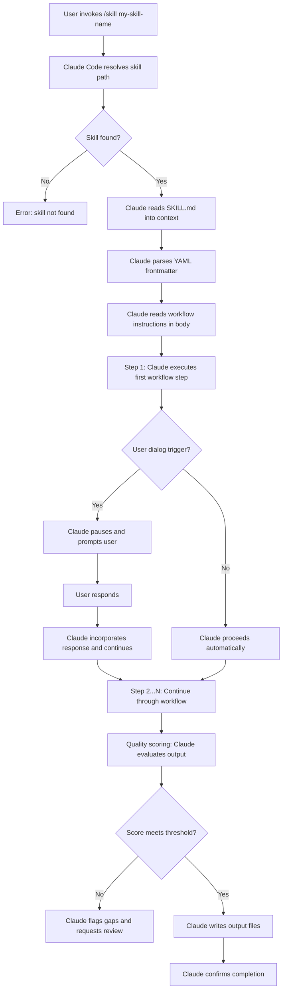

# Chapter 1: What Are Claude Code Skills?

Before you can build effective skills, you need a precise mental model of what they are and how they work. The word "skill" gets used loosely in AI conversations to mean anything from a prompt template to a fine-tuned model. In Claude Code, a skill has a specific, technical meaning — and that specificity is what makes skills powerful.

This chapter defines skills from first principles, explains how they execute, and establishes the conceptual vocabulary you will use throughout this guide.

---

## 1.1 The Precise Definition

A **Claude Code skill** is a markdown file named `SKILL.md` that defines an autonomous workflow for Claude to execute. When you invoke a skill, Claude reads the file, interprets the workflow instructions, and executes them step by step — making decisions, reading files, writing files, running commands, and prompting you for input at defined checkpoints.

Three properties distinguish a skill from any other text you might send to Claude:

**1. Persistence.** A skill lives in the filesystem at a known path. You write it once and invoke it repeatedly. The instructions do not disappear when the conversation ends. You can version it, share it, and iterate on it over time.

**2. Structure.** A skill defines a numbered workflow with explicit steps, prerequisites, decision points, and output specifications. Claude does not improvise the approach on each invocation — it follows the workflow you defined.

**3. Quality gates.** A well-designed skill includes scoring rubrics, validation checklists, and output format specifications. Before completing, Claude evaluates its own output against those criteria. This means every execution meets the same baseline standard, whether Claude runs it today or six months from now.

A skill is not:

- A saved chat prompt (those are stateless and unstructured)
- A fine-tuned model (those alter weights; skills alter behavior through instruction)
- A plugin or API integration (those require code; skills are pure markdown)
- A system prompt (those are global; skills are targeted, invocable, and composable)

---

## 1.2 The Standard Operating Procedure Analogy

The clearest real-world analogy for a Claude Code skill is a **Standard Operating Procedure (SOP)** — the kind used in hospitals, manufacturing plants, and professional service firms.

A hospital SOP for preparing a patient for surgery does not say "do surgery well." It says:

1. Verify patient identity against two identifiers.
2. Confirm the surgical site is marked.
3. Administer the pre-op checklist in order.
4. Document completion of each step before proceeding.

The SOP achieves consistency because it specifies exactly what to do, in what order, with explicit checkpoints. Any qualified staff member following the SOP produces a predictable result. The quality of the outcome does not depend on which person executes it on a given day.

Claude Code skills work the same way. The skill definition is the SOP. Claude is the staff member executing it. The numbered workflow steps ensure that each invocation follows the same sequence. Quality scoring rubrics ensure that each output meets the same baseline standard.

This analogy has one important extension: Claude can interpret context and adapt within steps in ways that a human following a written SOP cannot. Claude brings reasoning capability to each step. The skill constrains the workflow; Claude applies judgment within it.

---

## 1.3 The Skill Execution Model

Understanding what happens when you invoke a skill is essential for designing skills that work correctly.

When you type `/skill my-skill-name` in Claude Code, the following sequence occurs:



Several points in this diagram are worth examining closely.

**Path resolution.** Claude Code looks for skills in two locations: `~/.claude/skills/` (global, available in all projects) and `.claude/skills/` (project-local, available only in the current project). Project-local skills take precedence over global skills with the same name. The skill directory must be named to match the skill's `name` field in the YAML frontmatter.

**YAML frontmatter parsing.** The frontmatter at the top of `SKILL.md` tells Claude Code that this file is a skill definition. Without valid frontmatter, the file will not be recognized as a skill. Claude Code uses the `description` field from the frontmatter when generating the list of available skills for its own reference.

**Sequential execution.** Claude executes workflow steps in the order they are numbered. This is not automatic parallelism — it is intentional sequential processing. Some skills explicitly instruct Claude to run tasks in parallel when the steps are independent. But the default is sequential, which makes behavior predictable and debuggable.

**User dialog triggers.** Skills pause execution and prompt the user at defined points. A well-designed skill uses dialog triggers strategically: before taking irreversible actions (like overwriting files), when requiring information only the user can provide, and after presenting a plan that requires approval. Dialog triggers are how skills remain collaborative rather than fully autonomous.

**Quality scoring.** At the end of execution, the skill instructs Claude to evaluate its own output against a rubric. This self-assessment catches obvious gaps and ensures the output matches the skill's stated purpose. Skills that score below a threshold produce a gap report rather than silently delivering substandard output.

---

## 1.4 The SKILL.md File Format

Every skill is defined by a single file named `SKILL.md`. The file has two sections: a YAML frontmatter block and a markdown body.

### YAML Frontmatter

The frontmatter occupies the top of the file, delimited by `---` markers. It contains metadata that Claude Code uses to register and describe the skill.

```yaml
---
name: my-skill-name
description: >
  One to three sentences describing what this skill does and when to use it.
  This description appears in Claude's system prompt as part of the skill registry.
  Write it from Claude's perspective: "Use this skill when..."
license: MIT
allowed-tools:
  - read_file
  - write_file
  - execute_bash
---
```

The `name` field must match the directory name exactly. The `description` field is the most important — it is what appears in the skill registry that Claude sees at the start of every session. A poorly written description causes Claude to invoke the wrong skill or miss opportunities to use the right one.

The `allowed-tools` field is optional and constrains which Claude Code tools the skill can use. Omitting it grants the skill access to all available tools. Specifying it provides an explicit contract about what the skill will and will not do.

### The Markdown Body

The body follows the frontmatter and contains the actual skill definition. A production-quality skill body includes these sections in this order:

```markdown
# Skill Name

## Overview
One paragraph describing the skill's purpose and the output it produces.

## When to Use This Skill
Explicit conditions that trigger this skill. Include:
- Positive conditions (when TO use it)
- Negative conditions (when NOT to use it)
- Prerequisites that must exist before invocation

## Workflow

### Step 1: [Action Name]
Detailed instructions for what Claude should do in this step.

### Step 2: [Action Name]
...

## Output Files
What files the skill creates, their paths, and their formats.

## Quality Scoring
A rubric Claude uses to evaluate its own output before completing.

## Example Session
A sample invocation showing user input and expected behavior.

## Common Pitfalls
What goes wrong and how to prevent it.
```

This structure is a convention, not a hard requirement enforced by Claude Code. But following it consistently makes skills easier to read, debug, and extend — especially when you are working with skills written by others.

---

## 1.5 Ad-Hoc Prompting vs. Skill-Based Execution

The difference between asking Claude something directly and invoking a skill is not merely syntactic. It represents a fundamentally different relationship between the human and the AI.

| Dimension | Ad-Hoc Prompting | Skill-Based Execution |
|---|---|---|
| **Persistence** | Instructions exist only in the current conversation | Instructions live in the filesystem, permanent until changed |
| **Consistency** | Output varies with each conversation and phrasing | Output follows the same workflow every time |
| **Quality control** | Depends on the human to catch gaps | Built-in scoring rubrics catch gaps before delivery |
| **Reusability** | Prompt must be rewritten or copy-pasted each time | Invoked with a single command |
| **Shareability** | Must share the full prompt text | Share the skill directory; others install and invoke it |
| **Iteration** | Improve by rephrasing the prompt each session | Improve by editing SKILL.md; improvements persist |
| **Scope** | One conversation, one output | Multi-step workflow producing multiple output files |
| **Delegation** | Human must supervise each step | Human approves at defined checkpoints, Claude handles the rest |
| **Documentation** | The prompt is the only record | SKILL.md is a complete specification and documentation artifact |
| **Composability** | Prompts do not chain automatically | Skills can invoke other skills (meta-skills) |

The practical implication is this: if you find yourself copying and pasting the same long prompt into Claude more than twice, you should probably write a skill. If the output of that task needs to meet a consistent standard every time, you definitely should.

---

## 1.6 The Three Categories of Skills

The claude-skills repository organizes skills into three broad categories. Understanding these categories helps you identify which type of skill to build for a given need.

### Book Generation Skills

These skills automate the creation of intelligent textbooks — structured educational content built on MkDocs Material with concept dependency graphs, interactive simulations (MicroSims), Bloom's Taxonomy-aligned quizzes, and ISO 11179-compliant glossaries.

Book generation skills typically operate in a defined sequence, with each skill consuming the output of the previous one:

1. `course-description-analyzer` validates and structures the course description
2. `learning-graph-generator` produces a 200-concept dependency graph
3. `book-chapter-generator` designs chapter structure from the graph
4. `chapter-content-generator` writes detailed content for each chapter
5. `glossary-generator`, `faq-generator`, `quiz-generator`, `reference-generator` produce supporting content
6. `book-metrics-generator` analyzes quality across the full book
7. `readme-generator` and `linkedin-announcement-generator` handle publishing assets

Each skill in this chain has defined prerequisites (what must exist before it runs) and defined outputs (what it produces for the next skill to consume). This tight coupling between skills is what makes the full pipeline reliable at scale.

### Analysis Skills

Analysis skills examine existing content and produce structured reports. They are typically read-heavy (consuming many files) and produce markdown reports rather than creating new content from scratch.

The `book-metrics-generator` is a good example: it reads all chapter files, counts concepts covered, identifies missing content, evaluates MicroSim coverage, and produces a quality metrics report with a composite score.

Analysis skills often include scoring rubrics that produce numerical quality assessments. These scores make it possible to set objective thresholds — "do not deploy a book with a metrics score below 70" — and automate quality gates.

### Specialized Skills

Specialized skills do not fit neatly into the book generation pipeline or the analysis category. They serve specific, high-value use cases:

- `concept-classifier` creates interactive p5.js classification quiz MicroSims
- `microsim-generator` is a meta-skill that routes to 14 different visualization generators (p5.js, Chart.js, Mermaid, vis-network, Leaflet, Plotly, and others)
- `moving-rainbow` generates MicroPython code for Raspberry Pi Pico LED matrix hardware
- `story-generator` produces narrative educational content following specific structural templates

Specialized skills often push the boundaries of what skills can do: executing bash commands, generating working code in multiple languages, creating multi-file packages, and interfacing with external services.

---

## 1.7 Why Skills Matter: The Four Arguments

If you are considering investing time in building custom skills, these are the four strongest arguments for doing so.

### Consistency

When Claude generates content in an ad-hoc conversation, the output varies based on how you phrased the request, what was in the conversation history, and the stochastic nature of language model outputs. Skills reduce this variance by providing Claude with a precise, stable specification. The same skill invoked on Monday and Friday produces outputs that follow the same structure, meet the same standards, and complete the same steps — even if the actual content differs.

### Quality

Skills embed quality standards into the workflow itself. A skill that produces a glossary can instruct Claude to apply ISO 11179 standards to every definition: precise, concise, distinct, non-circular, free of business rules. An ad-hoc prompt can include similar instructions, but they are easy to forget, easy to omit, and not enforced at completion. Skills make quality criteria persistent and enforceable.

### Reproducibility

Skills make complex multi-step workflows reproducible. A workflow that once required careful manual orchestration — tell Claude to do step one, wait for output, review it, then tell Claude to do step two — can be encoded in a skill and re-executed consistently. This is particularly valuable for workflows you run repeatedly: generating chapters for new textbooks, analyzing new codebases, or producing reports on new datasets.

### Delegation

Skills change the nature of the collaboration between human and AI. Instead of supervising every step, you define the workflow once, specify the checkpoints where human input is required, and then let Claude execute. You review at the checkpoints and at the final output. This is a fundamentally more efficient use of your time than prompt-by-prompt supervision.

---

## 1.8 A Brief History: Dan McCreary's Intelligent Textbook Methodology

The skill system in its current form grew out of work by Dan McCreary on what he calls **intelligent textbooks** — educational resources built to be more adaptive, interactive, and learnable than traditional text.

McCreary's methodology requires building several interdependent artifacts for each textbook: a concept dependency graph (the learning graph), Bloom's Taxonomy-aligned content, interactive simulations (MicroSims), quality-gated quizzes, and ISO 11179-compliant glossaries. Each artifact has specific structural requirements and quality standards.

The challenge was that producing these artifacts consistently at scale required precise, repeatable workflows. Writing out those workflows in prose and following them manually was error-prone and slow. The natural solution was to encode the workflows as Claude Code skills — one skill per artifact type — and chain the skills together into a pipeline.

The result was the `claude-skills` repository: a collection of skills that can take a course description as input and produce a complete, deployable intelligent textbook as output. Each skill in the collection is a crystallized version of McCreary's methodology for one specific artifact, validated against real textbook projects and refined through iteration.

This guide teaches you to apply the same methodology to your own domains. The intelligent textbook use case provides many of the examples because it is the most fully developed skill ecosystem available. But the principles generalize: any complex, multi-step workflow that requires consistent quality and produces structured output is a candidate for a skill.

---

## 1.9 Skills as a Design Artifact

One aspect of skills that is easy to underestimate is their value as documentation. When you write a skill, you are not just encoding a workflow for Claude to execute — you are producing a specification of how a task should be done. That specification is readable by humans, versionable with git, and improvable over time.

This matters for teams. When multiple people collaborate on the same workflows — writing chapters, analyzing data, generating reports — the skill definition becomes the shared agreement about what the workflow is and what the output should look like. Instead of each team member developing their own ad-hoc approach to the same task, the skill is the single source of truth.

It also matters for personal productivity. The common pattern among experienced skill builders is that the act of writing a skill clarifies their thinking about the task itself. You cannot write a precise numbered workflow for a task you do not fully understand. The discipline of specifying every step, every conditional branch, every output format forces you to think through the task more rigorously than you would in the course of just doing it.

This is not unique to AI systems. The same phenomenon occurs when engineers write design documents, when surgeons follow surgical protocols, and when pilots run preflight checklists. The process of creating the procedure produces insights about the procedure that would not otherwise surface.

Consider this when deciding whether to write a skill. The investment is not just the time spent writing the markdown file. It also produces a cleaner, more explicit understanding of the workflow — which benefits you whether or not you end up invoking the skill frequently.

### Version Control and Collaborative Skills

Because skills are plain text files, they benefit from all the same version control practices you apply to code. A mature skill ecosystem keeps skills in a git repository, tracks changes with meaningful commit messages, and tags stable releases.

The commit history of a skill definition is a record of how your understanding of a workflow evolved. Early versions tend to be too vague (steps that are really just headers for vague actions). Later versions become more precise as failure modes are discovered and fixed. Reading the commit history of a well-maintained skill is instructive: you can see which pitfalls were added after real failures, which quality criteria were tightened after substandard output was discovered, and which conditional branches were added to handle edge cases.

For teams, pull requests against skill definitions serve the same purpose as pull requests against code: they create a forum for discussing whether the proposed workflow change is correct, complete, and consistent with the skill's purpose. This is a higher-quality process than the alternative — each person silently adjusting their prompts based on private experience without sharing the improvements.

### When Not to Build a Skill

Not every workflow benefits from being encoded as a skill. There are cases where ad-hoc prompting is the right approach.

**One-time tasks.** If you need to do something once and never again, the investment in writing and testing a skill is not justified. Ad-hoc prompting is appropriate for unique, non-recurring tasks.

**Exploratory work.** When you are still figuring out what the workflow should be — experimenting with different approaches, trying different output formats, discovering what the task actually requires — building a skill prematurely locks in design choices that may need to change. Do the exploratory work ad-hoc first. Write the skill once the workflow is understood.

**Simple single-step tasks.** A skill's value comes from encoding multi-step workflows with quality gates and decision points. A task that has one step and produces one output with no quality concerns does not benefit from being a skill. "Summarize this document" is not a skill; it is a prompt.

**Tasks with radically variable structure.** Some tasks are so context-dependent that no general workflow can be specified. If the right approach varies completely based on factors that cannot be anticipated in the skill definition, a skill will be too rigid to be useful. This is rare — most variation can be handled with conditional logic — but it does occur.

The skill vs. ad-hoc decision comes down to this: if you are doing the same thing more than twice, if the quality of the output matters, and if the workflow has defined steps, a skill will pay back its construction cost quickly.

## 1.10 What Comes Next

You now have the conceptual foundation for the rest of this guide:

- Skills are persistent, structured, quality-gated workflow definitions
- They live in `SKILL.md` files in `~/.claude/skills/` or `.claude/skills/`
- They execute through a defined sequence: read skill, parse frontmatter, execute steps, apply quality scoring, produce output
- They differ from ad-hoc prompting in persistence, consistency, quality, reusability, shareability, and composability
- They fall into three categories: book generation, analysis, and specialized

Chapter 2 maps the full skill ecosystem — the 30-skill limit, how skills are discovered, and the taxonomy of skill types from individual skills to meta-skill routers.

!!! tip "Before moving on"
    Think about a workflow you currently execute through ad-hoc Claude conversations. Does it have defined steps? Does the output need to meet a consistent standard? Does it produce files you use downstream? If yes to two or more of these, it is a strong candidate for a skill. Keep it in mind as you read the next two chapters.

!!! example "Key terms from this chapter"
    - **Skill**: A markdown-defined autonomous workflow for Claude Code, stored as `SKILL.md`
    - **YAML frontmatter**: Metadata block at the top of `SKILL.md` containing `name`, `description`, `license`, and `allowed-tools`
    - **Workflow steps**: Numbered sequential instructions in the skill body that Claude executes in order
    - **User dialog trigger**: A defined pause point where the skill prompts the user for input or approval
    - **Quality scoring**: A rubric embedded in the skill that Claude uses to evaluate its own output before completing
    - **Meta-skill**: A skill that routes to other skills based on context, consolidating multiple specialized skills into one entry point
