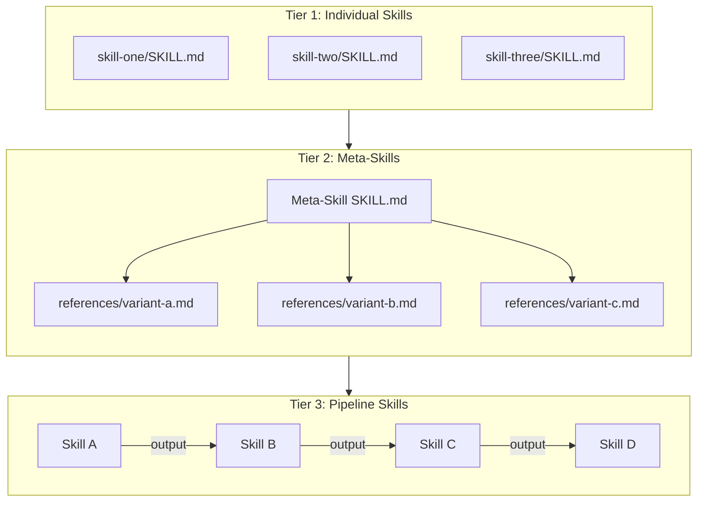

# Chapter 2: The Skill Ecosystem

A single skill is useful. A well-organized ecosystem of skills is transformative. This chapter maps the full landscape of Claude Code's skill system — how skills are stored, discovered, registered in Claude's context, and organized into categories. It also explains the constraints that shape skill design, most importantly the 30-skill limit that drove the creation of the meta-skill pattern.

Understanding the ecosystem before you build your own skills prevents common architectural mistakes. The choices you make about how many skills to create, how to name them, and whether to consolidate them into meta-skills have lasting consequences for how effectively Claude uses them.

---

## 2.1 The 30-Skill Limit

Claude Code enforces a hard limit of 30 active skills at any time. This is not an arbitrary policy — it reflects a real constraint in how skills integrate with Claude's context.

When Claude Code starts a session, it scans the skill directories and injects a compact registry into Claude's system prompt. This registry includes the `name` and `description` fields from each skill's YAML frontmatter. Claude uses this registry to know what skills are available and when to invoke them.

The system prompt has a finite token budget. Every skill description consumes tokens that would otherwise be available for conversation history, file contents, and instructions. At 30 skills with moderately detailed descriptions, the registry begins to consume a meaningful fraction of the available system prompt budget. Beyond 30 skills, the overhead becomes significant enough that Claude Code enforces the limit rather than allowing unbounded growth.

!!! warning "The 30-skill limit is a design constraint, not a temporary limitation"
    The limit exists because skills are loaded into the system prompt on every session, regardless of whether they are used. Unlike traditional software where you only pay for what you execute, every registered skill costs context tokens on every invocation. Design your skill ecosystem with this constraint in mind from the start.

The practical implication is that as you build more skills, you will eventually face a choice: archive older skills to make room for new ones, or consolidate multiple related skills into a single meta-skill. The meta-skill pattern, described in section 2.4, is the preferred solution for mature skill ecosystems.

---

## 2.2 How Skills Are Discovered

Claude Code discovers skills by scanning two filesystem locations at session startup:

**Global skills** live at `~/.claude/skills/`. They are available in every Claude Code session, across all projects. A global skill is installed once and works everywhere.

**Project-local skills** live at `.claude/skills/` relative to the project root (the directory containing `mkdocs.yml`, `package.json`, or another project marker). They are only available when Claude Code is invoked from within that project. Project-local skills override global skills with the same name.

The discovery process is straightforward: Claude Code lists all subdirectories in both locations and looks for a `SKILL.md` file in each subdirectory. A subdirectory without `SKILL.md` is ignored. The skill's registered name comes from the `name` field in the YAML frontmatter, not the directory name — though by strong convention these should always match.

```
~/.claude/skills/
├── glossary-generator/
│   └── SKILL.md             ← name: glossary-generator
├── book-chapter-generator/
│   └── SKILL.md             ← name: book-chapter-generator
├── microsim-generator/
│   ├── SKILL.md             ← name: microsim-generator
│   └── references/          ← Sub-skill guides (loaded on demand)
│       ├── p5-guide.md
│       ├── chartjs-guide.md
│       └── ...
└── my-custom-skill/
    └── SKILL.md             ← name: my-custom-skill
```

The `references/` subdirectory is a pattern used exclusively by meta-skills. It contains guide files that are not skill definitions — they are additional instructions loaded by the parent skill during execution. These guide files do not appear in the skill registry and do not count toward the 30-skill limit.

---

## 2.3 How the Skill Registry Works

Once Claude Code discovers all skills, it constructs a registry and injects it into Claude's system prompt. The registry entry for each skill looks approximately like this:

```
Available skill: glossary-generator
Description: Creates ISO 11179-compliant glossaries for intelligent textbooks.
Generates precise, concise, distinct, non-circular, and unencumbered definitions
for all concepts in the course. Use after the learning graph is finalized.
Invoke with: /skill glossary-generator
```

Claude reads this registry at the start of every session. When you describe what you want to accomplish, Claude matches your intent against the registry descriptions. If a description accurately describes when and why to use a skill, Claude will suggest or automatically invoke it at the appropriate moment.

This has two important implications for skill design:

**The description field is not documentation — it is routing logic.** Claude uses descriptions to make invocation decisions. A description that is vague, too long, or poorly targeted causes Claude to miss opportunities to use the skill or to invoke it incorrectly. Write descriptions as if they are instructions to Claude for when to activate the skill.

**Short, precise descriptions outperform long, comprehensive ones.** Because descriptions appear in the system prompt on every session, a 500-word description wastes far more tokens than a 50-word description. Aim for two to four sentences that specify the trigger condition, the primary output, and any critical prerequisites.

!!! tip "Testing your skill description"
    After installing a skill, start a new session and describe what you want to do in plain language — without mentioning the skill name. If Claude suggests the skill or invokes it automatically, your description is working. If Claude does not make the connection, the description needs revision.

---

## 2.4 The Three Tiers of Skills

Skills in the ecosystem fall into three tiers based on their structural complexity and their relationship to other skills.



### Tier 1: Individual Skills

An individual skill is a single `SKILL.md` file that executes one coherent workflow. It has no dependencies on other skills (though it may have prerequisites on files that other skills have previously created). Most skills start and remain at this tier.

Individual skills are the right choice when:

- The workflow is clearly bounded and self-contained
- The output is a single type of artifact (one file, one report, one analysis)
- The number of skills in your ecosystem is well below 30
- The skill does not need to behave differently based on context

Examples of well-designed individual skills: `glossary-generator`, `quiz-generator`, `course-description-analyzer`, `readme-generator`.

### Tier 2: Meta-Skills

A meta-skill is an individual skill that acts as a router. When invoked, it analyzes the user's request and loads an appropriate guide from its `references/` directory to handle the specific variant. The meta-skill itself is a single registered skill; the guides it loads are unregistered and do not consume skill slots.

Meta-skills solve the 30-skill limit problem by consolidating multiple specialized skills into one registry entry. Instead of 14 separate MicroSim generator skills (one per visualization library), there is one `microsim-generator` skill that routes to the appropriate library-specific guide.

The `microsim-generator` skill in the claude-skills repository demonstrates this pattern at scale:

```
microsim-generator/
├── SKILL.md              ← One registered skill, routes to 14 guides
└── references/
    ├── routing-criteria.md     ← How to select the right guide
    ├── p5-guide.md             ← p5.js simulations
    ├── chartjs-guide.md        ← Chart.js data visualizations
    ├── timeline-guide.md       ← vis-timeline chronological displays
    ├── map-guide.md            ← Leaflet geographic visualizations
    ├── vis-network-guide.md    ← Network/graph diagrams
    ├── mermaid-guide.md        ← Mermaid flowcharts and diagrams
    ├── plotly-guide.md         ← Plotly scientific charts
    ├── venn-guide.md           ← Venn.js set diagrams
    ├── bubble-guide.md         ← Bubble/scatter charts
    ├── causal-loop-guide.md    ← Causal loop diagrams
    ├── comparison-table-guide.md ← Comparison tables
    ├── celebration-guide.md    ← Celebration animations
    └── html-table.md           ← HTML table visualizations
```

From the user's perspective, there is one skill to remember and invoke. Claude handles the routing internally based on what the user describes. The 14 specialized implementations are hidden behind a single interface.

Meta-skills are the right choice when:

- You have more than 30 total skill definitions (or are approaching that limit)
- Multiple skills share a common invocation pattern but differ in implementation
- The selection logic between variants is deterministic and can be expressed as criteria
- Users should not need to remember which specific variant to invoke

### Tier 3: Pipeline Skills

A pipeline is not a single skill type — it is a coordinated sequence of individual or meta-skills where each skill's output is consumed by the next skill's input. Pipelines are orchestrated manually (the user invokes each skill in sequence) or through a master pipeline skill that coordinates the sequence.

The intelligent textbook creation workflow is an example of a pipeline:

```
course-description-analyzer
    → learning-graph-generator
        → book-chapter-generator
            → chapter-content-generator
                → glossary-generator + faq-generator + quiz-generator
                    → book-metrics-generator
                        → readme-generator
```

Each skill in this pipeline has defined input prerequisites (files that must exist) and defined outputs (files it creates for the next skill). The pipeline as a whole transforms a course description into a deployable textbook.

Pipeline skills are the right choice when:

- The full workflow spans multiple distinct artifact types
- Individual steps are useful in isolation (not just as part of the pipeline)
- Different users may need different subsets of the pipeline
- Each step has meaningful quality gates that benefit from human review

---

## 2.5 Survey of Existing Skills

The following table catalogs all skills in the claude-skills repository, organized by category. Understanding what already exists helps you avoid duplicating existing functionality and helps you identify gaps worth filling.

### Book Generation Skills

| Skill Name | Purpose | Primary Input | Primary Output |
|---|---|---|---|
| `course-description-analyzer` | Validates and structures course descriptions against quality criteria | Draft course description | Structured `course-description.md` |
| `learning-graph-generator` | Generates 200-concept dependency graphs as DAGs | `course-description.md` | `learning-graph.csv`, `learning-graph.json` |
| `book-chapter-generator` | Designs chapter structure from the learning graph | `learning-graph.json` | Chapter directories, `mkdocs.yml` nav entries |
| `chapter-content-generator` | Writes detailed educational content for each chapter | Chapter structure, `learning-graph.json` | Chapter `index.md` files with full content |
| `glossary-generator` | Produces ISO 11179-compliant definitions for all course concepts | `course-description.md`, `learning-graph.json` | `docs/glossary.md` |
| `faq-generator` | Creates frequently asked questions aligned to Bloom's Taxonomy | Course content files | `docs/faq.md` |
| `quiz-generator` | Generates Bloom's Taxonomy-aligned assessment questions | Chapter content | Quiz files per chapter |
| `reference-generator` | Compiles curated, annotated reference lists | Course topic and content | `docs/references.md` |
| `book-metrics-generator` | Analyzes full book quality and produces a composite score | All book files | Quality metrics report |
| `readme-generator` | Creates GitHub README for the textbook repository | Course description, book structure | `README.md` |
| `linkedin-announcement-generator` | Produces LinkedIn announcement posts for book launches | Course description, book URL | LinkedIn post draft |
| `diagram-reports-generator` | Audits MicroSim coverage and quality across all chapters | All chapter files | Diagram audit report |

### Meta-Skills

| Skill Name | Sub-Skills | Purpose |
|---|---|---|
| `book-installer` | 30 feature guides (mkdocs-template, learning-graph-viewer, skill-tracker, and more) | Installs and configures project infrastructure for intelligent textbooks |
| `microsim-generator` | 14 visualization guides (p5, chartjs, timeline, map, vis-network, mermaid, plotly, venn, bubble, causal-loop, comparison-table, celebration, html-table) | Creates interactive MicroSims using the best-matched JavaScript library |
| `microsim-utils` | 4 utility guides (standardization, screen-capture, add-icons, index-generator) | Maintenance utilities for MicroSim quality and consistency |

### Specialized Skills

| Skill Name | Purpose | Output Type |
|---|---|---|
| `concept-classifier` | Creates interactive p5.js classification quiz MicroSims | HTML/JS quiz package |
| `story-generator` | Produces narrative educational content following structural templates | Markdown story documents |
| `moving-rainbow` | Generates MicroPython code for Raspberry Pi Pico LED matrix hardware | `.py` hardware script |

---

## 2.6 The Skill Listing System

Knowing which skills are installed and available is an operational necessity. The claude-skills repository provides three methods for listing skills, each optimized for different use cases.

### The /skills Command

The `/skills` command is a Claude Code slash command defined in `commands/skills.md`. When you type `/skills` in a Claude Code session, Claude executes the listing procedure defined in that file.

The command uses a priority hierarchy:

1. **MCP server (zero tokens)**: If the `mcp__list_skills` tool is available, Claude calls it with `format: "names-only"`. This uses zero tokens because the MCP server handles the listing outside Claude's context window.
2. **Shell script (~67 tokens)**: If no MCP server is available, Claude executes `~/bin/list-skills.sh --names-only`. This costs approximately 67 tokens to display the output.
3. **Direct file reading (avoid)**: Reading `SKILL.md` files directly costs 5,000+ tokens and should never be used for listing purposes.

!!! warning "Never list skills by reading SKILL.md files directly"
    Reading all SKILL.md files to produce a skills list is technically possible but wastes thousands of tokens. Always use the shell script or MCP server for listing. Reserve direct SKILL.md reading for when you need the full workflow instructions of a specific skill.

### The list-skills.sh Script

The shell script at `scripts/list-skills.sh` provides programmatic access to the skill registry. It supports multiple output formats:

```bash
# Default text output
./scripts/list-skills.sh

# JSON output for programmatic use
./scripts/list-skills-format.sh json

# Markdown table output
./scripts/list-skills-format.sh markdown
```

The script scans `~/.claude/skills/`, reads the `name` and `description` fields from each SKILL.md frontmatter, and formats the output. It is the fastest non-MCP method for producing the skill list.

### The MCP Server

The `mcp-servers/skills-lister` directory contains a Model Context Protocol server that exposes skill listing as a tool. When configured, Claude can invoke `mcp__list_skills` to get the current skill registry with zero token cost.

The MCP server supports three output formats:

| Format | Output | Use Case |
|---|---|---|
| `names-only` | Just skill names, ~267 characters | Quick reference during conversation |
| `json` | Structured JSON with metadata, ~5,117 characters | Programmatic skill management |
| `full` | Human-readable with descriptions, ~5,063 characters | Detailed skill survey |

The MCP server is the preferred listing method for heavy users of the skill system who invoke skills frequently. The zero-token cost is meaningful when you are managing a large skill ecosystem and need to reference the registry often.

---

## 2.7 The Skill Ecosystem Tiers in Practice

To make the tier structure concrete, consider how the ecosystem evolved in the intelligent textbook domain.

**Phase 1: Individual skills.** The first skills created were individual, purpose-built agents: one for generating learning graphs, one for generating chapters, one for generating glossaries. Each was independent and straightforward to build. At this phase, the 30-skill limit was not a concern.

**Phase 2: Growth and the 30-skill limit.** As the ecosystem grew — more visualization types for MicroSims, more book infrastructure options, more analysis tools — the number of individual skills approached and eventually exceeded 30. Skills that were rarely used competed for registry slots with skills that were used daily.

**Phase 3: Meta-skill consolidation.** Closely related skills were consolidated into meta-skills. The 14 MicroSim visualization skills became `microsim-generator` with a `references/` directory. The multiple book infrastructure setup skills became `book-installer` with its own references. This reduced the registry from 30+ individual skills to 18 registered skills, with the full capability preserved in the reference guides.

**Phase 4: Archived skills.** The original individual skills that were consolidated into meta-skills were moved to `skills/archived/`. They remain available as reference material for understanding the full implementation, but they are no longer registered and do not consume skill slots.

This evolution pattern is worth internalizing before you begin building your own skills. Start with individual skills. Build the meta-skill pattern only when you have a clear grouping of related skills that are approaching the limit, or when you have multiple skills that share a common invocation pattern.

---

## 2.8 Installing Skills

Skills can be installed in two ways: by placing files directly in the skill directory, or by using symlinks.

### Direct Installation

Copy or create the skill directory in `~/.claude/skills/`:

```bash
mkdir -p ~/.claude/skills/my-skill
# Then create SKILL.md in that directory
```

Direct installation is simple but means you maintain separate copies of the skill in each location where you have it.

### Symlink Installation

The claude-skills repository uses symlinks to install skills globally from a central development location:

```bash
# From the claude-skills repo root
./scripts/install-claude-skills.sh
```

This script creates symlinks from `~/.claude/skills/` pointing to the skill directories in the repository. The advantage is that you develop skills in the repository, and any edits are immediately reflected in the global installation without copying files.

For project-local installation, modify the script target:

```bash
# Instead of ~/.claude/skills/, symlink to .claude/skills/
ln -s ~/projects/claude-skills/skills/my-skill .claude/skills/my-skill
```

Symlink installation is the recommended approach when you are actively developing skills, because it keeps a single source of truth and allows you to version skills with git.

---

## 2.9 What the Ecosystem Tells You About Skill Design

Surveying the full ecosystem reveals several patterns that recur across well-designed skills:

**Skills are scoped to single artifact types.** The `glossary-generator` produces glossaries. The `quiz-generator` produces quizzes. The `readme-generator` produces READMEs. This tight scoping makes it obvious when to invoke each skill and what to expect from it. Broad skills that try to do everything at once are harder to invoke correctly and harder to iterate on.

**Skills have defined prerequisites.** Every book generation skill specifies what files must exist before it runs. The `book-chapter-generator` requires `course-description.md` and `learning-graph.json`. If you invoke it before those files exist, the skill instructs Claude to stop and report the missing prerequisites rather than proceeding with incomplete information.

**Skills produce predictable file layouts.** Well-designed skills specify exactly which files they create, at which paths, in which formats. This makes it possible to chain skills together reliably — the output of one skill is a well-defined input for the next.

**Descriptions are optimized for routing.** The most effective skill descriptions in the ecosystem are written from the perspective of "when should Claude activate this skill?" rather than "what does this skill do in exhaustive detail?" The distinction matters: a description written for humans differs from a description written to guide Claude's routing decisions.

These patterns are the implicit design principles of the ecosystem. Chapter 4 makes them explicit in the context of the SKILL.md structure, and Chapter 6 develops them into a full workflow design methodology.

---

## 2.10 What Comes Next

You now have a complete map of the skill ecosystem:

- The 30-skill limit reflects the system prompt token budget and shapes all ecosystem design decisions
- Skills are discovered by scanning `~/.claude/skills/` and `.claude/skills/` for subdirectories containing `SKILL.md`
- The skill registry is injected into Claude's system prompt with the name and description from each skill's frontmatter
- Skills fall into three tiers: individual, meta-skill, and pipeline
- The existing skill ecosystem covers book generation, meta-skill routing, and specialized domains
- Three methods exist for listing skills, optimized for different token budgets

Chapter 3 moves from understanding the ecosystem to building within it. You will construct your first skill from scratch — a `changelog-generator` — iterating from a minimal viable definition to a production-quality skill with workflow steps, user dialog triggers, and quality scoring.

!!! tip "Inventory your existing workflows"
    Before reading Chapter 3, list three repetitive workflows you currently execute through ad-hoc Claude conversations. For each one, identify: What files does it read? What files does it produce? Where in the process do you need to provide input? These questions will become the raw material for your first skill definition.

!!! example "Key terms from this chapter"
    - **30-skill limit**: The maximum number of registered skills in Claude Code, enforced to protect the system prompt token budget
    - **Global skill**: A skill installed in `~/.claude/skills/`, available in all Claude Code sessions
    - **Project-local skill**: A skill installed in `.claude/skills/` within a project, only available in that project
    - **Skill registry**: The compact list of skill names and descriptions injected into Claude's system prompt at session start
    - **Tier 1 (Individual skill)**: A single `SKILL.md` file executing one coherent workflow
    - **Tier 2 (Meta-skill)**: A skill that routes to sub-skill guides in a `references/` directory
    - **Tier 3 (Pipeline)**: A coordinated sequence of skills where each skill's output is the next skill's input
    - **references/ directory**: A subdirectory within a meta-skill directory containing guide files that are loaded on demand and do not count toward the 30-skill limit
