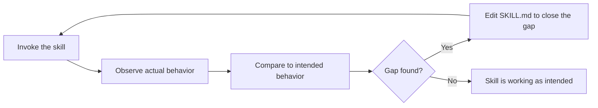

# Chapter 3: Your First Skill

The best way to understand how skills work is to build one. This chapter walks you through constructing a `changelog-generator` skill from scratch, starting with the absolute minimum that Claude Code will recognize as a skill, and iterating to a production-quality definition with a complete workflow, user dialog triggers, and a quality scoring rubric.

By the end of this chapter, you will have:

- A working skill installed at `~/.claude/skills/changelog-generator/SKILL.md`
- A clear understanding of how each component of the skill definition affects Claude's behavior
- A tested iteration loop you can apply to any skill you build
- A production-ready checklist for evaluating when a skill is finished

---

## 3.1 Choosing the Right First Skill

The `changelog-generator` is an ideal first skill for several reasons.

It solves a real, recurring problem: tracking changes to a codebase or document collection over time. Every software project, every textbook, every content repository benefits from a clear, readable changelog. Writing changelogs manually is tedious, inconsistent, and easy to skip. This is exactly the profile of a task that benefits from a skill.

It is also well-scoped. The input is clear (git history or a set of recent changes), the output is clear (a formatted `CHANGELOG.md` entry), and the workflow has a defined beginning and end. There are no hidden complexities that will derail your first attempt.

Finally, it is realistic. You will be able to invoke and test this skill immediately, see the output, identify what needs improvement, and iterate. Skills that require complex infrastructure to test are poor choices for learning.

---

## 3.2 Stage 1: The Minimal Viable Skill

The minimum file that Claude Code will recognize as a skill contains only a valid YAML frontmatter block. No body content, no workflow steps, just the metadata that registers the skill.

Create the directory and file:

```bash
mkdir -p ~/.claude/skills/changelog-generator
```

Then create `~/.claude/skills/changelog-generator/SKILL.md` with this content:

```yaml
---
name: changelog-generator
description: >
  Generates a formatted CHANGELOG.md entry from recent git commits or
  a description of recent changes. Use this skill when you need to document
  what changed in a project between two points in time.
---
```

That is a complete, valid skill definition. Claude Code will register it, and it will appear when you run `/skills`.

**What happens when you invoke it at this stage.**

Start a new Claude Code session and type `/skill changelog-generator`. Claude will read the SKILL.md file, find only the frontmatter and no workflow instructions, and... improvise. It will do something reasonable based on the description and its general knowledge of changelogs, but the output will be inconsistent. Some invocations will produce Keep a Changelog format; others will use a different format. Some will run `git log`; others will ask you what changed.

This inconsistency is the problem that skills exist to solve. The minimal viable skill proves the registration mechanism works, but it does not yet provide the structured workflow that makes skills valuable.

!!! example "What to observe at Stage 1"
    Invoke the skill twice in separate sessions without saying anything after the invocation. Observe whether the format of the output is the same both times. It will not be. This inconsistency is what the workflow steps in Stage 2 will fix.

---

## 3.3 Stage 2: Adding the Basic Workflow

The workflow section transforms a registered skill into a defined procedure. Each numbered step is an instruction to Claude that constrains what it does and in what order.

Here is the Stage 2 version of the skill:

```markdown
---
name: changelog-generator
description: >
  Generates a formatted CHANGELOG.md entry from recent git commits or
  a description of recent changes. Use this skill when you need to document
  what changed in a project between two points in time. Output follows
  Keep a Changelog format (keepachangelog.com).
---

# Changelog Generator

## Overview

This skill produces a properly formatted `CHANGELOG.md` entry documenting
recent changes to a project. It follows the Keep a Changelog format
(keepachangelog.com) with sections for Added, Changed, Fixed, Removed,
Deprecated, and Security changes. Output is ready to paste into your
CHANGELOG.md file.

## When to Use This Skill

Use this skill when:

- You are preparing a release and need to document what changed
- You want to update CHANGELOG.md after a sprint or milestone
- A collaborator asks what changed since the last version

Do NOT use this skill if:

- You need automated changelog generation from CI/CD (use a dedicated tool)
- The project has no version history or semantic versioning scheme

## Workflow

### Step 1: Gather Change Information

Run the following command to get recent git commits:

```bash
git log --oneline --since="30 days ago" --no-merges
```

If git is not available or the project is not a git repository, ask the user:
"Please describe the changes made since the last release."

### Step 2: Categorize Changes

Review the commit messages or user-provided descriptions and categorize
each change into the appropriate Keep a Changelog section:

- **Added**: New features or capabilities
- **Changed**: Changes to existing functionality
- **Fixed**: Bug fixes
- **Removed**: Removed features or capabilities
- **Deprecated**: Features marked for future removal
- **Security**: Security fixes or improvements

Omit sections that have no entries.

### Step 3: Format the Changelog Entry

Format the entry as follows:

```markdown
## [Unreleased] - YYYY-MM-DD

### Added
- Item one
- Item two

### Fixed
- Item three
```

Replace YYYY-MM-DD with today's date. Use "Unreleased" as the version
unless the user specifies a version number.

### Step 4: Present Output

Display the formatted changelog entry to the user and ask:
"Does this changelog entry look correct? If you have a version number
to use instead of 'Unreleased', provide it now."
```

**What is different at Stage 2.**

The skill now has a defined structure: an Overview section, a When to Use section, and a four-step workflow. Invoke this skill in two separate sessions and you will see consistent behavior: Claude runs git log, categorizes the commits, formats the output in Keep a Changelog format, and presents it for review.

The description field in the frontmatter has also been improved. It now specifies the output format (Keep a Changelog) and the trigger condition more precisely. This helps Claude identify when to suggest the skill during normal conversation.

!!! warning "Common mistake at this stage"
    Beginning builders often write workflow steps that are too vague. "Step 1: Get the changes" is not actionable. "Step 1: Run `git log --oneline --since='30 days ago' --no-merges` and parse the output" is actionable. Every step should specify exactly what Claude should do, not just what the step is about.

---

## 3.4 Stage 3: Adding User Dialog and File Writing

The Stage 2 skill produces good output, but it does not save it anywhere. It also does not handle the case where the project already has a CHANGELOG.md that needs updating rather than creating from scratch. Stage 3 adds both.

```markdown
---
name: changelog-generator
description: >
  Generates a formatted CHANGELOG.md entry from recent git commits or
  a description of recent changes. Use this skill when you need to document
  what changed in a project between two points in time. Output follows
  Keep a Changelog format (keepachangelog.com). Reads existing CHANGELOG.md
  if present and prepends the new entry.
---

# Changelog Generator

## Overview

This skill produces a properly formatted `CHANGELOG.md` entry documenting
recent changes to a project. It follows the Keep a Changelog format
(keepachangelog.com) with sections for Added, Changed, Fixed, Removed,
Deprecated, and Security changes.

If a CHANGELOG.md already exists in the project root, this skill reads
the existing file and prepends the new entry, preserving all prior history.

## When to Use This Skill

Use this skill when:

- You are preparing a release and need to document what changed
- You want to update CHANGELOG.md after a sprint or milestone
- A collaborator asks what changed since the last version

**Prerequisites:**

- Project must be a git repository OR the user can describe changes manually
- Must be invoked from the project root directory

Do NOT use this skill if:

- You need automated changelog generation from CI/CD (use a dedicated tool)
- The project has no version history or semantic versioning scheme

## Workflow

### Step 1: Check for Existing Changelog

Check if a CHANGELOG.md file already exists in the current directory:

```bash
ls -la CHANGELOG.md 2>/dev/null
```

If CHANGELOG.md exists, read its current contents to preserve them when
writing the updated file.

### Step 2: Gather Change Information

Run the following command to get recent git commits:

```bash
git log --oneline --since="30 days ago" --no-merges
```

If git is not available or the project is not a git repository, ask:
"This project does not appear to use git. Please describe the changes
made since the last release, one change per line."

Wait for the user response before proceeding to Step 3.

If git IS available, proceed automatically to Step 3.

### Step 3: Confirm Scope with User

Display the raw commit list to the user and ask:
"Here are the commits from the last 30 days. Should I use all of them,
or would you like to specify a different date range or version boundary?
Also, what version number should I use? (Press Enter to use 'Unreleased')"

Wait for user response before proceeding.

### Step 4: Categorize Changes

Review the commits or user-provided descriptions and categorize each
into the appropriate Keep a Changelog section:

- **Added**: New features or capabilities (feat: prefix in conventional commits)
- **Changed**: Changes to existing functionality (refactor:, perf: prefixes)
- **Fixed**: Bug fixes (fix: prefix)
- **Removed**: Removed features (feat: with removal language)
- **Deprecated**: Features marked for future removal
- **Security**: Security fixes (security: prefix or CVE mentions)

Omit sections that have no entries.

**Rewrite commit messages for readability.** Conventional commit prefixes
(feat:, fix:, chore:) should be removed. Cryptic internal references
should be paraphrased. Write entries as a human would read them, not as
a developer wrote them at 2 AM.

### Step 5: Format the Changelog Entry

Format the new entry:

```markdown
## [VERSION] - YYYY-MM-DD

### Added
- Item one, written in plain language

### Fixed
- Item two, written in plain language
```

Replace VERSION with the user-provided version or "Unreleased".
Replace YYYY-MM-DD with today's date.

### Step 6: Write the File

If CHANGELOG.md did not exist: write the new entry with a standard header.

Standard header format:
```markdown
# Changelog

All notable changes to this project will be documented in this file.

The format is based on [Keep a Changelog](https://keepachangelog.com/en/1.0.0/).

## [VERSION] - YYYY-MM-DD

...entries...
```

If CHANGELOG.md already existed: prepend the new entry after the header
(the first `## ` heading), preserving all existing entries below it.

Confirm with the user before overwriting an existing file:
"I will prepend the new entry to your existing CHANGELOG.md.
Does this look correct? (y/n)"

Wait for confirmation. If "n", ask what changes the user wants and
revise before writing.

### Step 7: Confirm Completion

After writing the file, display:
"CHANGELOG.md updated. New entry:
[show the entry]
Run `git diff CHANGELOG.md` to review the full change."

## Output Files

- `CHANGELOG.md` — Created or updated in the current directory
```

**What is different at Stage 3.**

Three significant additions appear in this version:

**Prerequisite specification.** The "When to Use This Skill" section now lists explicit prerequisites. Claude will check these before proceeding and report missing prerequisites rather than failing mid-workflow.

**Conditional user dialog.** Step 2 branches: if git is not available, Claude asks the user for changes. If git is available, Claude proceeds automatically. This conditional logic makes the skill robust to different project setups without requiring the user to tell Claude which case applies.

**Destructive action confirmation.** Step 6 asks the user to confirm before overwriting an existing file. This is a critical pattern for any skill that writes files. Never overwrite without asking.

---

## 3.5 Stage 4: Adding Quality Scoring

Quality scoring is what separates skills from scripts. A script either produces output or fails. A skill produces output, evaluates that output against defined criteria, and reports gaps before handing the result to the user.

Add the following sections to the end of your Stage 3 skill:

```markdown
## Quality Scoring

Before confirming completion, evaluate the changelog entry against this
rubric. Score each item and calculate the total. If total score is below
75/100, flag the specific gaps and offer to revise.

| Criterion | Points | Evaluation |
|-----------|--------|------------|
| All commits accounted for | 20 | Every commit in the selected range appears in at least one section |
| Correct categorization | 20 | Added/Changed/Fixed/Removed used per Keep a Changelog definitions |
| Plain language | 20 | No commit hashes, branch names, internal jargon, or raw prefixes |
| Completeness | 15 | No empty sections included; all populated sections present |
| Date accuracy | 10 | Date matches today's date (verify before writing) |
| Version format | 10 | Version is "Unreleased" or follows semver (X.Y.Z) |
| File integrity | 5 | Existing CHANGELOG.md history preserved, no content removed |
| **Total** | **100** | **Minimum passing score: 75** |

If score < 75: Present the gap report with specific items that failed,
ask the user if they want revisions before writing the file.

## Example Session

**User:** `/skill changelog-generator`

**Claude:** Checking for existing CHANGELOG.md... Found. Reading current contents.

Running git log for the last 30 days...

Found 12 commits. Here they are:
- a1b2c3d feat: add dark mode toggle
- d4e5f6g fix: broken link in header nav
- h7i8j9k chore: update dependencies
- ... (9 more)

Should I use all of these, or would you like a different date range?
What version number? (Enter for "Unreleased")

**User:** Use all of them. Version is 2.3.0.

**Claude:** Categorizing and formatting...

Quality check: 95/100. One dependency update commit categorized as
"Changed" since it affects behavior — confirming this is correct.

New entry looks like:

## [2.3.0] - 2025-09-14

### Added
- Dark mode toggle for user interface

### Fixed
- Broken navigation link in site header

### Changed
- Updated third-party library dependencies

Prepending to CHANGELOG.md. Confirm? (y/n)

**User:** y

**Claude:** CHANGELOG.md updated. Run `git diff CHANGELOG.md` to review.

## Common Pitfalls

### Pitfall 1: Running git log from the wrong directory

If invoked from a subdirectory, git log may produce incorrect results or
fail. Always verify you are in the project root before running git commands.

**Prevention:** Add `pwd && git rev-parse --show-toplevel` as the first
bash command in Step 2 to confirm the current directory is the git root.

### Pitfall 2: Including merge commits

Merge commits appear in git log by default and produce changelog noise.
Always use `--no-merges` flag.

### Pitfall 3: 30-day window misses release boundary

The 30-day window may include commits from before the last release or
miss commits that are part of this release. The Step 3 confirmation prompt
exists to catch this — but users often skip it without reviewing.

**Prevention:** The Step 3 prompt should display the oldest and newest
commit dates, making it obvious whether the window is correct.

### Pitfall 4: Conventional commit prefix pollution

Commits that follow conventional commit format (feat:, fix:, chore:)
should have their prefixes stripped in the output. "feat: add dark mode"
becomes "Added dark mode". The skill already instructs this in Step 4,
but review the output before confirming.
```

**What is different at Stage 4.**

The quality scoring rubric gives Claude a framework for evaluating its own output. The numerical scoring creates a threshold (75/100) below which Claude must flag gaps rather than silently deliver substandard results. The example session shows exactly what a correct interaction looks like. The common pitfalls section encodes hard-won knowledge about what goes wrong.

---

## 3.6 Where to Save the Skill

The complete Stage 4 skill lives at:

```
~/.claude/skills/changelog-generator/SKILL.md
```

Create the directory if it does not exist:

```bash
mkdir -p ~/.claude/skills/changelog-generator
```

Then write the file with the Stage 4 content.

To confirm the skill is registered, start a new Claude Code session and run `/skills`. You should see `changelog-generator` in the list.

!!! tip "Project-local vs. global installation"
    If the `changelog-generator` skill is useful across all your projects (it is), install it globally in `~/.claude/skills/`. If you are building a skill that is specific to one project — perhaps one that reads from that project's specific data files — install it project-locally in `.claude/skills/` within the project root.

---

## 3.7 Testing Your Skill

Testing a skill means invoking it and observing whether it behaves as specified. This is different from testing software: you are not looking for deterministic output, you are looking for consistent, high-quality output that follows the workflow.

**Test 1: First invocation.** Start a new session in a git project directory. Type `/skill changelog-generator`. Observe each step. Does Claude run git log? Does it ask for version confirmation? Does it format the output correctly?

**Test 2: Existing CHANGELOG.md.** Create a minimal `CHANGELOG.md` in the project root. Invoke the skill again. Does Claude detect the existing file? Does it ask for confirmation before overwriting?

**Test 3: Non-git project.** Invoke the skill from a directory with no git repository. Does Claude detect the missing git history and ask you to describe changes manually?

**Test 4: Quality scoring trigger.** After Claude produces the changelog entry, examine it critically. Does the quality score seem accurate? Are the common pitfalls section's failure modes reflected in the rubric?

Record what you observe. If behavior deviates from specification, the fix is in the skill definition, not in how you invoke it.

---

## 3.8 The Iteration Loop

Skills improve through a tight loop of invocation, observation, and refinement. The loop has four steps:



**Common gaps and their fixes:**

| Observed behavior | Likely cause | Fix |
|---|---|---|
| Output format varies between invocations | Workflow step too vague | Add explicit format specification |
| Claude skips a step | Step 2 does not follow from Step 1 clearly | Add explicit "then proceed to Step X" instructions |
| Claude asks unnecessary questions | Step does not specify when to proceed automatically | Add "If X is true, proceed automatically" |
| Claude does not ask at critical decision points | Missing user dialog trigger | Add explicit "Ask the user: '...'" instruction |
| Quality score never below 75 | Rubric criteria too lenient | Raise point values for critical criteria |
| Wrong files written | Output section not specific enough | Add exact file paths and formats to Output section |
| Skill invoked for wrong task | Description too broad | Narrow the description and add "Do NOT use if" criteria |

Most gaps are in the workflow steps: either too vague, missing conditional logic, or not specifying when to pause for user input. The example session section of a skill is particularly valuable here — if you write a precise example session and Claude's actual behavior matches it, the skill is working correctly. If there is a divergence, the skill definition needs adjustment.

!!! warning "Do not compensate for a bad skill definition by reprompting"
    When a skill does not behave correctly, the instinct is to add clarifying instructions during the session: "No, I meant for you to do X first." Resist this. Instead, identify what the skill definition lacks and add it there. The fix should be in the skill, not in the session. If you fix it in the session, the problem will recur on the next invocation.

---

## 3.9 The Complete Stage 4 Skill

Here is the complete, production-ready `changelog-generator` skill in a single code block for easy copying:

```markdown
---
name: changelog-generator
description: >
  Generates a formatted CHANGELOG.md entry from recent git commits or
  a description of recent changes. Use this skill when you need to document
  what changed in a project between two points in time. Output follows
  Keep a Changelog format (keepachangelog.com). Reads existing CHANGELOG.md
  if present and prepends the new entry.
---

# Changelog Generator

## Overview

This skill produces a properly formatted CHANGELOG.md entry documenting
recent changes to a project. It follows the Keep a Changelog format
(keepachangelog.com) with sections for Added, Changed, Fixed, Removed,
Deprecated, and Security changes.

If a CHANGELOG.md already exists in the project root, this skill reads
the existing file and prepends the new entry, preserving all prior history.

## When to Use This Skill

Use this skill when:

- You are preparing a release and need to document what changed
- You want to update CHANGELOG.md after a sprint or milestone
- A collaborator asks what changed since the last version

**Prerequisites:**

- Project must be a git repository OR the user can describe changes manually
- Must be invoked from the project root directory

Do NOT use this skill if:

- You need automated changelog generation from CI/CD (use a dedicated tool)
- The project has no version history or semantic versioning scheme

## Workflow

### Step 1: Check for Existing Changelog

Check if a CHANGELOG.md file already exists in the current directory:

```bash
ls -la CHANGELOG.md 2>/dev/null
```

If CHANGELOG.md exists, read its current contents to preserve them when
writing the updated file.

### Step 2: Gather Change Information

Run the following command to get recent git commits:

```bash
git log --oneline --since="30 days ago" --no-merges
```

If git is not available or the project is not a git repository, ask:
"This project does not appear to use git. Please describe the changes
made since the last release, one change per line."

Wait for the user response before proceeding to Step 3.

If git IS available, proceed automatically to Step 3.

### Step 3: Confirm Scope with User

Display the raw commit list to the user and ask:
"Here are the commits from the last 30 days. Should I use all of them,
or would you like to specify a different date range or version boundary?
Also, what version number should I use? (Press Enter to use 'Unreleased')"

Wait for user response before proceeding.

### Step 4: Categorize Changes

Review the commits or user-provided descriptions and categorize each
into the appropriate Keep a Changelog section:

- **Added**: New features or capabilities
- **Changed**: Changes to existing functionality
- **Fixed**: Bug fixes
- **Removed**: Removed features
- **Deprecated**: Features marked for future removal
- **Security**: Security fixes or CVE mentions

Omit sections that have no entries.

Rewrite commit messages for readability. Remove conventional commit prefixes.
Paraphrase cryptic references. Write entries as a human would read them.

### Step 5: Format the Changelog Entry

Format the new entry:

    ## [VERSION] - YYYY-MM-DD

    ### Added
    - Item written in plain language

    ### Fixed
    - Item written in plain language

Replace VERSION with the user-provided version or "Unreleased".
Replace YYYY-MM-DD with today's date.

### Step 6: Write the File

If CHANGELOG.md did not exist: write the new entry with a standard header:

    # Changelog

    All notable changes to this project will be documented in this file.

    The format is based on Keep a Changelog (https://keepachangelog.com/en/1.0.0/).

    ## [VERSION] - YYYY-MM-DD
    ...entries...

If CHANGELOG.md already existed: prepend the new entry after the first
line of the existing file header, before any existing version entries.
Preserve all existing entries.

Confirm with the user before writing:
"I will prepend the new entry to your existing CHANGELOG.md. Confirm? (y/n)"

Wait for confirmation. If "n", ask what revisions the user wants.

### Step 7: Confirm Completion

After writing, display:
"CHANGELOG.md updated. Run `git diff CHANGELOG.md` to review."

## Output Files

- `CHANGELOG.md` — Created or updated in the current directory

## Quality Scoring

Evaluate the changelog entry before writing. Score each criterion.
If total is below 75/100, flag gaps and offer to revise.

| Criterion | Points |
|-----------|--------|
| All commits accounted for | 20 |
| Correct categorization | 20 |
| Plain language (no raw prefixes or hashes) | 20 |
| Completeness (no empty sections included) | 15 |
| Date accuracy | 10 |
| Version format (Unreleased or X.Y.Z) | 10 |
| File integrity (existing history preserved) | 5 |
| **Total** | **100** |

## Example Session

User: /skill changelog-generator

Claude: Checking for CHANGELOG.md... Found. Reading current contents.

Running git log for last 30 days... Found 12 commits.

Here they are: [commit list]. Should I use all of them, or a different
range? What version number? (Enter for Unreleased)

User: All of them. Version 2.3.0.

Claude: [formats entry, scores 95/100, confirms with user, writes file]
"CHANGELOG.md updated. Run git diff CHANGELOG.md to review."

## Common Pitfalls

- Running from a subdirectory: git log may produce incorrect results.
  Verify you are in the project root.
- Including merge commits: always use --no-merges.
- 30-day window misses release boundary: the Step 3 prompt catches this,
  but display oldest/newest commit dates to make the window obvious.
- Conventional commit prefix pollution: strip feat:, fix:, chore: prefixes
  and rewrite entries in plain language.
```

---

## 3.10 Production-Readiness Checklist

Your skill is production-ready when it satisfies all of the following:

```
Frontmatter
  [ ] name matches the directory name exactly
  [ ] description is 2-4 sentences specifying trigger condition and output
  [ ] description written from Claude's routing perspective, not documentation perspective

Structure
  [ ] Overview section explains purpose and primary output in 1-2 sentences
  [ ] "When to Use" includes positive conditions, negative conditions, and prerequisites
  [ ] Workflow steps are numbered and sequentially ordered
  [ ] Each step specifies exactly what Claude should do (not just what the step is about)
  [ ] Conditional logic is explicit ("If X, do Y. Otherwise, do Z.")
  [ ] User dialog triggers are explicit ("Ask the user: '...'")
  [ ] Destructive actions (file writes, overwrites) require explicit user confirmation

Quality
  [ ] Quality scoring rubric with specific criteria and point values
  [ ] Minimum passing score defined (75/100 recommended)
  [ ] Gap report behavior specified (what to do if score is below threshold)

Documentation
  [ ] Output files section lists every file the skill creates, with paths and formats
  [ ] Example session shows correct interaction from invocation to completion
  [ ] Common pitfalls section covers at least three known failure modes

Testing
  [ ] Skill has been invoked at least twice in separate sessions
  [ ] Output is consistent between invocations
  [ ] Conditional branches (e.g., git vs. no git) have each been tested
  [ ] Quality scoring has been triggered at least once (introduce a flaw to test it)
  [ ] Edge cases (empty input, existing files, user saying "no" at confirmations) tested
```

This checklist is the answer to "is my skill done?" If every item is checked, the skill will behave consistently, produce quality-gated output, and handle the failure cases you know about. New failure cases will be discovered through use and added to the common pitfalls section over time.

---

## 3.11 What Comes Next

You have built a complete skill from scratch, understood how each component affects Claude's behavior, and established the iteration loop for improving skills over time. The `changelog-generator` demonstrates all the core patterns:

- Frontmatter for registration
- A "When to Use" section with positive conditions, negative conditions, and prerequisites
- Numbered workflow steps with explicit instructions
- Conditional logic for branching based on environment state
- User dialog triggers at decision points and before destructive actions
- Quality scoring with a rubric and a minimum threshold
- An example session showing correct behavior
- A common pitfalls section encoding known failure modes

Chapter 4 goes deeper into the SKILL.md structure, examining each section in detail and explaining the design decisions behind the patterns you used in this chapter. Chapter 5 covers YAML frontmatter in depth, including the `allowed-tools` field and how to constrain skill capabilities. Chapter 6 addresses workflow design as a discipline — how to decompose complex tasks into workflow steps that produce consistent, high-quality output.

!!! tip "Build your own first skill in parallel"
    The `changelog-generator` is a learning vehicle. Your most valuable next step is to identify a real workflow in your own work and build a skill for it using the same four-stage process. Use the production-readiness checklist at Stage 4. The workflow you chose when reading the "Before moving on" tip at the end of Chapter 1 is your starting point.

!!! example "Key terms from this chapter"
    - **Minimal viable skill**: A SKILL.md containing only YAML frontmatter — the minimum for Claude Code to register the skill
    - **Workflow step**: A numbered instruction in the skill body specifying exactly what Claude should do at that stage of execution
    - **User dialog trigger**: An explicit instruction telling Claude to pause and ask the user a specific question before proceeding
    - **Conditional logic**: Branching instructions in the skill body that tell Claude to take different actions based on the current state
    - **Destructive action confirmation**: The pattern of requiring explicit user confirmation before writing, overwriting, or deleting files
    - **Quality scoring rubric**: A table of criteria and point values that Claude uses to evaluate its own output before delivering it
    - **Minimum passing score**: The threshold below which Claude must flag gaps and offer to revise rather than silently delivering substandard output
    - **Iteration loop**: The cycle of invoke, observe, compare, edit that refines a skill toward correct and consistent behavior
