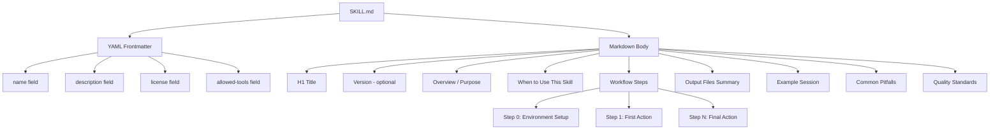

# Chapter 4: SKILL.md Structure

## The Complete Anatomy of a Skill Definition File

Every skill in the Claude Code ecosystem lives in a single file: `SKILL.md`. Understanding every section of this file — what it does, why it exists, and what breaks without it — is the foundation of skill authorship.

This chapter dissects the SKILL.md format completely. By the end, you will be able to read any skill file and understand exactly what Claude will do when it executes it. You will also understand the design decisions behind the format and be able to make intentional choices about every section you write.

---

## What a SKILL.md File Actually Is

A `SKILL.md` file is simultaneously three things:

1. **A configuration document** — the YAML frontmatter tells Claude Code metadata about the skill: its name, what it does, what tools it is allowed to use, and its license.
2. **An instruction set** — the markdown body is a workflow that Claude reads and executes step by step.
3. **A context injection** — portions of the file, particularly the `description` field, are injected directly into Claude's context window as part of its operational instructions.

The file format was designed to be human-readable first. A skill author should be able to read a SKILL.md file and immediately understand what the skill does, when to use it, and what it produces. Claude reads the same file. There is no separate "machine-readable" format — the human instructions and the machine instructions are identical.

This design principle has a practical consequence: **clarity in your SKILL.md is not a nicety, it is a functional requirement.** Vague instructions produce inconsistent behavior. Precise instructions produce consistent, reproducible output.

---

## Document Structure Overview



---

## Section-by-Section Anatomy

### The YAML Frontmatter Block

The frontmatter is the first section of any SKILL.md file. It is enclosed between triple-dash delimiters (`---`) and written in YAML syntax.

```yaml
---
name: glossary-generator
description: This skill automatically generates a comprehensive glossary of terms from a learning graph's concept list, ensuring each definition follows ISO 11179 metadata registry standards (precise, concise, distinct, non-circular, and free of business rules). Use this skill when creating a glossary for an intelligent textbook after the learning graph concept list has been finalized.
license: MIT
allowed-tools: Bash(~/.claude/skills/glossary-generator:*)
---
```

The frontmatter serves as the skill's identity document. Claude Code reads this before loading the rest of the file and uses it to:

- Register the skill under its `name`
- Surface the `description` when the user requests skill discovery
- Enforce tool permissions from `allowed-tools`
- Record the `license` for distribution purposes

**What happens if frontmatter is missing or malformed?**

If the frontmatter is absent, Claude Code will not recognize the file as a valid skill. The skill will not appear in skill listings, and invoking it by name will fail. If the YAML is syntactically invalid (for example, incorrect indentation or unescaped special characters), the skill may load but with corrupted metadata.

---

### The H1 Title

The first line of the markdown body should be an H1 heading that names the skill in plain English.

```markdown
# Glossary Generator
```

This is distinct from the `name` field in the frontmatter. The frontmatter `name` is the machine identifier (kebab-case, used for invocation). The H1 title is the human-readable name displayed in documentation, logs, and when Claude announces what it is about to do.

**Best practice:** The H1 title should match the skill's purpose directly. If the frontmatter `name` is `course-description-analyzer`, the H1 title might be `Course Description Analyzer` or `Course Description Analyzer and Generator`. Avoid H1 titles that are clever or metaphorical — they reduce clarity without adding value.

---

### The Version Line (Optional)

Immediately after the H1 title, you may include a version declaration:

```markdown
# Learning Graph Generator

**Version:** 0.03
```

Versioning serves multiple purposes:

- It gives users a way to report which version they used when filing bug reports
- It gives Claude a way to announce its version at the start of a session, which helps users confirm the correct skill loaded
- It forces the skill author to think of skills as evolving artifacts, not static documents

A convention used in the McCreary skill ecosystem is to have Claude announce its version in Step 0:

```markdown
Tell the user that they are running Version 0.03 of the Learning Graph Generator Skill.
```

This creates an explicit handshake at session start that confirms skill identity and version.

---

### Overview / Purpose

The overview section follows immediately after the version (or H1 if no version is used). It contains one to three paragraphs that explain:

1. **What the skill does** — the core transformation it performs
2. **The domain context** — why this matters and where it fits in a larger workflow
3. **The output quality target** — what standards govern the output

```markdown
## Purpose

This skill automates glossary creation for intelligent textbooks by converting concept labels
from a learning graph into properly formatted glossary definitions. Each definition follows
ISO 11179 metadata registry standards: precise, concise, distinct, non-circular, and free of
business rules. The skill ensures consistency across terminology, validates cross-references,
and produces alphabetically ordered entries with relevant examples.
```

The overview is important for two reasons. First, it gives Claude immediate context for interpreting every subsequent instruction. If Step 4 says "generate a definition," Claude already knows from the overview that the definition must meet ISO 11179 standards — it does not need to be told again. Second, the overview is what a new user will read to determine whether this skill is appropriate for their current task.

**What happens if the overview is missing?**

Claude will proceed through the workflow steps without the broader context that the overview provides. This may cause it to interpret ambiguous instructions in unexpected ways. The behavior will appear correct until an edge case arises that the steps do not explicitly address.

---

### When to Use This Skill

This section is a bulleted list of specific trigger conditions. It answers the question: "How do I know whether to invoke this skill right now?"

```markdown
## When to Use This Skill

Use this skill after the Learning Graph skill has completed and the concept list has been finalized.
All markdown content in the /docs area can also be scanned looking for words or phases that might
not be clear to the average high-school student.

Specifically, trigger this skill when:

- A concept list file exists (typically `docs/learning-graph/02-concept-list-v1.md`)
- The concept list has been reviewed and approved
- The course description exists with clear learning outcomes
- Ready to create or update the textbook's glossary
```

This section matters because skills in a pipeline have dependencies. A glossary generator depends on a finalized concept list. A chapter content generator depends on a finalized learning graph. The "When to Use This Skill" section makes those dependencies explicit as conditions the user can check before invoking.

The section also helps with skill discovery. When a user describes what they want to do and asks Claude to suggest a skill, Claude reads the "When to Use" sections of available skills and matches them against the user's stated context.

**Design guidance:** Write trigger conditions as things you can verify by checking the filesystem or the current project state. Avoid vague conditions like "when you feel the project is ready." Use specific, checkable conditions like "a concept list file exists at `docs/learning-graph/02-concept-list-v1.md`."

---

### The Workflow Section

The workflow is the most important section of any SKILL.md file. It is a numbered sequence of steps that Claude executes in order. Each step is a heading (`### Step N: Step Name`) followed by detailed instructions.

The standard numbering convention starts at Step 0, not Step 1. Step 0 is always environment setup.

```markdown
## Workflow

### Step 0: Setup

Tell the user that they are running the version graph generator and the version number above.

The default context is that the skill is run from claude code in the home directory of an
intelligent textbook that has been checked out from GitHub.

Detect the project root by looking for mkdocs.yml in the current directory or parent directories.
Set the following path variables for use throughout this skill:

- PROJECT_ROOT: directory containing mkdocs.yml
- DOCS_DIR: PROJECT_ROOT/docs
- LOG_DIR: PROJECT_ROOT/logs

If DOCS_DIR does not exist, halt and ask the user to confirm the working directory.
```

Each subsequent step performs one cohesive action or decision:

```markdown
### Step 1: Validate Input Quality

Before generating definitions, assess the quality of the concept list:

1. Read the concept list file (typically `docs/learning-graph/02-concept-list-v1.md`)
2. Check for duplicate concept labels (target: 100% unique)
3. Verify Title Case formatting (target: 95%+ compliance)
4. Validate length constraints (target: 98% under 32 characters)
5. Assess concept clarity (no ambiguous terms)

Calculate a quality score (1-100 scale):

- 90-100: All concepts unique, properly formatted, appropriate length
- 70-89: Most concepts meet standards, minor formatting issues
- 50-69: Some duplicate concepts or formatting inconsistencies
- Below 50: Significant issues requiring manual review

**User Dialog Triggers:**

- If score < 70: Ask "The concept list has quality issues. Would you like to review and clean
  it before generating the glossary?"
- If duplicates found: Ask "Found [N] duplicate concepts. Should I remove duplicates
  automatically or would you like to review?"
```

Notice the structure within each step:

- **Ordered sub-tasks** (numbered list) for actions that must happen in sequence
- **Decision tables** for threshold-based logic
- **User Dialog Triggers** as a distinct labeled block so Claude recognizes when to pause and ask

---

### Output Files Summary

This section documents every file the skill creates, organized by priority.

```markdown
## Output Files Summary

**Required:**

1. `docs/glossary.md` — Complete glossary in alphabetical order with ISO 11179-compliant definitions

**Recommended:**

2. `docs/learning-graph/glossary-quality-report.md` — Quality assessment and recommendations

**Optional:**

3. `docs/learning-graph/glossary-cross-ref.json` — JSON mapping for semantic search
4. Updates to `mkdocs.yml` navigation if glossary link is missing
```

The three-tier classification (Required / Recommended / Optional) serves a specific purpose. It tells Claude — and the user — which outputs are essential for success, which are valuable but skippable under time pressure, and which are extras that add value but do not block downstream steps.

Without this section, Claude may produce different files on different runs depending on how it interprets the workflow steps. The Output Files Summary creates a contract: if the skill completes successfully, these files will exist.

**What happens if this section is missing?**

Claude will still produce files, but there is no explicit contract about what those files should be. Different runs may produce different outputs. Downstream skills that depend on specific file paths from this skill may break unpredictably.

---

### Example Session

The example session shows a realistic interaction — what the user says, what Claude does, and what output is produced.

```markdown
## Example Session

**User:** "Generate a glossary from my concept list"

**Claude (using this skill):**

1. Reads `docs/learning-graph/02-concept-list-v1.md`
2. Validates quality (checks for duplicates, formatting)
3. Reads `docs/course-description.md` for context
4. Generates ISO 11179-compliant definitions
5. Adds examples to 70% of terms
6. Sorts alphabetically
7. Creates `docs/glossary.md`
8. Generates quality report
9. Reports: "Created glossary with 187 terms. Overall quality score: 89/100.
   Added examples to 71% of terms. No circular definitions found."
```

The example session accomplishes three things:

1. It gives Claude a concrete model of the expected interaction pattern
2. It gives users a preview of what to expect when they invoke the skill
3. It serves as a quick smoke test — if a new version of the skill produces a wildly different interaction pattern than the example shows, something has changed

---

### Common Pitfalls to Avoid

This section documents recurring failure modes — things that go wrong in practice that are not obvious from reading the workflow steps.

```markdown
## Common Pitfalls to Avoid

**Circular Definitions:**
- Bad: "A Learning Graph is a graph that shows learning."
- Good: "A directed graph of concepts that reflects the order concepts should be learned."

**Too Vague:**
- Bad: "A thing used in education."
- Good: "A directed graph of concepts that reflects prerequisite relationships."

**Processing concepts before reading course context:**
If you skip Step 2 (Read Course Context) and go directly to generating definitions,
the definitions will be generic rather than tailored to this specific course's
terminology and audience level.
```

The before/after format for anti-patterns is particularly effective because it gives Claude explicit negative examples. Claude learns to avoid the "Bad" patterns not through abstract rules but through concrete comparison.

---

### Quality Standards and Scoring Rubric

The quality scoring section defines the rubric Claude uses to assess its own output. This is covered in detail in Chapter 7. For now, understand its structural role:

```markdown
## Quality Scoring Reference

Use this rubric to score each definition (1-100 scale):

**85-100: Excellent**
- Meets all 4 ISO 11179 criteria (20+ pts each)
- Appropriate length (20-50 words)
- Includes relevant example
- Clear, unambiguous language

**70-84: Good**
- Meets 3-4 ISO criteria
- Acceptable length (15-60 words)
- May lack example
- Generally clear

**Below 55: Needs Revision**
- Fails multiple ISO criteria
- Requires complete rewrite
```

The quality scoring section transforms Claude from a text generator into a self-auditing system. Before reporting completion, Claude compares its output against the rubric and either proceeds (if score >= threshold) or flags the issue to the user (if score < threshold).

---

## A Fully Annotated SKILL.md Example

The following is a complete, production-quality SKILL.md file with inline annotations explaining every design choice.

```yaml
---
# FRONTMATTER
# name: Machine identifier. Must match the directory name. Kebab-case only.
name: readme-generator

# description: Single paragraph. Two sentences minimum.
# Sentence 1: What the skill does.
# Sentence 2: When to trigger it.
# This exact text may appear in Claude's context window during skill selection.
description: This skill generates a comprehensive GitHub README.md file for any
  repository by analyzing existing code, documentation, and project structure.
  Use this skill when a repository lacks a README or when the existing README
  needs a complete overhaul to meet professional standards.

license: MIT

# allowed-tools: Restrict what Claude can do while running this skill.
# Format: ToolName(path-glob:*) or just ToolName for no restriction.
# Omitting this field allows all tools — risky for production skills.
allowed-tools: Bash(~/.claude/skills/readme-generator:*), Bash(/tmp:*)
---
```

```markdown
# README Generator
# H1 title: human-readable, matches skill purpose

**Version:** 1.2
# Version: enables announcements in Step 0 and helps with bug reports

## Overview
# Overview: 2-3 paragraphs. Establishes domain context for interpreting later steps.

This skill analyzes a repository's structure, code, documentation, and configuration
files to produce a professional README.md. The output follows GitHub's best practices
for open-source documentation, including badges, installation instructions, usage
examples, and contribution guidelines.

The skill performs a read-only analysis pass before generating any output, ensuring
it understands the project before making claims about it. Quality scoring validates
the output against a 100-point rubric before delivery.

## When to Use This Skill
# Trigger conditions: specific, checkable, filesystem-verifiable

- No `README.md` exists in the repository root
- Existing `README.md` is fewer than 200 words
- Repository has been significantly updated but the README reflects old functionality
- Preparing a repository for public release or portfolio presentation

## Workflow

### Step 0: Environment Setup
# Step 0 is always environment setup. Never skip it.

Tell the user you are running README Generator version 1.2.

Detect the repository root by looking for `.git/` in the current directory or
parent directories. If not found, halt and ask: "I cannot detect a git repository.
Please confirm your working directory."

Set path variables:
- REPO_ROOT: directory containing `.git/`
- README_PATH: REPO_ROOT/README.md
- LOG_PATH: REPO_ROOT/logs/readme-generator-[timestamp].md

Create the logs directory if it does not exist:
```bash
mkdir -p $REPO_ROOT/logs
```
# Step 0 establishes all path variables once. All later steps reference these variables.
# This prevents hardcoded paths that break when the skill runs in different projects.

### Step 1: Repository Analysis
# Each step has a single, cohesive purpose

Perform a read-only scan of the repository structure:

1. List all files in the root directory
2. Detect the primary programming language from file extensions
3. Check for `package.json`, `pyproject.toml`, `Cargo.toml`, `go.mod` — use whichever
   exists to determine ecosystem and extract dependencies
4. Read the first 50 lines of the main entry point if it can be detected
5. Check for existing `docs/` directory or documentation files

Record findings in a structured summary (do not write to disk yet).

**Skip-if-complete detection:**
If `README.md` exists and has more than 1,000 words, ask: "A substantial README already
exists. Would you like to overwrite it, or append sections that are missing?"
# Skip-if-complete detection prevents accidentally overwriting good work.

### Step 2: Content Planning

Based on the analysis from Step 1, determine which README sections are applicable:

| Section | Include If |
|---------|------------|
| Badges | Public repo with CI/CD detected |
| Installation | Package or binary detected |
| Usage Examples | Code examples or CLI args detected |
| API Reference | Library or SDK project detected |
| Configuration | Config files detected |
| Contributing | Open-source intent detected |
| License | License file exists |

Plan the section order before writing. Record the plan as a comment in the log.

### Step 3: Draft README
# Generation step. Uses the plan from Step 2.

Generate `README.md` using the section plan from Step 2. Follow these standards:

- Use H1 for the project name (single occurrence, at the top)
- Use H2 for all main sections
- Use H3 for sub-sections within sections
- Code blocks must specify their language (e.g., ```bash, ```python)
- Every code example must be executable — no placeholder pseudocode

**User Dialog Trigger:**
If the skill cannot determine the project's primary purpose from the file scan, ask:
"I could not determine what this project does. Can you describe it in 1-2 sentences?"
# Dialog triggers pause execution and collect information that cannot be inferred.

### Step 4: Quality Scoring

Score the draft README against the 100-point rubric (see Quality Scoring section below).

If score >= 80: Proceed to Step 5.
If score 65-79: Proceed with a note to the user about improvement areas.
If score < 65: Ask the user: "The draft scores [N]/100. Key issues: [list].
  Would you like me to revise before saving, or save and address issues later?"

### Step 5: Write Output

Write the approved README to `README_PATH`.

Append a session log to `LOG_PATH`:
```
Session: README Generator v1.2
Date: [timestamp]
Repository: [REPO_ROOT]
Quality Score: [N]/100
Sections Generated: [list]
Words: [count]
```

Report to the user:
"README.md created. [N] words, quality score [N]/100. Sections: [list]."

## Output Files Summary

**Required:**
1. `README.md` — Complete project documentation in the repository root

**Recommended:**
2. `logs/readme-generator-[timestamp].md` — Session log with quality score and decisions

**Optional:**
3. Updates to `mkdocs.yml` if the project uses MkDocs and README should link to docs

## Example Session

**User:** "Generate a README for this project"

**Claude (using this skill):**
1. Detects repository root at `/Users/dan/projects/my-api/`
2. Scans structure — detects Python, `pyproject.toml`, FastAPI dependency
3. Plans sections: badges, installation, usage, API reference, contributing, license
4. Drafts README with FastAPI-specific examples
5. Scores draft: 84/100 (strong structure, good examples, missing badges)
6. Writes README.md
7. Reports: "README.md created. 847 words, quality score 84/100. Missing: CI badge
   (no CI config detected). Recommend adding GitHub Actions workflow."

## Common Pitfalls to Avoid

**Inventing functionality:**
Only document what actually exists in the repository. Do not write "coming soon"
sections or describe features that are not yet implemented.

**Generic installation instructions:**
Bad: "Install the dependencies."
Good: "Run `pip install -e .` to install the package and all dependencies in
development mode."

**Placeholder code examples:**
Bad: `my_function(your_data)`
Good: `result = transform_csv("input.csv", delimiter=",")`

## Quality Scoring Reference

| Category | Weight | Criteria |
|----------|--------|----------|
| Completeness | 30 pts | All relevant sections present |
| Accuracy | 30 pts | All claims verifiable from codebase |
| Usability | 20 pts | New user can install and run from README alone |
| Code Quality | 20 pts | All examples syntactically correct and executable |

**Thresholds:**
- 80-100: Excellent — deliver immediately
- 65-79: Good — deliver with improvement notes
- Below 65: Needs revision — ask user before saving
```

---

## Why Every Section Is Non-Optional

Consider what happens when you remove each section from a SKILL.md:

| Missing Section | Consequence |
|----------------|-------------|
| Frontmatter | Skill cannot be loaded or invoked |
| H1 Title | Claude has no named reference point; logs become ambiguous |
| Overview | Ambiguous step instructions are interpreted inconsistently |
| When to Use | Users invoke at wrong time in workflow; dependencies not met |
| Workflow Steps | Skill has no instructions — produces arbitrary output |
| Step 0 | Path variables undefined; filesystem operations fail |
| Output Files Summary | No contract on deliverables; downstream skills break |
| Example Session | No reference for expected interaction pattern |
| Common Pitfalls | Known failure modes repeat across runs |
| Quality Scoring | No self-validation; output quality is unpredictable |

The sections are not decorative. Each one either makes Claude's behavior more consistent, protects against a known failure mode, or creates a contract that other parts of your system can depend on.

---

## The Directory Structure for a Skill

A SKILL.md file lives inside a directory that may contain supporting files:

```
~/.claude/skills/
└── my-skill/
    ├── SKILL.md              ← Required. The skill definition.
    ├── assets/
    │   └── templates/        ← Optional. Templates referenced in workflow steps.
    ├── references/           ← Optional. Sub-skill guides for meta-skills.
    │   ├── variant-a.md
    │   └── variant-b.md
    └── scripts/              ← Optional. Python or bash utilities.
        └── validate.py
```

The SKILL.md file is the only required file. Supporting assets extend the skill's capabilities without bloating the SKILL.md file itself. A skill that generates Python validation scripts, for example, can store those scripts in `scripts/` and reference them in the workflow steps.

---

## Key Takeaways

- Every SKILL.md contains two logical sections: YAML frontmatter and a markdown body
- The frontmatter is Claude Code's configuration layer — name, description, license, allowed-tools
- The markdown body is Claude's instruction set — every section shapes how it interprets and executes the workflow
- Step 0 is always environment setup and always the first workflow step
- The Output Files Summary creates a binding contract on what the skill produces
- Quality scoring sections transform the skill from a generator into a self-validating system
- No section is optional — each one prevents a specific class of failure

In Chapter 5, we examine the YAML frontmatter in depth, including how the `description` field becomes part of Claude's system prompt and how `allowed-tools` glob patterns control execution permissions.
