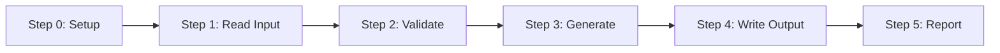
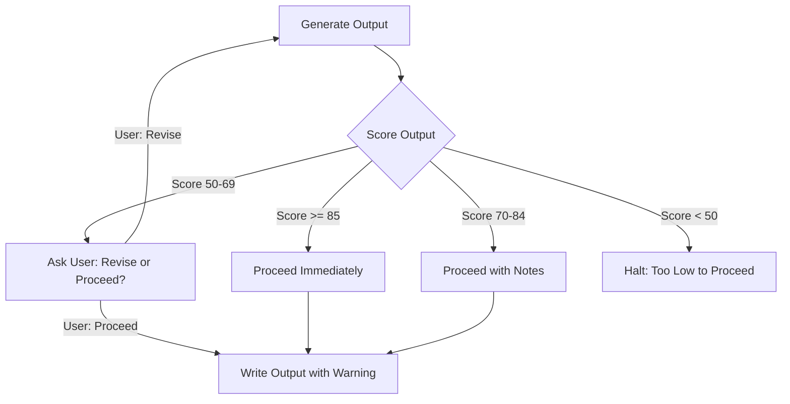

# Chapter 6: Workflow Design

## Building Multi-Step Workflows That Execute Reliably

The workflow is the engine of a skill. Everything else in the SKILL.md file — frontmatter, overview, output summary — exists to support it. A well-designed workflow executes identically whether Claude runs it the first time or the hundredth time, whether the project is large or small, whether the user is experienced or a first-timer.

This chapter covers the full architecture of skill workflows: the Step 0 environment setup pattern, sequential vs. parallel execution, user dialog triggers, conditional branching, error handling, and the quality gate pattern. Three worked examples of increasing complexity close the chapter.

---

## The Anatomy of a Workflow Step

Every step in a skill workflow follows the same structural pattern:

```markdown
### Step N: Descriptive Step Name

[One sentence explaining the purpose of this step]

[Detailed instructions for what Claude should do]

[Optional: User Dialog Triggers]
[Optional: Skip-if-complete detection]
[Optional: Decision table or threshold logic]
```

The step heading (`### Step N:`) is not just a label — it is a semantic anchor. When Claude is mid-execution and needs to reference another step, or when a user asks "what step are you on?", the step heading provides a clear, unambiguous reference point. Use consistent step numbering starting from Step 0.

### What Makes a Good Step

A well-designed step has three properties:

1. **Single cohesive purpose** — one step, one goal. "Validate input and generate content and write output" is three steps masquerading as one.
2. **Clear completion criteria** — Claude should know unambiguously when the step is done.
3. **Explicit error handling** — what should happen if the step fails or the inputs are not as expected?

A poorly designed step is either too small ("Read the file") or too large ("Do everything"). The right granularity is a step that corresponds to a meaningful checkpoint — a point where you would naturally want to verify progress before continuing.

---

## Step 0: The Environment Setup Pattern

Step 0 is the most important step in any skill workflow. It is always the first step, always named "Setup" or "Environment Setup," and always performs the same core function: **establishing the filesystem context that all subsequent steps depend on.**

Without Step 0, every subsequent step that references a file path is a potential failure. With Step 0, paths are established once, verified once, and all subsequent steps operate with confidence.

### The Three Jobs of Step 0

**Job 1: Announce the skill and version**

```markdown
### Step 0: Environment Setup

Tell the user you are running [Skill Name] version [X.Y].
```

This announcement serves as an explicit confirmation that the correct skill loaded. If the wrong skill loaded, the user can stop execution immediately rather than after several steps of incorrect work.

**Job 2: Detect the project root**

```markdown
Detect the project root by looking for `mkdocs.yml` in the current directory.
If not found, check parent directories up to three levels up.

If `mkdocs.yml` is still not found, halt and ask:
"I cannot detect an MkDocs project. Are you running this skill from the project's
root directory? The project root should contain mkdocs.yml."
```

The project root detection check is important because skills run from wherever the user starts Claude Code — which may not be the project root. A skill that assumes it is already in the project root will silently write files to the wrong location.

**Job 3: Establish path variables**

```markdown
Set the following path variables for use throughout this skill:

- PROJECT_ROOT: directory containing mkdocs.yml
- DOCS_DIR: PROJECT_ROOT/docs
- LEARNING_GRAPH_DIR: DOCS_DIR/learning-graph
- LOG_DIR: PROJECT_ROOT/logs

Create directories that do not exist:
```bash
mkdir -p $DOCS_DIR/learning-graph
mkdir -p $LOG_DIR
```
```

Setting path variables in Step 0 gives every subsequent step a consistent reference. Step 3 that says "write to `$DOCS_DIR/glossary.md`" will always write to the same place regardless of where the user invoked Claude Code.

### A Complete Step 0 Template

```markdown
### Step 0: Environment Setup

Tell the user you are running [Skill Name] version [X.Y].

Detect the project root by locating `mkdocs.yml` in the current directory or parent
directories. If not found, halt and ask the user to navigate to the project root before
continuing.

Set path variables:
- PROJECT_ROOT: directory containing mkdocs.yml
- DOCS_DIR: PROJECT_ROOT/docs
- LOG_DIR: PROJECT_ROOT/logs

Create required directories if they do not exist:
```bash
mkdir -p $LOG_DIR
```

Open the session log at `$LOG_DIR/[skill-name]-[timestamp].md` and record:
- Skill name and version
- Execution start timestamp
- PROJECT_ROOT path
- User's current working directory
```

---

## Sequential Execution

The default execution model for skill workflows is sequential: Step 0 runs, then Step 1, then Step 2, and so on. Each step completes before the next begins.

Sequential execution is appropriate when:
- Each step depends on the output of the previous step
- The order of operations matters for correctness
- You want clear checkpoints between operations



Most skill workflows are sequential. The dependencies between steps — Step 3 needs the validated input from Step 2, Step 4 needs the generated content from Step 3 — enforce a natural ordering that sequential execution respects.

---

## Parallel Execution

Some steps can run simultaneously because they are independent of each other. You can instruct Claude to execute these steps in parallel:

```markdown
### Step 2: Gather Context (Parallel)

Execute the following reads simultaneously:

- Read `docs/course-description.md` (course context for audience and vocabulary)
- Read `docs/learning-graph/02-concept-list-v1.md` (concept list to define)
- Read `mkdocs.yml` (navigation structure for output placement)

Proceed to Step 3 once all three files are read.
```

Parallel execution is appropriate when:
- Steps access different files with no overlapping writes
- Steps are read-only operations
- Time is a concern and steps are independent

Use the word "simultaneously" or "in parallel" explicitly to signal to Claude that these steps can overlap. Do not use parallel execution for steps that write to the same file or that depend on each other's output.

### Caution: Token Cost of Parallelism

Reading multiple large files in parallel consumes context window space faster than reading them sequentially. For skills that run against large projects, consider whether parallel reads are necessary or whether sequential reads with explicit scope limits are more efficient.

---

## User Dialog Triggers

User dialog triggers are conditional pause points — moments where the skill stops, presents information to the user, and waits for input before continuing.

The golden rule for user dialog triggers: **ask only when you cannot proceed without user input, or when proceeding without asking would risk significant unwanted changes.**

### When to Trigger a Dialog

```markdown
**User Dialog Triggers:**

- If quality score < 70: Ask "The input quality score is [N]/100. Issues found:
  [list]. Would you like to fix these issues before proceeding, or continue anyway?"

- If output file already exists: Ask "A glossary already exists at docs/glossary.md
  ([N] words). Overwrite, append missing terms, or skip?"

- If required input file is missing: Ask "I cannot find docs/learning-graph/
  02-concept-list-v1.md. Would you like me to look for a concept list with a
  different filename, or should we create one first?"
```

### Three Categories of Dialog Triggers

**Category 1: Quality gate triggers**

These trigger when input quality falls below a threshold. The user is informed of the specific issue and given a choice about how to proceed.

```markdown
If the concept list quality score is below 70/100, halt and report:
"Quality score: [N]/100. Issues found:
- [N] duplicate concepts
- [N] concepts exceed 32 characters
- [N] concepts not in Title Case

Options:
1. Fix issues automatically and continue
2. Show me the problem concepts (I will fix manually)
3. Continue anyway (glossary may have quality issues)"

Wait for user selection before proceeding.
```

**Category 2: Destructive action triggers**

These trigger before any operation that could overwrite or delete existing work.

```markdown
Before writing docs/glossary.md, check if the file exists.

If it exists and contains more than 100 lines:
Ask: "docs/glossary.md already exists with [N] terms. How should I proceed?
1. Overwrite completely
2. Update existing terms and add missing ones
3. Skip (keep the existing glossary)"
```

**Category 3: Ambiguity resolution triggers**

These trigger when the skill cannot determine the correct action from the available information.

```markdown
If the project contains multiple course description files (e.g., course-description.md
and course-description-v2.md), ask:
"I found multiple course description files. Which should I use?
- course-description.md (last modified: [date])
- course-description-v2.md (last modified: [date])"
```

### What to Avoid in Dialog Triggers

**Avoid asking for information you can determine yourself:**
```
# Wrong: Claude can detect the language from file extensions
Ask: "What programming language does this project use?"

# Right: Check file extensions first, only ask if ambiguous
Read the file extensions in the repository root. If .py files dominate, assume Python.
If unclear (mixed languages or no clear majority), ask the user.
```

**Avoid over-checking with the user:**

A skill that asks for permission at every step is friction, not safety. Dialog triggers should be reserved for genuinely uncertain or high-stakes decisions. A skill that asks five questions before doing any work will be abandoned.

**Avoid open-ended questions:**

```
# Wrong: Too open-ended, forces user to think about implementation
Ask: "How do you want me to handle the glossary?"

# Right: Specific options with clear implications
Ask: "The glossary already exists. Options:
1. Overwrite (replace all existing definitions)
2. Update (keep existing, fill in missing concepts)
3. Skip"
```

---

## Conditional Branching

Conditional branching allows a skill to follow different execution paths based on conditions it detects. The most common patterns are:

### Pattern 1: File Existence Branch

```markdown
### Step 1: Detect Project State

Check if `docs/course-description.md` exists.

**If the file does NOT exist:** Follow the Creation Workflow starting at Step 2a.
**If the file DOES exist:** Follow the Analysis Workflow starting at Step 2b.
```

This pattern is used extensively in the course-description-analyzer skill, which can either create a course description from scratch or validate an existing one. The branch point is a clear binary check.

### Pattern 2: Quality Score Branch

```markdown
### Step 3: Quality Gate

Calculate the input quality score (see Quality Scoring section).

**Score 85-100:** Proceed directly to Step 4. No user dialog required.
**Score 70-84:** Proceed to Step 4 with a note: "Input quality is good but not
  excellent. [Specific issue]. Continuing."
**Score 50-69:** Trigger User Dialog — present issues and ask how to proceed.
**Score < 50:** Halt. Report: "Input quality is too low to produce acceptable
  output. Quality score: [N]/100. Critical issues: [list]. Please address these
  issues and re-run the skill."
```

The quality score branch creates four tiers of response rather than a binary pass/fail. This graduated response is more useful — it does not interrupt the user unnecessarily for minor issues, but it does halt for serious problems.

### Pattern 3: Skip-if-Complete Detection

Skip-if-complete detection checks whether a step's output already exists before executing it. This prevents redundant work when a skill is partially re-run.

```markdown
### Step 5: Generate Concept List

Before generating, check for existing concept list files:

**If `docs/learning-graph/02-concept-list-v1.md` exists:**
  - Read the file and count concepts
  - If concept count >= 180: Ask "A concept list with [N] concepts already exists.
    Skip this step and use the existing list?" (Default: yes)
  - If concept count < 180: Note "Existing concept list has only [N] concepts
    (target: 200). Regenerating." and proceed.

**If no concept list exists:** Generate the concept list now.
```

Skip-if-complete detection is especially valuable in long-running skills (10+ steps) where earlier steps may have already completed in a previous session. Re-running the entire skill from the beginning when only the last two steps need to be redone wastes tokens and time.

### Pattern 4: Content-Dependent Branch

```markdown
### Step 4: Determine Output Format

Read the `site_url` field from `mkdocs.yml`.

**If `site_url` is set:** Assume public deployment. Include badges and live-site links
  in the README.
**If `site_url` is not set:** Assume private/development project. Generate a minimal
  README without deployment links.
```

---

## Error Handling Patterns

Errors in skill workflows fall into three categories: missing inputs, unexpected file states, and execution failures. Each requires a different handling pattern.

### Missing Input Handling

```markdown
### Step 1: Validate Required Inputs

Check that the following required files exist:

| File | Required For |
|------|-------------|
| `docs/course-description.md` | Context for all definitions |
| `docs/learning-graph/02-concept-list-v1.md` | The concepts to define |

**If any required file is missing:**
Report clearly which file is missing and why it is needed:
"Required file not found: docs/learning-graph/02-concept-list-v1.md
This file contains the concept list that the glossary generator will define.
To create it, run the learning-graph-generator skill first, then return to
this skill."

Halt. Do not proceed to Step 2 without all required inputs.
```

The error message should:
1. State exactly what is missing
2. Explain what the missing thing is used for
3. Tell the user how to get it

### Unexpected File State Handling

```markdown
If `docs/learning-graph/02-concept-list-v1.md` exists but is empty (0 bytes):
Report: "Found docs/learning-graph/02-concept-list-v1.md but it is empty. This
file may have been created but not populated. Please check if the learning graph
generator completed successfully."
Halt.

If the file exists but contains fewer than 10 lines:
Report: "Found docs/learning-graph/02-concept-list-v1.md but it contains only
[N] lines, which is too few to be a complete concept list. Minimum expected: 50 lines."
Trigger User Dialog: "Continue with partial concept list, or halt to investigate?"
```

### Execution Failure Handling

When a bash command or file operation fails, the skill should report the failure explicitly rather than silently continuing:

```markdown
Run:
```bash
mkdir -p docs/learning-graph
```

If this command fails (e.g., due to permission errors), report:
"Failed to create docs/learning-graph/ directory. This may be a file permission
issue. Error: [error message]. Please check that you have write permissions in
this project directory."
Halt.
```

### The Halt vs. Ask Decision

When an error occurs, the skill must decide: halt completely, or pause and ask the user how to proceed?

Use **halt** when:
- A required input is completely missing and cannot be substituted
- A write operation would overwrite something irreplaceable
- The error state suggests the project is in an unexpected configuration

Use **ask** when:
- There is a reasonable alternative path the user might prefer
- The issue is recoverable without starting over
- The severity is unclear (low quality vs. no quality)

---

## The Quality Gate Pattern

The quality gate is a specific pattern that appears at the end of generation steps. It evaluates the generated output against a rubric and makes a proceed/stop decision.



The quality gate sits between generation and output writing. It serves two purposes:

1. **Self-correction**: If the score is low, Claude revises before asking — it does not immediately interrupt the user with low-quality output.
2. **User transparency**: When the score is borderline, the user is informed and given agency over whether to proceed.

A complete quality gate implementation looks like this:

```markdown
### Step 4: Quality Gate

After generating all definitions, calculate the overall quality score using the
rubric in the Quality Scoring section below.

Apply the following threshold logic:

**Score 85-100 (Excellent):**
Proceed to Step 5 without interruption. Note the score in the session log.

**Score 70-84 (Good):**
Proceed to Step 5. Inform the user:
"Output quality score: [N]/100. [N] definitions could be improved. Continuing."
Log the specific definitions that scored below 80.

**Score 50-69 (Needs Work):**
Before writing output, present the issues to the user:
"Quality score: [N]/100. [N] definitions have significant issues:
- [Definition 1]: [Issue]
- [Definition 2]: [Issue]
Options:
1. Auto-fix the flagged definitions and continue
2. Show me each flagged definition for manual review
3. Save as-is and address issues later"

**Score < 50 (Insufficient):**
Halt. Do not write output. Report:
"Output quality score: [N]/100 — below the minimum threshold of 50 to produce
useful output. Critical issues: [list]. This typically means the input concept
list has fundamental problems. Please review the concept list and re-run."
```

---

## Worked Example 1: A Simple Single-Purpose Skill

**Context:** A skill that checks whether all required files for a chapter exist before running the chapter content generator.

This is a simple skill — three steps, no generation, read-only — that demonstrates clean workflow structure.

```markdown
## Workflow

### Step 0: Environment Setup

Tell the user you are running Chapter Prerequisite Checker version 1.0.

Detect project root by locating mkdocs.yml. If not found, halt with:
"Cannot detect MkDocs project root. Please run from the project directory."

Set path variables:
- PROJECT_ROOT: directory containing mkdocs.yml
- DOCS_DIR: PROJECT_ROOT/docs

### Step 1: Read Chapter Configuration

Read mkdocs.yml and extract the nav section.
Read the list of chapters from the nav entries under the "Chapters" section.

If the nav section has no "Chapters" entries, halt with:
"No chapters found in mkdocs.yml nav. Has the book-chapter-generator been run?"

### Step 2: Check Prerequisites for Each Chapter

For each chapter in the nav:

1. Check that the chapter's markdown file exists in DOCS_DIR
2. Check that `docs/learning-graph/learning-graph.json` exists
3. Check that `docs/course-description.md` exists

Build a report table:

| Chapter | Markdown File | Status |
|---------|--------------|--------|
| Chapter 1: [title] | docs/chapters/01.md | Ready / Missing |
| ... | ... | ... |

### Step 3: Report Results

If all chapters are ready: Report "All [N] chapters have prerequisite files.
Ready to run chapter-content-generator."

If any chapters are missing files: Report:
"[N] of [N] chapters are missing prerequisite files:
[table of missing files]
Run the book-chapter-generator skill to create the missing chapter files."
```

This example demonstrates: Step 0 environment setup, clean error handling, a simple linear flow with no branching, and a useful report output.

---

## Worked Example 2: A Branching Content-Generation Skill

**Context:** A skill that either creates or updates a FAQ document depending on whether one already exists. Moderate complexity — branching at Step 1, quality gate at Step 4.

```markdown
## Workflow

### Step 0: Environment Setup

Tell the user you are running FAQ Generator version 2.1.

Detect project root by locating mkdocs.yml. Halt if not found.

Set path variables:
- PROJECT_ROOT: directory containing mkdocs.yml
- DOCS_DIR: PROJECT_ROOT/docs
- FAQ_PATH: DOCS_DIR/faq.md
- LOG_DIR: PROJECT_ROOT/logs

Create LOG_DIR if it does not exist.

Open session log at LOG_DIR/faq-generator-[timestamp].md.

### Step 1: Detect Project State

Check whether FAQ_PATH exists.

**If FAQ_PATH does NOT exist:**
→ Follow the Creation Workflow (Steps 2a through 4a)

**If FAQ_PATH DOES exist:**
Read FAQ_PATH and count existing questions (count lines beginning with "##").
→ Follow the Update Workflow (Steps 2b through 4b)

### CREATION WORKFLOW

### Step 2a: Read Source Material

Read the following files to gather content for FAQ generation:
- docs/course-description.md
- docs/glossary.md (if it exists)
- docs/learning-graph/02-concept-list-v1.md (if it exists)

If course-description.md does not exist, halt:
"Cannot generate FAQ without docs/course-description.md. Run the
course-description-analyzer skill first."

### Step 3a: Generate FAQ

Generate 20-30 questions based on the source material. Organize questions into categories:

1. Course Overview Questions (5-7 questions)
2. Concept and Terminology Questions (8-10 questions)
3. Learning Path Questions (4-6 questions)
4. Practical Application Questions (4-6 questions)

Format each question as an H2 heading followed by a paragraph answer:
```markdown
## What is a learning graph?

A learning graph is a directed acyclic graph of concepts that represents
the order in which concepts should be learned to achieve mastery...
```

### Step 4a: Quality Gate (Creation)

Score the generated FAQ:

- Coverage: Do the questions address the most likely student questions? (40 pts)
- Accuracy: Are the answers consistent with source material? (30 pts)
- Clarity: Are questions and answers clearly written? (30 pts)

If total score >= 70: Proceed to write output.
If score < 70: Revise the lowest-scoring section before proceeding.

Skip to Step 5.

### UPDATE WORKFLOW

### Step 2b: Analyze Existing FAQ

Read FAQ_PATH and extract all existing questions.
Read docs/course-description.md and docs/glossary.md for new content.

Identify concepts or topics covered in the course description or glossary that
are NOT addressed in the existing FAQ.

If fewer than 5 new topics found: Report "Existing FAQ appears comprehensive.
Found [N] potential additions. Continue to add them? (yes/no)"

### Step 3b: Generate Additions

For each identified gap, generate 1-2 new questions and answers.
Determine the appropriate category for each new question.
Prepare additions without modifying existing content yet.

### Step 4b: Quality Gate (Update)

Review proposed additions:

- Are the new questions non-redundant with existing questions? (50 pts)
- Are the answers accurate and consistent with existing content? (50 pts)

If score >= 70: Proceed.
If score < 70: Remove or revise the redundant/inaccurate additions.

### Step 5: Write Output

**Creation:** Write the complete FAQ to FAQ_PATH.
**Update:** Append approved additions to the appropriate sections in FAQ_PATH.

Update mkdocs.yml if FAQ is not already in the nav:
Under the appropriate section, add: `- FAQ: faq.md`

Log session results:
- Questions created/added: [N]
- Quality score: [N]/100
- Timestamp

Report to user:
"FAQ [created/updated]. Added [N] questions. Quality score: [N]/100.
[Any notes on low-scoring sections or skipped topics]"
```

This example demonstrates: early branching at the workflow level, two distinct sub-workflows with appropriate skip points, quality gates adapted to each sub-workflow, and a unified output step.

---

## Worked Example 3: A Multi-Phase Pipeline Skill with Rich Branching

**Context:** A comprehensive chapter content generator that orchestrates multiple phases — planning, generation, quality scoring, revision, and output — with complex branching and user dialog throughout.

This is a full-complexity skill representative of production-grade workflow design.

```markdown
## Workflow

### Step 0: Environment Setup

Tell the user you are running Chapter Content Generator version 3.0.

Detect project root by locating mkdocs.yml. If not found, halt.

Set path variables:
- PROJECT_ROOT: directory containing mkdocs.yml
- DOCS_DIR: PROJECT_ROOT/docs
- CHAPTERS_DIR: DOCS_DIR/chapters
- LEARNING_GRAPH_DIR: DOCS_DIR/learning-graph
- LOG_DIR: PROJECT_ROOT/logs

Create LOG_DIR and CHAPTERS_DIR if they do not exist.

Check for required dependencies:

| Required File | Status |
|--------------|--------|
| docs/course-description.md | [Check: exists / missing] |
| docs/learning-graph/learning-graph.json | [Check: exists / missing] |
| docs/learning-graph/02-concept-list-v1.md | [Check: exists / missing] |

If any required file is missing, halt with specific instructions on which
skill to run to create the missing file.

### Step 1: Determine Scope

Ask: "Which chapters should I generate?
1. All chapters listed in mkdocs.yml
2. A specific chapter (I will ask which one)
3. Only chapters with empty or missing content files"

Wait for user selection.

**If option 1 selected:**
Read mkdocs.yml and extract all chapter file paths from the nav section.
Store as CHAPTER_LIST.

**If option 2 selected:**
List all chapters from mkdocs.yml nav with their current word counts.
Ask user to select which chapter(s) to generate.

**If option 3 selected:**
Scan CHAPTERS_DIR for .md files. Count words in each.
Build CHAPTER_LIST from files with fewer than 200 words.
Report: "Found [N] chapters with insufficient content. Generating those [N] chapters."

### Step 2: Load Context (Parallel)

Load the following files simultaneously:
- docs/course-description.md (audience, objectives, vocabulary level)
- docs/learning-graph/learning-graph.json (concept dependencies)
- docs/learning-graph/02-concept-list-v1.md (complete concept list)
- docs/glossary.md (if exists — for terminology consistency)

Extract from the learning graph:
- Total concepts: [N]
- Taxonomy distribution by category
- For each chapter: which concepts are introduced, which are prerequisites

### Step 3: Generate Chapter Plan

For each chapter in CHAPTER_LIST, create a content plan:

```
Chapter [N]: [Title]
- Target concepts from learning graph: [list]
- Prerequisite concepts (from earlier chapters): [list]
- Bloom's Taxonomy levels to address: [Remember, Understand, Apply, ...]
- Recommended structure:
  - Introduction (~300 words)
  - Section 1: [Concept group] (~500 words)
  - Section 2: [Concept group] (~500 words)
  - Worked Example (~400 words)
  - Practice Exercises (5-8 questions)
  - Summary (~200 words)
- Estimated total: [N] words
```

Present the plan summary to the user:
"Content plan complete. [N] chapters planned, estimated [N] words total.
Proceed with generation? (yes/no/adjust plan)"

Wait for user response before proceeding to Step 4.

### Step 4: Generate Content (Per-Chapter Loop)

For each chapter in CHAPTER_LIST:

#### 4.1: Skip-if-Complete Check

Read the existing chapter file if it exists.
If word count > 800: Ask "Chapter [N] already has [N] words. Skip, overwrite, or append?"

#### 4.2: Generate Chapter Draft

Generate the chapter following the plan from Step 3.

Requirements:
- Introduce each target concept before using it
- Do not use concepts not yet introduced (reference learning graph for ordering)
- Include at least 2 worked examples per section
- Include 5-8 practice exercises at varying Bloom's levels
- Use MkDocs Material admonitions for tips, warnings, and notes
- Code examples (if applicable to course domain) must be runnable

#### 4.3: Per-Chapter Quality Gate

Score the draft using the Chapter Quality Rubric (see Quality Scoring section):

**Score >= 80:** Write to file. Continue to next chapter.
**Score 70-79:** Write to file. Note improvement areas in session log.
**Score < 70:** Revise the specific failing sections. Re-score. If still < 70
  after revision, write with a warning comment at the top of the file:
  <!-- QUALITY SCORE: [N]/100 — needs revision -->

#### 4.4: Write Chapter

Write the chapter to CHAPTERS_DIR/[chapter-number]/index.md.

Verify mkdocs.yml includes this chapter in the nav. If missing, add it.

Log chapter completion:
- Chapter: [title]
- Words: [N]
- Quality score: [N]/100
- Concepts covered: [N]
- Time: [timestamp]

### Step 5: Final Report

After all chapters are generated, produce a summary report:

```
Chapter Content Generation Complete
====================================
Chapters generated: [N]
Total words: [N]
Average quality score: [N]/100
Lowest quality chapter: [title] ([N]/100)
Highest quality chapter: [title] ([N]/100)

Chapters needing attention (score < 75):
- [Chapter title]: [N]/100 — [Key issue]

Next recommended step: Run book-metrics-generator to validate cross-chapter
concept coverage.
```

Write this report to LOG_DIR/chapter-generation-[timestamp].md.
```

This example demonstrates: multi-phase scope selection at the start, parallel context loading, a planning step with user approval gate, a per-chapter generation loop with skip-if-complete detection, per-item quality scoring with automated revision, and a comprehensive final report.

---

## Workflow Design Principles — Summary

The following principles apply across all three examples and should guide your own workflow design:

| Principle | Implementation |
|-----------|---------------|
| Step 0 is always environment setup | Detect root, set paths, create dirs, open log |
| Steps have single cohesive purpose | One step = one meaningful checkpoint |
| Error messages name the solution | "Run skill X to create the missing file" |
| Dialog triggers are minimum-necessary | Only ask when you cannot proceed without input |
| Skip-if-complete before overwriting | Always check before destructive operations |
| Quality gates separate generation from output | Score first, write second |
| Branching is declared at the branch point | Make the decision logic explicit and readable |
| Session logs capture everything | Score, decisions, timestamps, file paths |

---

## Key Takeaways

- Step 0 is the most important step in any skill — it establishes the environment that all subsequent steps depend on
- User dialog triggers should be minimum-necessary: ask only when proceeding without input would risk unwanted changes or produce incorrect results
- Conditional branching (if X exists, follow path A; else follow path B) is the primary mechanism for handling different project states
- Skip-if-complete detection prevents redundant work in multi-step skills
- The quality gate pattern separates generation from output writing, creating a self-evaluation checkpoint before any file is saved
- Error handling should name the problem, explain why it matters, and tell the user how to fix it
- Session logging makes skills auditable, debuggable, and reproducible

In Chapter 7, we examine the quality scoring system in depth — how to design rubrics, decompose quality into weighted sub-categories, and calibrate thresholds that produce consistent, useful results.
