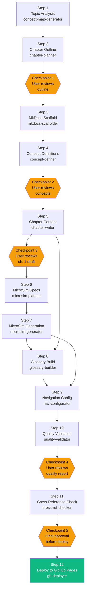

# Chapter 11: Pipeline Orchestration

A single skill solves a single problem well. But some problems are not single problems. They are sequences of interdependent problems where the solution to each step becomes the raw material for the next.

Building an intelligent textbook — a production-grade, multi-chapter, multi-MicroSim learning resource — is not something a single skill can handle. It requires a concept map, a chapter outline, chapter content, MicroSimulations, quality validation, a navigation structure, and a deployment configuration. Each of these depends on earlier outputs. None of them can be parallelized arbitrarily.

This is the problem pipeline orchestration solves.

A pipeline is an ordered sequence of skill invocations where each skill's output feeds the next skill's input, dependencies are enforced, checkpoints allow user review at critical junctures, and the whole sequence can be paused and resumed without loss.

This chapter explains how pipelines work, covers the 12-step intelligent textbook pipeline as the canonical example, explains checkpoint design and prerequisite detection, and shows you how to design your own multi-skill pipeline.

---

## The Core Concept: Skills as Pipeline Stages

In a pipeline, each skill is a stage. A stage takes inputs, produces outputs, and signals completion so the next stage can begin.

The properties that make a skill pipeline-ready:

1. **Defined inputs** — the skill specifies exactly what it needs (files, parameters, prior outputs)
2. **Defined outputs** — the skill produces artifacts with predictable names and locations
3. **Prerequisite detection** — the skill checks that its required inputs exist before starting
4. **Completion signaling** — the skill writes a clear completion marker (log entry, state file update, or output file) that the next stage can check
5. **Idempotency** — running the skill twice with the same inputs produces the same outputs (enabling safe retries)

Skills that lack any of these properties can still be used in pipelines, but they introduce fragility. A skill that does not check its prerequisites may run and fail silently. A skill that does not signal completion may cause the next stage to start on incomplete data.

---

## Dependency Order and the Dependency Graph

Pipelines are defined by their dependency graph — a directed acyclic graph (DAG) where each node is a stage and each edge means "this stage must complete before that stage can begin."

A simple three-stage pipeline has a linear graph:

```
Stage A → Stage B → Stage C
```

Real pipelines have branching dependencies. Some stages can run in parallel once their shared predecessor completes. Some stages have multiple predecessors that must all complete before they can begin.

```
Stage A → Stage B → Stage D → Stage F
       ↘           ↗
        Stage C →
```

In this graph, Stage B and Stage C can run in parallel once Stage A completes. Stage D cannot begin until both Stage B and Stage C are complete. Stage F runs last.

When designing a pipeline, drawing the dependency graph before writing any skill definitions is the most valuable step you can take. It reveals:

- Which stages can be parallelized (accelerating the pipeline)
- Which stages are critical path (where delays cascade)
- Which stages have multiple dependencies (where coordination is needed)
- Whether any circular dependencies exist (which would make the pipeline impossible to execute)

---

## The 12-Step Intelligent Textbook Pipeline

The intelligent textbook pipeline is the most fully-developed pipeline in the Claude Code skill ecosystem. It takes a topic and produces a complete, deployed MkDocs Material textbook — chapter content, MicroSimulations, navigation, quality validation, and GitHub Pages deployment.

Here is the complete pipeline as a Mermaid diagram:



### Pipeline Summary

| Step | Skill | Input | Output | Checkpoint After? |
|------|-------|-------|--------|-------------------|
| 1 | `concept-map-generator` | Topic string | `concept-map.md`, `concepts.json` | No |
| 2 | `chapter-planner` | `concept-map.md` | `chapter-outline.md` | Yes — outline review |
| 3 | `mkdocs-scaffolder` | `chapter-outline.md` | Full directory tree, `mkdocs.yml` | No |
| 4 | `concept-definer` | `concepts.json` | `definitions.md`, `glossary-draft.md` | Yes — concept review |
| 5 | `chapter-writer` | `chapter-outline.md`, `definitions.md` | `docs/chapters/*/index.md` (all) | Yes — ch.1 sample review |
| 6 | `microsim-planner` | `chapter-outline.md`, chapters | `microsim-plan.json` | No |
| 7 | `microsim-generator` | `microsim-plan.json` | `docs/sims/*.html` | No |
| 8 | `glossary-builder` | All chapters, `glossary-draft.md` | `docs/glossary.md` | No |
| 9 | `nav-configurator` | All outputs | `mkdocs.yml` (updated nav) | No |
| 10 | `quality-validator` | All chapters, all sims | `quality-report.md` | Yes — quality review |
| 11 | `cross-ref-checker` | All chapters, glossary | `cross-ref-report.md` | Yes — final approval |
| 12 | `gh-deployer` | Entire `docs/` tree | Live GitHub Pages site | No (is the end) |

---

## Stage-by-Stage Walkthrough

### Step 1: Concept Map Generator

**Input:** A topic string (e.g., "intelligent textbook design") provided by the user.

**What it does:** Analyzes the topic to extract 40-80 core concepts, their relationships, and the domain structure. Outputs a visual concept map in Mermaid format and a structured `concepts.json` for downstream use.

**Key output:** `concept-map.md` (human-readable), `concepts.json` (machine-readable, consumed by Step 4).

**Why it is first:** Everything downstream — chapter structure, MicroSim selection, glossary — derives from the concept inventory. No step can run meaningfully without it.

---

### Step 2: Chapter Planner

**Input:** `concept-map.md`

**What it does:** Groups concepts into pedagogically sound chapters. Sequences chapters from foundational to advanced. Proposes 10-14 chapter titles with 6-8 section headings per chapter.

**Key output:** `chapter-outline.md` — the master document consumed by Steps 3, 5, and 6.

**Checkpoint 1:** The user reviews the chapter outline here. This is the highest-leverage review in the pipeline — changing the outline after chapters are written requires rewriting chapters. The checkpoint is mandatory, not optional.

**Checkpoint design:** Claude presents the outline and explicitly pauses: "Review the chapter outline above. Reply with any changes, or type 'approve' to continue to Step 3." No step 3 skill is invoked until the user responds.

---

### Step 3: MkDocs Scaffolder

**Input:** `chapter-outline.md`

**What it does:** Creates the full MkDocs Material directory structure — all chapter directories, placeholder `index.md` files, `mkdocs.yml` with full navigation, `docs/` structure including the `sims/` directory for MicroSims.

**Key output:** A fully functional (but empty) MkDocs site that can be served locally immediately.

**Prerequisite check:** Verifies that `chapter-outline.md` exists and is non-empty before starting. If missing, warns the user and halts.

---

### Step 4: Concept Definer

**Input:** `concepts.json`

**What it does:** Generates precise, jargon-free definitions for every concept in the inventory. Produces a `definitions.md` file consumed by Step 5 to ensure consistent terminology across all chapters, and a `glossary-draft.md` that Step 8 will expand.

**Checkpoint 2:** The user reviews the concept definitions. This is particularly important for domain-specific terminology where the auto-generated definition might be subtly wrong. A wrong definition propagated across 12 chapters creates a consistency problem that is expensive to fix later.

---

### Step 5: Chapter Writer

**Input:** `chapter-outline.md`, `definitions.md`

**What it does:** Writes all chapters in sequence, using the outline for structure and the definitions for consistent terminology. Each chapter is written to `docs/chapters/[N]/index.md`.

**Checkpoint 3:** After chapter 1 is complete but before proceeding to chapters 2-12, the user reviews chapter 1. This gives the user the opportunity to adjust tone, depth, length, and style before 11 more chapters are written in the same pattern. This checkpoint can save enormous rework.

**Batch resumption:** This step writes a `chapter-status.json` file tracking each chapter's completion state. If the session ends mid-batch, the next session reads this file and resumes from the next pending chapter.

---

### Step 6: MicroSim Planner

**Input:** `chapter-outline.md`, completed chapter files

**What it does:** Identifies the 5-8 highest-value locations for interactive MicroSimulations within the textbook. For each location, produces a detailed MicroSim specification: concept being illustrated, interaction type, data range, visual style, and expected learning outcome.

**Key output:** `microsim-plan.json` — consumed by Step 7.

**Why after Step 5:** MicroSim placement decisions are informed by the actual chapter content. The planner reads chapters to find concepts that are difficult to convey in prose and would benefit most from an interactive visualization.

---

### Step 7: MicroSim Generator

**Input:** `microsim-plan.json`

**What it does:** For each MicroSim specification, generates a standalone HTML file with embedded JavaScript and Chart.js (or D3.js for complex visualizations). Each file is saved to `docs/sims/[sim-name].html`.

**This is a meta-skill:** The MicroSim Generator routes internally to different reference guides (chartjs-guide.md, d3-guide.md, canvas-guide.md) based on the visualization type in each specification — the meta-skill router pattern from Chapter 8 in practice.

**State tracking:** `sim-status.json` tracks each MicroSim's lifecycle state, enabling batch resumption.

---

### Step 8: Glossary Builder

**Input:** All chapter files, `glossary-draft.md`

**What it does:** Scans all chapter content for term usage frequency and consistency. Expands the draft glossary with usage context, cross-references, and related terms. Produces the final `docs/glossary.md`.

**Convergent inputs:** Step 8 accepts inputs from both Step 5 (chapters) and Step 4 (glossary draft). It is a convergence point in the dependency graph — it must wait for both upstream paths to complete.

---

### Step 9: Navigation Configurator

**Input:** All completed `docs/` files

**What it does:** Reads the actual files produced (not the planned files) and builds the correct `mkdocs.yml` navigation block. Handles chapters, MicroSims, glossary, and any auxiliary pages. Replaces the scaffolded nav with the production nav.

**Why after Steps 7 and 8:** Navigation must reflect what actually exists, not what was planned. MicroSim names may differ from specifications. Additional pages may have been created.

---

### Step 10: Quality Validator

**Input:** All chapter files, all MicroSim files

**What it does:** Applies a comprehensive quality rubric across all content:
- Chapter word count targets met
- All chapter sections from the outline are present
- No broken internal links
- MicroSims load correctly (JavaScript syntax check)
- Glossary terms cross-referenced in at least one chapter
- Reading level appropriate for target audience

**Key output:** `quality-report.md` — a scored assessment of every chapter and MicroSim with specific remediation notes for anything below threshold.

**Checkpoint 4:** The user reviews the quality report. Issues flagged here can be fixed before the cross-reference check and before deployment. The checkpoint exists because quality issues are cheaper to fix at this stage than after deployment.

---

### Step 11: Cross-Reference Checker

**Input:** All chapters, glossary

**What it does:** Verifies that terms defined in the glossary are referenced appropriately in chapters. Checks that forward references ("see Chapter 8") point to chapters that exist. Verifies that MicroSim references in chapter prose match actual MicroSim filenames.

**Key output:** `cross-ref-report.md`

**Checkpoint 5:** The final approval before deployment. After this checkpoint, the user confirms everything is ready and the deploy runs. This is the last chance to pull back without any public-facing consequence.

---

### Step 12: GitHub Pages Deployer

**Input:** Entire `docs/` tree, `mkdocs.yml`

**What it does:** Runs `mkdocs gh-deploy`, configures GitHub Pages, and verifies the site is accessible. Logs the deployment URL.

**This step is irreversible in the public sense** — once deployed, the site is live. The checkpoint before it exists for this reason.

---

## Checkpoint Design

Checkpoints are deliberate pauses in the pipeline where Claude stops, presents its work, and waits for explicit user approval before continuing. They are not optional review suggestions — they are hard stops.

### Where to Place Checkpoints

Place checkpoints at:

1. **High-leverage decision points** — where the user's approval gates a large amount of downstream work (outline review, chapter 1 review)
2. **Irreversibility boundaries** — just before steps that are difficult or impossible to undo (deployment, bulk file writes that overwrite prior outputs)
3. **Quality gates** — after validation steps where issues must be resolved before proceeding
4. **Expensive downstream steps** — before steps that will consume significant time and tokens, giving the user a chance to redirect

The textbook pipeline has 5 checkpoints because it has 5 distinct decision points that meet these criteria. Not every pipeline needs 5. A 4-step pipeline might have 1 or 2.

### Checkpoint Implementation

In a pipeline orchestrator skill, checkpoints are implemented as explicit pause instructions:

```markdown
## Checkpoint 1: Outline Review

The chapter outline above represents the complete structure of the textbook.
Every chapter will be written to match this outline.

**Review carefully:**
- Chapter titles and sequence
- Section headings within each chapter
- Balance of coverage across topics

To proceed: reply "approve" or provide specific changes.
To modify: describe the changes needed and the pipeline will revise the outline
before continuing.

**The pipeline will not advance to Step 3 until you respond.**
```

The final sentence is the critical instruction. Claude will not invoke the next skill until the checkpoint is resolved.

### Checkpoint State in the Session Log

Every checkpoint event is logged:

```markdown
## Checkpoint 1 — Outline Review
**Status:** Approved
**User response:** "approve — add a chapter on deployment before the reference chapter"
**Action taken:** Chapter outline revised to add Chapter 15 on deployment
**Time elapsed waiting for approval:** 4m 12s
**Proceeding to:** Step 3
```

This allows a resume session to know which checkpoints were approved and with what instructions, without re-asking the user.

---

## Prerequisite Detection

Every skill in a pipeline should check its prerequisites before beginning work. This prevents a common failure mode: a skill runs, produces output based on incomplete inputs, and the pipeline continues on a flawed foundation.

### Implementing Prerequisite Detection

In the skill's pre-flight section:

```markdown
## Pre-Flight: Prerequisite Check

Before starting, verify all required inputs exist:

Required files:
- [ ] `chapter-outline.md` — read first 100 words to verify structure
- [ ] `definitions.md` — verify file exists and is non-empty

If any required file is missing:
HALT. Report to user: "Step 5 (chapter-writer) cannot start: [filename] is
missing. Complete Step [N] first or provide the file manually."

Do NOT proceed with missing prerequisites. Do NOT attempt to generate
substitute content.
```

The final two sentences are important. A skill should not attempt to be helpful by generating a substitute for a missing prerequisite — that produces subtly wrong output that is harder to debug than an explicit error. Fail loudly and specifically.

### Prerequisite Check Format

The check should be as lightweight as possible — just enough to verify existence and basic validity, not enough to consume significant tokens:

- For required files: check existence + read first 100 words (verifies it is not empty or corrupted)
- For JSON state files: check existence + read top-level keys (verifies the schema matches expectations)
- For directories: check existence + count files (verifies scaffolding completed)

Do not read entire prerequisite files as part of the check. Read only enough to confirm validity.

---

## How One Skill's Output Becomes the Next Skill's Input

The handoff between pipeline stages is defined by file contracts — agreements about what a skill produces and where it puts it.

### Defining File Contracts

Every pipeline skill defines two things in its SKILL.md:

**Input contract** — what files it expects, at what paths, in what format:
```markdown
## Inputs

| File | Path | Format | Required |
|------|------|--------|----------|
| Chapter outline | `./chapter-outline.md` | Markdown with H2 chapter headers | Yes |
| Concept definitions | `./definitions.md` | Markdown, one H3 per concept | Yes |
```

**Output contract** — what files it produces, at what paths, in what format:
```markdown
## Outputs

| File | Path | Format | Consumed By |
|------|------|--------|-------------|
| Chapter N | `./docs/chapters/[N]/index.md` | MkDocs Material markdown | Steps 8, 9, 10, 11 |
| Status file | `./chapter-status.json` | JSON, lifecycle states | Resume detection |
| Session log | `./logs/chapter-writer-v1.0.0-[DATE].md` | Markdown log format | Resume detection |
```

When the output contract of Step N matches the input contract of Step N+1, the handoff is automatic. The orchestrating pipeline skill (if you build one) or the user simply invokes the next skill after the previous one signals completion.

### The Orchestrator Pattern

For complex pipelines, an orchestrator skill manages the sequencing. Instead of the user manually invoking each skill, they invoke the orchestrator once:

```
/textbook-pipeline "AI and machine learning fundamentals" --audience "graduate students"
```

The orchestrator:
1. Reads the pipeline definition (which steps exist, in what order, with what dependencies)
2. Invokes Step 1
3. Detects Step 1 completion from its output file
4. Invokes Step 2
5. Reaches Checkpoint 1, pauses, presents work, waits for approval
6. On approval, invokes Step 3
7. Continues until pipeline completes or a step fails

The orchestrator's SKILL.md contains the pipeline definition — the ordered list of steps, their dependencies, and checkpoint positions — not the execution logic for any individual step. Each step's logic lives in its own skill's SKILL.md.

---

## Designing Your Own Multi-Skill Pipeline

### Step 1: Define the End State

Start from what you want to have when the pipeline completes. Be specific. "A deployed textbook with 12 chapters and 5 MicroSims at [URL]" is a definition. "A good textbook" is not.

### Step 2: Identify the Stages

Work backward from the end state. What must exist for the last step to run? What must exist for the second-to-last step to run? Continue until you reach a stage whose only input is the user's initial request.

Each stage you identify becomes a potential skill. Some stages may be combinable (if they are small and have the same inputs/outputs). Some stages may need to split (if a stage is too complex to handle in one skill).

### Step 3: Draw the Dependency Graph

Draw the DAG before writing any skill definitions. Identify:
- Which stages can run in parallel (accelerate these paths)
- Which stages are on the critical path (optimize these first)
- Where convergent inputs occur (coordinate these carefully)
- Whether any circular dependencies exist (redesign if they do)

### Step 4: Define File Contracts

For each stage, define the input and output contracts. Verify that every output contract has a matching input contract downstream. If an output file is never consumed, the stage may be unnecessary.

### Step 5: Place Checkpoints

Apply the checkpoint criteria: high-leverage decision points, irreversibility boundaries, quality gates, expensive downstream steps. Place checkpoints at those locations. Err on the side of more checkpoints during initial pipeline development — you can remove them later if they feel unnecessary.

### Step 6: Define Prerequisite Checks

For each stage with a prerequisite (every stage except the first), write the pre-flight check. Specify exactly what is checked and what the error message says if the check fails.

### Step 7: Build and Test Incrementally

Build the first two stages and test the handoff before building stages 3-12. The most common pipeline failures are handoff failures — output contracts that do not match input contracts, file paths that differ by one character, JSON schemas that evolved between writing the producer and the consumer.

Testing stage-by-stage catches these failures at their source.

---

## Session Management in Long Pipelines

A 12-step pipeline that produces 120,000 words of content across dozens of files will run across multiple sessions. The session management patterns from Chapter 10 apply here in a pipeline-specific way.

### The Pipeline State File

The orchestrator skill maintains a `pipeline-status.json` that tracks the state of each pipeline stage:

```json
{
  "pipeline_id": "textbook-ai-fundamentals-2024-11-15",
  "topic": "AI and machine learning fundamentals",
  "version": "1.0.0",
  "created": "2024-11-15T09:00:00Z",
  "last_updated": "2024-11-15T16:44:00Z",
  "stages": {
    "step-01-concept-map": { "status": "complete", "completed_at": "2024-11-15T09:47:00Z" },
    "step-02-chapter-planner": { "status": "complete", "checkpoint_approved": true, "completed_at": "2024-11-15T10:15:00Z" },
    "step-03-scaffolder": { "status": "complete", "completed_at": "2024-11-15T10:22:00Z" },
    "step-04-concept-definer": { "status": "complete", "checkpoint_approved": true, "completed_at": "2024-11-15T11:05:00Z" },
    "step-05-chapter-writer": { "status": "in_progress", "sub_status": { "complete": 7, "pending": 5 } },
    "step-06-microsim-planner": { "status": "pending" },
    "step-07-microsim-generator": { "status": "pending" },
    "step-08-glossary-builder": { "status": "pending" },
    "step-09-nav-configurator": { "status": "pending" },
    "step-10-quality-validator": { "status": "pending" },
    "step-11-cross-ref-checker": { "status": "pending" },
    "step-12-deployer": { "status": "pending" }
  }
}
```

A resume session reads this file first (~600 tokens) and immediately knows: steps 1-4 are complete, step 5 is in progress with 7 of 12 chapters done, steps 6-12 are pending. Without this file, reconstructing this state would require reading all produced outputs — potentially 50,000+ tokens.

### Checkpoint Approval Persistence

Checkpoint approvals are persisted in the pipeline state file. When a resume session reaches a step that follows a checkpoint, it checks whether the checkpoint is already approved before displaying it again. This prevents the user from being shown the same checkpoint review twice after a session resume.

---

## Anti-Patterns in Pipeline Design

**Do not build a monolithic orchestrator.** An orchestrator skill that contains the full logic for all 12 steps is not a pipeline — it is a single skill with 12 workflows embedded. The correct design is an orchestrator that invokes individual skills, each of which contains its own workflow logic.

**Do not skip prerequisite checks to save tokens.** A 100-token prerequisite check prevents the 10,000-token cost of a skill that runs to completion on incomplete inputs and produces unusable output. The math is always in favor of the check.

**Do not place checkpoints after irreversible actions.** A checkpoint before deployment is useful. A checkpoint after deployment is decorative. Checkpoints must occur before the action that requires approval, not after it.

**Do not hardcode file paths in skill definitions.** Skills that hardcode absolute paths work for exactly one user in exactly one directory structure. Use relative paths from the working directory, or accept the output directory as a parameter.

**Do not let a stage fail silently.** When a stage fails, it should write its failure to the pipeline state file, log the error with specifics, and surface a clear message to the user. Silent failures produce pipelines where stages 5-12 appear to complete successfully on broken inputs from stage 4.

---

## Summary

Pipeline orchestration transforms a collection of individual skills into a coordinated production system. The 12-step intelligent textbook pipeline demonstrates every pattern in practice: dependency order, checkpoint design, prerequisite detection, file contracts, batch resumption, and session state management.

The key principles:

**Dependency graphs first.** Draw the DAG before writing any skill. The graph reveals parallelism opportunities, critical path, and convergent inputs.

**File contracts define handoffs.** Every stage's output contract must match the next stage's input contract. Mismatches are the primary source of pipeline failures.

**Checkpoints are hard stops.** At high-leverage decision points and irreversibility boundaries, the pipeline waits for explicit user approval. This is not optional politeness — it is a design requirement.

**Prerequisite checks fail loudly.** A missing prerequisite is reported immediately and specifically. No stage attempts to substitute for a missing input.

**State files enable resumption.** The pipeline state file allows any new session to understand exactly where the pipeline stands at the cost of one small file read.

The pipeline pattern is the culmination of everything in this guide: meta-skill routing (Chapter 8) for variant selection within stages, token efficiency design (Chapter 9) to keep individual stages lean, and session logging (Chapter 10) to provide the state persistence that makes multi-session pipelines possible.

With these four patterns mastered — routing, efficiency, logging, and orchestration — you have the full toolkit for building production-grade Claude Code skill systems at any scale.
