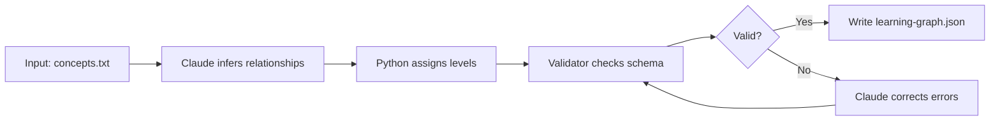

# Chapter 12: Data Format Skills

Data format skills occupy a specific and important role in the Claude Code skill ecosystem. They accept structured input — CSV files, JSON payloads, learning graphs, metadata schemas — and return transformed output that downstream tools, MicroSims, or human reviewers can use directly. Unlike analysis skills (which evaluate content) or code generation skills (which produce executable programs), data format skills are fundamentally about transformation: changing the shape, encoding, or organization of information without changing its meaning.

This chapter covers the conceptual framework for data format skills, the practical file patterns they rely on, how Python helper scripts extend their capabilities, and a complete worked example: a skill that converts survey data into a format ready for Chart.js visualization.

---

## What Makes a Skill a "Data Format" Skill

The defining characteristic is that the primary deliverable is a data artifact rather than narrative text or executable code. The output might be:

- A JSON file structured for a specific consumer (a MicroSim, a React component, an MkDocs plugin)
- A CSV file with normalized, cleaned column names
- A metadata schema with validation rules
- A learning graph represented as nodes and edges in a standardized format

The content going in and coming out is largely the same information — the skill's value is in the reshaping.

This distinction matters for skill design because:

1. **Output validation is deterministic.** You can write a schema and check the output against it. A narrative skill's quality is subjective; a data format skill either produces valid JSON or it does not.
2. **Python helpers become first-class tools.** Parsing CSVs, validating schemas, and normalizing strings are all tasks where a five-line Python script is more reliable than prompting Claude to do it in its head.
3. **The `data.json` pattern applies.** Data format skills typically produce or consume a canonical `data.json` or similar file that serves as the handoff point between the skill and its consumers.

---

## The `data.json` Pattern

Many Claude Code MicroSims and textbook visualizations follow a pattern where the interactive component reads its configuration and data from a `data.json` file in the same directory. This separation of data from rendering logic is intentional: it allows a data format skill to regenerate the data without touching the visualization code.

A typical `data.json` for a bar chart MicroSim looks like this:

```json
{
  "title": "Survey Results: AI Tool Adoption",
  "description": "Responses from 47 participants across 3 cohorts",
  "chart_type": "bar",
  "x_axis_label": "Tool Category",
  "y_axis_label": "Percentage of Respondents",
  "colors": ["#6200ea", "#03dac6", "#ff6d00"],
  "series": [
    {
      "label": "Cohort A",
      "values": [72, 45, 88, 31, 67]
    },
    {
      "label": "Cohort B",
      "values": [58, 61, 79, 44, 55]
    }
  ],
  "categories": ["LLM Chat", "Image Gen", "Code Assist", "Voice AI", "Search AI"]
}
```

The MicroSim's JavaScript reads this file at initialization:

```javascript
fetch('data.json')
  .then(res => res.json())
  .then(data => initChart(data));
```

When you build a data format skill, your goal is often to produce exactly this kind of file — a structured, validated artifact that another system will consume without further transformation.

---

## Python Helper Scripts in Data Format Skills

Claude Code can execute Python scripts during skill execution using the `Bash` tool. This capability transforms data format skills from "prompt Claude to reshape this data" into "run a deterministic transformation, then let Claude handle the parts that require judgment."

A skill directory that includes a Python helper looks like this:

```
skills/
  survey-to-chart-data/
    SKILL.md
    transform.py
    schema.json
    example-input.csv
    example-output.json
```

The `SKILL.md` references the Python script explicitly in its workflow:

```markdown
---
name: survey-to-chart-data
description: Converts a survey CSV export to Chart.js-ready data.json
triggers:
  - /survey-to-chart
  - /chart-data
allowed-tools:
  - Read
  - Write
  - Bash
---

## Workflow

1. Read the input CSV file specified by the user
2. Run `python3 transform.py <input_file> <output_file>` using the Bash tool
3. Read the output JSON and validate it against schema.json
4. Report any validation errors and corrections made
5. Confirm the output file path to the user
```

The `allowed-tools` frontmatter field is important here. Without `Bash` in the list, Claude Code will not execute shell commands during this skill's execution. Always declare tool permissions explicitly for data format skills that use Python helpers.

---

## Python Helper Design Principles

When writing `transform.py` for a data format skill, follow these conventions:

**Accept file paths as arguments, not stdin.** Claude Code's Bash tool works most reliably with explicit file paths. Use `sys.argv` rather than piping data.

**Write to a file, not stdout.** The skill workflow reads the output file using the `Read` tool. Writing to stdout requires capturing it, which adds complexity.

**Exit with a non-zero code on failure.** Claude Code checks exit codes. If your Python script fails silently and exits 0, the skill will proceed with bad or missing output.

**Include a schema validation step in the script.** Validate the output against the expected schema before writing it. Return a descriptive error message if validation fails.

```python
#!/usr/bin/env python3
"""
transform.py - Convert survey CSV to Chart.js-ready data.json

Usage: python3 transform.py <input_csv> <output_json>
"""

import sys
import json
import csv
import re
from pathlib import Path


def normalize_column(name: str) -> str:
    """Convert a human-readable column header to a valid key."""
    return re.sub(r'[^a-z0-9_]', '_', name.lower().strip()).strip('_')


def load_survey_csv(path: str) -> dict:
    rows = []
    with open(path, newline='', encoding='utf-8') as f:
        reader = csv.DictReader(f)
        for row in reader:
            rows.append({normalize_column(k): v for k, v in row.items()})
    return rows


def build_chart_data(rows: list, group_col: str, value_col: str) -> dict:
    groups = {}
    for row in rows:
        group = row.get(group_col, 'Unknown')
        try:
            value = float(row.get(value_col, 0))
        except ValueError:
            value = 0
        if group not in groups:
            groups[group] = []
        groups[group].append(value)

    categories = sorted(groups.keys())
    averages = [round(sum(groups[c]) / len(groups[c]), 1) for c in categories]

    return {
        "chart_type": "bar",
        "categories": categories,
        "series": [{"label": value_col.replace('_', ' ').title(), "values": averages}],
        "x_axis_label": group_col.replace('_', ' ').title(),
        "y_axis_label": value_col.replace('_', ' ').title()
    }


def validate_output(data: dict) -> list:
    errors = []
    required = ["chart_type", "categories", "series", "x_axis_label", "y_axis_label"]
    for field in required:
        if field not in data:
            errors.append(f"Missing required field: {field}")
    if "series" in data:
        for s in data["series"]:
            if "label" not in s or "values" not in s:
                errors.append("Each series must have 'label' and 'values'")
    return errors


def main():
    if len(sys.argv) < 3:
        print("Usage: python3 transform.py <input_csv> <output_json>", file=sys.stderr)
        sys.exit(1)

    input_path = sys.argv[1]
    output_path = sys.argv[2]

    # Allow optional column overrides
    group_col = sys.argv[3] if len(sys.argv) > 3 else "cohort"
    value_col = sys.argv[4] if len(sys.argv) > 4 else "score"

    rows = load_survey_csv(input_path)
    data = build_chart_data(rows, group_col, value_col)

    errors = validate_output(data)
    if errors:
        for e in errors:
            print(f"Validation error: {e}", file=sys.stderr)
        sys.exit(2)

    Path(output_path).parent.mkdir(parents=True, exist_ok=True)
    with open(output_path, 'w', encoding='utf-8') as f:
        json.dump(data, f, indent=2)

    print(f"Output written to {output_path}")
    print(f"Categories: {len(data['categories'])}, Series: {len(data['series'])}")


if __name__ == "__main__":
    main()
```

---

## Learning Graph Data Flows

Learning graphs — the data structures that power concept relationship visualizations in intelligent textbooks — have their own canonical format. A data format skill for learning graphs accepts a list of concepts and their relationships and produces a JSON structure that a D3.js or Cytoscape.js visualization can render.

The standard learning graph format used in the claude-skills ecosystem is:

```json
{
  "concepts": [
    {
      "id": "skill-anatomy",
      "label": "Skill Anatomy",
      "type": "foundation",
      "level": 1,
      "description": "The structural components of a SKILL.md file"
    },
    {
      "id": "yaml-frontmatter",
      "label": "YAML Frontmatter",
      "type": "component",
      "level": 2,
      "description": "Metadata block at the top of a SKILL.md"
    }
  ],
  "relationships": [
    {
      "source": "skill-anatomy",
      "target": "yaml-frontmatter",
      "type": "contains",
      "weight": 1.0
    }
  ],
  "metadata": {
    "domain": "claude-code-skills",
    "total_concepts": 2,
    "total_relationships": 1,
    "generated_at": "2026-02-20"
  }
}
```

A skill that generates this format from a plain-text concept list is straightforward to build. The workflow:

1. Accept a Markdown or plain-text file listing concept names with optional descriptions
2. Use Claude to infer relationships between concepts (this is where the LLM adds genuine value — relationship inference from a concept list is a judgment task)
3. Assign level numbers based on prerequisite depth (foundational concepts = level 1, advanced = higher levels)
4. Run a Python validator to confirm the output conforms to the schema
5. Write the result to `learning-graph.json`



---

## Metadata Schema Validation

Data format skills that produce schemas — rather than instance data — serve a different purpose: they define the shape that other data must conform to. A metadata schema skill might accept a directory of Markdown files and produce a JSON Schema document that describes the frontmatter fields those files use.

This is a two-pass process:

**Pass 1: Discovery.** The skill reads all files in the directory and catalogs every frontmatter field it finds, along with its inferred type and whether it appears consistently.

**Pass 2: Synthesis.** Claude synthesizes the catalog into a JSON Schema with descriptions, required fields, and enum constraints where the values are consistent.

```json
{
  "$schema": "http://json-schema.org/draft-07/schema#",
  "title": "MicroSim Metadata Schema",
  "type": "object",
  "required": ["title", "description", "difficulty", "concepts"],
  "properties": {
    "title": {
      "type": "string",
      "description": "Human-readable title for the MicroSim"
    },
    "description": {
      "type": "string",
      "description": "One or two sentence description of what the sim teaches"
    },
    "difficulty": {
      "type": "string",
      "enum": ["beginner", "intermediate", "advanced"],
      "description": "Difficulty level for the target learner"
    },
    "concepts": {
      "type": "array",
      "items": { "type": "string" },
      "description": "List of concept IDs this sim teaches"
    }
  }
}
```

---

## Worked Example: Survey Data to Visualization-Ready Format

Here is the complete, end-to-end design of a data format skill that converts survey export data to a Chart.js-ready format. This example brings together all the patterns discussed in this chapter.

### Skill Directory Structure

```
skills/
  survey-to-chart-data/
    SKILL.md
    transform.py
    validate_schema.py
    examples/
      sample-input.csv
      expected-output.json
    README.md
```

### SKILL.md

```markdown
---
name: survey-to-chart-data
description: |
  Converts a survey CSV export to a Chart.js-ready data.json file.
  Supports grouped bar charts, line charts, and pie charts.
  Validates output against the MicroSim data schema before writing.
triggers:
  - /survey-to-chart
  - /chart-data
  - /survey-convert
allowed-tools:
  - Read
  - Bash
  - Write
version: 1.0.0
---

## Purpose

Transform survey data exports (CSV) into structured JSON files that
Chart.js MicroSims can consume directly. Handle column name normalization,
type coercion, missing value imputation, and output schema validation.

## Parameters

The user must provide:
- `input`: Path to the CSV file
- `output`: Path for the data.json output (default: same directory as input)
- `group_col`: Column name to use for grouping (default: first string column)
- `value_col`: Column name to use for values (default: first numeric column)
- `chart_type`: One of bar, line, pie (default: bar)

## Workflow

### Step 1: Parse the user's request
Extract input path, output path, and column preferences from the user message.
If paths are ambiguous, ask for clarification before proceeding.

### Step 2: Inspect the CSV headers
Use the Read tool to read the first 5 lines of the CSV.
Report the column names to the user and confirm which columns to use.

### Step 3: Run the transformation script
Execute:
```
python3 ~/.claude/skills/survey-to-chart-data/transform.py \
  <input_path> <output_path> <group_col> <value_col>
```

### Step 4: Validate the output
Run:
```
python3 ~/.claude/skills/survey-to-chart-data/validate_schema.py <output_path>
```
If validation fails, read the error output and attempt to correct the issue
by re-running the transformation with adjusted parameters.

### Step 5: Report to the user
Confirm the output file path, the number of categories and series,
and any data quality issues detected during transformation.

## Error Handling

- If the CSV is empty or has no parseable rows, report this immediately and stop.
- If the specified column does not exist, list available columns and ask
  the user to choose.
- If the output directory does not exist, create it before writing.
- Never overwrite an existing data.json without confirming with the user.
```

### The Validation Script

```python
#!/usr/bin/env python3
"""
validate_schema.py - Validate a data.json against the MicroSim chart schema

Usage: python3 validate_schema.py <data_json_path>
Exit 0: valid | Exit 1: invalid
"""

import sys
import json

REQUIRED_FIELDS = ["chart_type", "categories", "series"]
VALID_CHART_TYPES = {"bar", "line", "pie"}


def validate(data: dict) -> list:
    errors = []

    for field in REQUIRED_FIELDS:
        if field not in data:
            errors.append(f"Missing required field: '{field}'")

    if "chart_type" in data and data["chart_type"] not in VALID_CHART_TYPES:
        errors.append(
            f"Invalid chart_type '{data['chart_type']}'. "
            f"Must be one of: {', '.join(VALID_CHART_TYPES)}"
        )

    if "categories" in data:
        if not isinstance(data["categories"], list) or len(data["categories"]) == 0:
            errors.append("'categories' must be a non-empty list")

    if "series" in data:
        if not isinstance(data["series"], list) or len(data["series"]) == 0:
            errors.append("'series' must be a non-empty list")
        else:
            for i, s in enumerate(data["series"]):
                if "label" not in s:
                    errors.append(f"Series[{i}] missing 'label'")
                if "values" not in s:
                    errors.append(f"Series[{i}] missing 'values'")
                elif "categories" in data:
                    if len(s["values"]) != len(data["categories"]):
                        errors.append(
                            f"Series[{i}] has {len(s['values'])} values "
                            f"but {len(data['categories'])} categories"
                        )

    return errors


def main():
    if len(sys.argv) < 2:
        print("Usage: python3 validate_schema.py <data_json_path>", file=sys.stderr)
        sys.exit(1)

    path = sys.argv[1]
    try:
        with open(path) as f:
            data = json.load(f)
    except json.JSONDecodeError as e:
        print(f"Invalid JSON: {e}", file=sys.stderr)
        sys.exit(1)
    except FileNotFoundError:
        print(f"File not found: {path}", file=sys.stderr)
        sys.exit(1)

    errors = validate(data)
    if errors:
        print(f"Validation failed ({len(errors)} errors):")
        for e in errors:
            print(f"  - {e}")
        sys.exit(1)
    else:
        print("Validation passed.")
        print(f"  chart_type: {data['chart_type']}")
        print(f"  categories: {len(data['categories'])}")
        print(f"  series: {len(data['series'])}")


if __name__ == "__main__":
    main()
```

---

## Handling Schema Evolution

Data format skills often outlive the schemas they produce. When a MicroSim's `data.json` format changes — a field is renamed, a new required field is added, an array becomes a nested object — existing skills that produce the old format break silently. The generated files look valid, but the visualization fails at runtime.

Three practices prevent schema evolution from becoming a problem:

**Embed the schema version in the output.** Every `data.json` should include a `schema_version` field:

```json
{
  "schema_version": "2.0",
  "chart_type": "bar",
  ...
}
```

The consumer (the MicroSim JavaScript) reads `schema_version` and either handles migration in-place or raises a clear error explaining which version it expects.

**Keep old schemas in the skill repository.** When you update the schema, do not delete the old one. Store schemas in a `schemas/` directory:

```
skills/
  survey-to-chart-data/
    schemas/
      v1.0.json
      v2.0.json
    SKILL.md
    transform.py
    validate_schema.py   # reads version from output, validates against correct schema
```

The validation script reads the `schema_version` field from the output and selects the appropriate schema file to validate against. This allows a single skill to produce and validate multiple schema versions during a transition period.

**Document breaking changes in the SKILL.md changelog.** When the output schema changes in a way that breaks existing consumers, make it explicit in the SKILL.md frontmatter with a `breaking_changes` field and document migration steps in the README.

---

## When to Use a Python Helper vs. Pure Prompt

The decision between using a Python helper script and relying on Claude to perform the transformation in a single prompt turn is not always obvious. The rule of thumb:

**Use Python when the transformation is deterministic.** Column name normalization, type coercion, numeric aggregation, schema validation — these have exactly one correct answer for any given input. A Python function is faster, cheaper, and more reliable than asking Claude to reason through each row of a CSV.

**Use Claude when the transformation requires judgment.** Inferring relationships between concepts, choosing which columns are semantically related, deciding whether a value is an outlier or a legitimate data point — these require the kind of contextual reasoning that Claude does well and Python cannot.

The best data format skills use both: Python for the mechanical parts, Claude for the judgment calls. The Python helper does the heavy lifting (parsing, normalizing, aggregating) and returns a partially complete structure. Claude fills in the fields that require semantic understanding (descriptions, labels, relationship types) and runs the final validation.

This division of labor also improves debugging. When a data format skill produces wrong output, you can isolate whether the problem is in the Python transformation (test the script directly) or in Claude's judgment layer (look at what structure the Python returned and how Claude modified it).

---

## Design Checklist for Data Format Skills

Before shipping a data format skill, verify these properties:

| Property | Check |
|----------|-------|
| Output schema is documented | Does `README.md` describe the output format? |
| Python helper exits non-zero on failure | Tested with bad input? |
| `allowed-tools` includes `Bash` if script runs | Frontmatter has `Bash`? |
| Output file is never silently overwritten | Skill checks for existing file? |
| Column/field names are normalized | No spaces or special chars in keys? |
| Example input and expected output included | `examples/` directory exists? |
| Validation script is separate from transform script | Two scripts, clear separation? |

---

## Summary

Data format skills are transformation tools: they change the shape of data without changing its meaning. The patterns that make them reliable are consistent output schemas, deterministic Python helpers for the mechanical parts, explicit tool permissions in frontmatter, and separate validation scripts that confirm output quality before Claude reports success. The `data.json` pattern connects data format skills to the broader MicroSim ecosystem, making them a foundational layer for any textbook or course that uses interactive visualizations.
