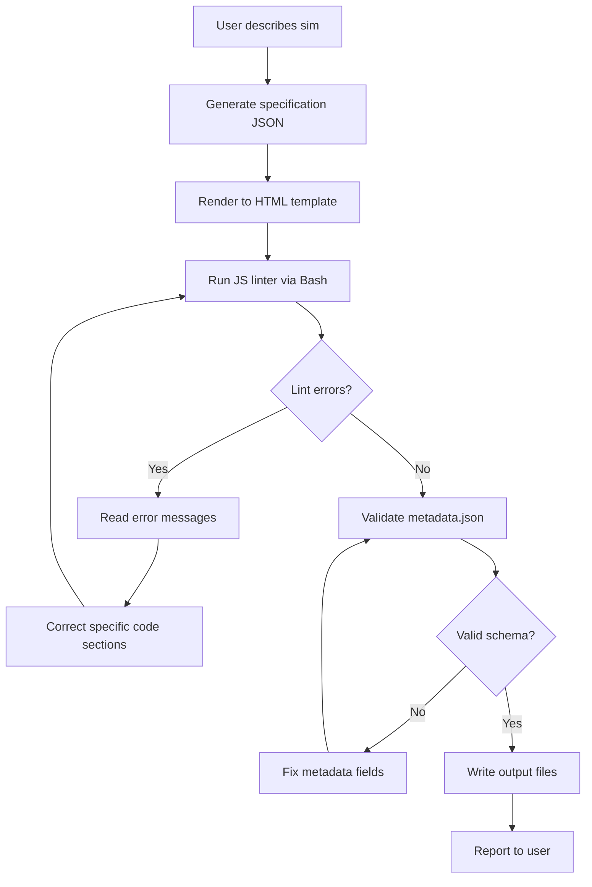

# Chapter 13: Code Generation Skills

Code generation skills occupy a privileged position in the Claude Code skill ecosystem. They do not just transform existing artifacts or score existing content — they produce new, executable programs from a description. A well-designed code generation skill is, in effect, a highly constrained specialist that knows exactly what kind of code to produce, what quality it must meet, and how to structure the output for immediate use.

This chapter covers the patterns that make code generation skills reliable: template-driven output, multi-file generation with consistent naming, metadata files that describe the generated artifact, and output validation strategies. The concept-classifier skill serves as a sustained case study throughout.

---

## What Separates a Code Generation Skill from a Prompt

When you ask Claude to "write a Chart.js bar chart," you get something that works — sometimes. The output quality varies with phrasing, context, and session state. It might use a deprecated API, omit the responsive wrapper, or forget to include the CDN link.

A code generation skill eliminates this variability by encoding all of those requirements explicitly in the skill's workflow and quality criteria. Every invocation of the skill produces code that meets the same specification, regardless of how the user phrased the request.

The difference is the difference between improvisation and execution. The skill author does the design work once. Every builder who uses the skill benefits from that design work.

---

## The MicroSim Generation Pattern

MicroSims are self-contained, single-file interactive simulations used in intelligent textbooks. A MicroSim generation skill produces a complete, deployable artifact every time it runs. The canonical output is:

```
output/
  index.html          # The complete simulation (HTML + CSS + JS in one file)
  metadata.json       # Structured description of the sim
  screenshot.png      # Optional: captured via headless browser
```

The `index.html` follows a strict template structure:

```html
<!DOCTYPE html>
<html lang="en">
<head>
    <meta charset="UTF-8">
    <meta name="viewport" content="width=device-width, initial-scale=1.0">
    <title><!-- TITLE --></title>
    <style>
        /* Base layout — do not modify */
        body {
            font-family: system-ui, -apple-system, sans-serif;
            margin: 0;
            padding: 1rem;
            background: #fafafa;
        }
        #canvas-container {
            max-width: 800px;
            margin: 0 auto;
        }
        h1 { font-size: 1.4rem; margin-bottom: 0.25rem; }
        p.description { color: #555; font-size: 0.9rem; margin-bottom: 1rem; }
        .controls { margin: 1rem 0; display: flex; gap: 0.5rem; flex-wrap: wrap; }
        canvas { border: 1px solid #ddd; border-radius: 4px; width: 100%; }
    </style>
</head>
<body>
    <div id="canvas-container">
        <h1><!-- TITLE --></h1>
        <p class="description"><!-- DESCRIPTION --></p>
        <div class="controls" id="controls"></div>
        <canvas id="sim" width="760" height="400"></canvas>
        <p id="status" style="color:#666;font-size:0.8rem"></p>
    </div>

    <!-- Library loaded from CDN — version pinned -->
    <script src="https://cdn.jsdelivr.net/npm/p5@1.9.0/lib/p5.min.js"></script>
    <script>
    // ============================================================
    // MicroSim: <!-- TITLE -->
    // Concepts: <!-- CONCEPTS -->
    // Generated: <!-- DATE -->
    // ============================================================

    // --- State variables ---
    // <!-- STATE_VARS -->

    // --- p5.js setup ---
    function setup() {
        let canvas = createCanvas(760, 400);
        canvas.parent('sim');
        // <!-- SETUP_BODY -->
    }

    // --- p5.js draw loop ---
    function draw() {
        background(250);
        // <!-- DRAW_BODY -->
    }

    // --- Controls ---
    // <!-- CONTROLS_CODE -->
    </script>
</body>
</html>
```

A code generation skill that uses this template fills in the comment placeholders. The template guarantees consistent layout, pinned library versions, and required metadata comments on every generation.

---

## The `metadata.json` File

Every generated MicroSim includes a `metadata.json` that describes the artifact independently of the HTML. This file serves multiple purposes:

- It powers search and discovery in a textbook's concept index
- It provides the data a quality audit skill needs to score the sim without reading the HTML
- It enables automated learning graph generation (concepts are the nodes)

```json
{
  "title": "Concept Classifier Simulation",
  "description": "Interactive demonstration of how a classifier routes concepts to skill categories based on keyword matching and semantic similarity.",
  "sim_type": "interactive",
  "library": "p5.js",
  "library_version": "1.9.0",
  "concepts": [
    "concept-classification",
    "skill-routing",
    "keyword-matching",
    "semantic-distance"
  ],
  "difficulty": "intermediate",
  "estimated_time_minutes": 8,
  "controls": [
    {
      "type": "text-input",
      "label": "Concept name",
      "description": "Enter a concept to classify"
    },
    {
      "type": "button",
      "label": "Classify",
      "description": "Trigger classification"
    }
  ],
  "learning_outcomes": [
    "Explain how keyword matching differs from semantic classification",
    "Predict which skill category a concept will route to",
    "Identify edge cases where classification confidence is low"
  ],
  "generated_at": "2026-02-20",
  "generator_skill": "microsim-generator",
  "generator_version": "2.1.0",
  "quality_score": 87
}
```

---

## Template Patterns for Consistent Output

The core technique in code generation skills is the use of fill-in-the-blank templates rather than open-ended generation. There are three approaches, each with distinct tradeoffs:

### Approach 1: Comment Placeholders (shown above)

Claude fills in comment-delimited sections. The surrounding structure is fixed. This is the most reliable approach for HTML/JS output because the structural scaffolding cannot be accidentally omitted.

**Best for:** Single-file outputs, when the structure is fixed and only the logic varies.

**Risk:** If Claude misinterprets a placeholder boundary, it can corrupt the surrounding structure.

### Approach 2: JSON Template Filling

The skill produces a JSON object with well-defined fields, then a second step renders that JSON into final code. This separates the "what should this sim do" decision (Claude's role) from the "how should it be structured" (the template's role).

```markdown
## Step 1: Generate the sim specification as JSON

Produce a JSON object with these fields:
- title: string
- description: string
- state_vars: array of {name, type, initial_value, description}
- setup_logic: string (pseudocode or JavaScript)
- draw_logic: string (JavaScript for the draw loop)
- controls: array of {type, label, variable, min, max, step}

## Step 2: Render the JSON into the HTML template

Use the template at ~/.claude/skills/microsim-generator/template.html.
Replace each placeholder with the corresponding JSON field value.
```

**Best for:** Complex sims where decomposing the specification makes quality easier to verify.

### Approach 3: Multi-Pass Generation

Generate the code, run it through a validator (headless browser, linter, or unit test), then regenerate any sections that fail. This is the most expensive approach but produces the highest quality output.



---

## The Concept-Classifier Skill: A Case Study

The concept-classifier skill routes a concept name to one of several skill categories: foundational, applied, procedural, evaluative, or meta. It produces a classification report as a JSON file. This skill is useful for automatically tagging concepts in a learning graph with their cognitive type.

### Directory Structure

```
skills/
  concept-classifier/
    SKILL.md
    classify.py
    categories.json
    test-cases.txt
```

### `categories.json` — The Classification Schema

```json
{
  "categories": {
    "foundational": {
      "description": "Definitions, concepts, principles — what something IS",
      "keywords": ["what is", "definition", "principle", "concept", "theory", "model"],
      "bloom_level": 1
    },
    "applied": {
      "description": "Using a concept in a specific context — what something DOES",
      "keywords": ["using", "applying", "implementing", "building", "creating"],
      "bloom_level": 3
    },
    "procedural": {
      "description": "Step-by-step processes — HOW to do something",
      "keywords": ["how to", "process", "workflow", "steps", "procedure", "install"],
      "bloom_level": 3
    },
    "evaluative": {
      "description": "Judgment, scoring, auditing — assessing quality or correctness",
      "keywords": ["evaluate", "assess", "score", "audit", "validate", "review"],
      "bloom_level": 5
    },
    "meta": {
      "description": "Concepts about the system itself — strategy, architecture, design",
      "keywords": ["strategy", "architecture", "design", "system", "orchestrate", "router"],
      "bloom_level": 6
    }
  }
}
```

### `SKILL.md`

```markdown
---
name: concept-classifier
description: |
  Classifies a concept into one of five cognitive categories based on
  keyword matching and Claude's semantic judgment. Produces a JSON
  classification report.
triggers:
  - /classify-concept
  - /concept-type
allowed-tools:
  - Read
  - Bash
  - Write
version: 1.2.0
---

## Purpose

Given a concept name and optional description, determine which cognitive
category it belongs to. Return a structured JSON report with the
classification, confidence score, and rationale.

## Workflow

### Step 1: Read the categories schema
Read ~/.claude/skills/concept-classifier/categories.json

### Step 2: Run keyword-based pre-classification
Execute:
```
python3 ~/.claude/skills/concept-classifier/classify.py "<concept_name>"
```
This returns a JSON object with keyword-match scores for each category.

### Step 3: Apply semantic judgment
Review the keyword scores alongside your semantic understanding of the
concept. Consider:
- What cognitive operation does mastering this concept require?
- At what Bloom's Taxonomy level would a learner demonstrate understanding?
- Is the concept primarily definitional, procedural, or evaluative?

### Step 4: Produce the classification report

Output a JSON object:
{
  "concept": "<name>",
  "category": "<category>",
  "confidence": <0.0 to 1.0>,
  "bloom_level": <1 to 6>,
  "rationale": "<one sentence>",
  "keyword_scores": { ... }
}

### Step 5: Write the report
If the user specified an output path, write the JSON to that path.
Otherwise, display it inline.

## Quality Standards

- Confidence below 0.6 should be flagged as uncertain
- Rationale must reference the specific characteristic that drove the classification
- Never classify as "meta" without explicit architectural or strategic framing
```

### The Python Pre-Classifier

```python
#!/usr/bin/env python3
"""
classify.py - Keyword-based pre-classification for concept-classifier skill

Usage: python3 classify.py "<concept_name>"
Output: JSON with keyword match scores per category
"""

import sys
import json
import re
from pathlib import Path

CATEGORIES_FILE = Path(__file__).parent / "categories.json"


def load_categories():
    with open(CATEGORIES_FILE) as f:
        return json.load(f)["categories"]


def score_concept(concept: str, categories: dict) -> dict:
    concept_lower = concept.lower()
    words = set(re.findall(r'\w+', concept_lower))
    scores = {}

    for cat_name, cat_data in categories.items():
        score = 0
        matched_keywords = []
        for keyword in cat_data["keywords"]:
            kw_words = keyword.split()
            if all(w in concept_lower for w in kw_words):
                score += 1
                matched_keywords.append(keyword)
        scores[cat_name] = {
            "score": score,
            "matched_keywords": matched_keywords,
            "bloom_level": cat_data["bloom_level"]
        }

    return scores


def main():
    if len(sys.argv) < 2:
        print("Usage: python3 classify.py \"<concept_name>\"", file=sys.stderr)
        sys.exit(1)

    concept = sys.argv[1]
    categories = load_categories()
    scores = score_concept(concept, categories)

    result = {
        "concept": concept,
        "keyword_scores": scores,
        "top_category": max(scores, key=lambda k: scores[k]["score"])
    }

    print(json.dumps(result, indent=2))


if __name__ == "__main__":
    main()
```

---

## Output Validation Strategies

Code generation skills must answer a fundamental question: how do you know the generated code works? There are four strategies, each appropriate for different contexts:

### 1. Structural Validation (always applicable)

Check that the output file exists, is non-empty, and matches the expected structure. For HTML, verify the file parses as valid HTML. For JSON, verify it parses as valid JSON. This catches catastrophic failures — blank files, truncated output, syntax errors.

```bash
# Check HTML is well-formed (requires html5lib or similar)
python3 -c "
import sys
from html.parser import HTMLParser
class Validator(HTMLParser): pass
with open(sys.argv[1]) as f: Validator().feed(f.read())
print('HTML structure valid')
" index.html
```

### 2. Schema Validation (for JSON outputs)

Run the output against a JSON Schema. This is the most reliable automated check for metadata files and data format outputs.

### 3. Linting (for JavaScript)

Run ESLint or a basic syntax check against the generated JavaScript. This catches undefined variables, missing semicolons, and common logic errors before the user opens the file.

```bash
# Quick syntax check using Node.js
node --check generated-sim.js 2>&1
```

### 4. Smoke Testing (for interactive sims)

The most thorough check is running the sim in a headless browser and verifying that no console errors appear. This requires Playwright or Puppeteer and is worth setting up for skills that generate complex interactive code.

```javascript
// smoke-test.js — run with: node smoke-test.js index.html
const { chromium } = require('playwright');

(async () => {
  const browser = await chromium.launch();
  const page = await browser.newPage();
  const errors = [];
  page.on('console', msg => {
    if (msg.type() === 'error') errors.push(msg.text());
  });
  await page.goto(`file://${process.argv[2]}`);
  await page.waitForTimeout(2000);
  await browser.close();

  if (errors.length > 0) {
    console.error('Console errors detected:');
    errors.forEach(e => console.error('  ', e));
    process.exit(1);
  } else {
    console.log('Smoke test passed — no console errors');
  }
})();
```

---

## Multi-File Code Generation

Some code generation skills produce multiple files that must work together. A React component skill might produce:

```
output/
  ConceptCard.jsx        # The component
  ConceptCard.test.js    # Unit tests
  ConceptCard.stories.js # Storybook story
  index.js               # Re-export
```

The critical design principle for multi-file generation: **generate a manifest first, then generate each file in sequence.** This prevents the common failure mode where Claude generates file A, then in generating file B, "forgets" what it decided in file A, producing inconsistent code.

```markdown
## Multi-File Generation Workflow

### Step 1: Generate the manifest

Before writing any code, produce a JSON manifest that specifies:
- All files to be generated with their purposes
- All shared variables, types, and interfaces
- The import/export graph between files

Write this manifest to manifest.json before proceeding.

### Step 2: Generate each file

For each file in the manifest:
1. Read manifest.json to recall shared decisions
2. Generate the file
3. Verify it imports only what the manifest specifies
4. Write the file

### Step 3: Validate cross-file consistency

After all files are written, read each one and verify:
- Import paths match the actual file names
- Exported symbols match what other files import
- No undefined references across file boundaries
```

---

## Structuring Skill Workflows for Multi-Step Generation

Code generation skills that produce complex output benefit from an explicit sequencing model in SKILL.md. The workflow section should not simply say "generate a MicroSim" — it should enumerate each step, specify what is written to disk at each step, and define what constitutes success at each step before proceeding.

This structure serves two purposes. First, it makes the skill's behavior predictable and testable. Second, it gives Claude clear stopping points where it can verify partial work before continuing — which prevents the common failure mode of generating a large block of code, discovering a structural problem at the end, and needing to regenerate everything.

### The Checkpoint Pattern

```markdown
## Workflow

### Step 1: Generate the sim specification
Produce a JSON object matching the spec schema.
Write it to spec.json in the output directory.
CHECKPOINT: Validate spec.json against the spec schema before continuing.

### Step 2: Generate the HTML template output
Using spec.json, fill in all template placeholders.
Write to index.html.
CHECKPOINT: Verify the HTML file size is > 1KB and contains the title
from spec.json before continuing.

### Step 3: Generate metadata.json
Using spec.json, produce the metadata object.
Write to metadata.json.
CHECKPOINT: Validate metadata.json against the MicroSim metadata schema.

### Step 4: Report completion
List all generated files with sizes.
Report the overall quality score from metadata.json.
```

Checkpoints transform a single large generation task into a series of smaller, verifiable sub-tasks. If step 2 fails, the skill can retry step 2 without discarding the work from step 1. This is analogous to database transactions: commit the result of each step before starting the next.

---

## When Not to Use a Code Generation Skill

Code generation skills are powerful but not always the right tool. Three situations where a skill is the wrong approach:

**When the code is highly one-off.** If a user needs a Chart.js bar chart for a specific dataset with unique styling that will never be reused, a general prompt works fine. The overhead of invoking a skill (which loads a template, runs a specification generator, validates output) is not worth it for a single use.

**When the target technology changes frequently.** A skill that generates React code will become outdated as React evolves. If you cannot commit to maintaining the skill, a prompt with explicit version requirements is lower maintenance.

**When the user needs to understand the code deeply.** A skill produces correct code efficiently. If the user's goal is to learn how the code works by seeing it constructed step by step, a conversational approach with explanations is more educational than a skill that delivers a finished artifact.

Code generation skills pay off when: (1) the same type of code is generated repeatedly, (2) the structure and quality bar are consistent across all instances, and (3) speed and consistency matter more than the generative process.

---

## Summary

Code generation skills are reliable because they constrain Claude's generative behavior to a well-defined template and quality specification. The key patterns are: use comment-placeholder or JSON-fill templates to guarantee structural consistency; generate a `metadata.json` alongside every code artifact; validate output against a schema or linter before reporting success; use checkpoints between generation steps for complex multi-file output; and for multi-file generation, produce a manifest first to anchor shared decisions. The concept-classifier skill demonstrates how a lightweight Python pre-processor, combined with Claude's semantic judgment, produces higher-quality classification than either approach alone. Code generation skills are the right investment when the same type of artifact is produced repeatedly and consistency matters more than flexibility.
