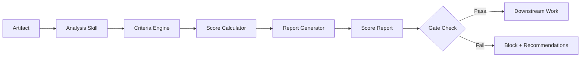

# Chapter 14: Analysis and Validation Skills

Analysis skills are the quality layer of the Claude Code skill ecosystem. Where data format skills transform and code generation skills produce, analysis skills evaluate. They take an existing artifact — a Markdown file, a learning graph, a course description, a MicroSim — and return a structured assessment: scores, flags, specific recommendations, and sometimes an automated pass/fail verdict that gates further work.

This chapter covers the design patterns for analysis skills, with deep dives into DAG validation for learning graphs, the book-metrics-generator pattern, course description assessment scoring, and the general-purpose quality gate pattern that enables skills to enforce standards before proceeding.

---

## The Anatomy of an Analysis Skill

Every analysis skill shares the same fundamental structure:

1. **Input acquisition** — read the artifact to be evaluated
2. **Criteria application** — compare the artifact against defined standards
3. **Scoring** — assign numeric or categorical scores to each criterion
4. **Reporting** — produce a structured report with scores, findings, and recommendations
5. **Gate decision** — optionally block downstream work if scores fall below a threshold

The critical design insight is that criteria must be explicit and measurable before the skill is written. Vague criteria like "good quality" or "well-structured" produce inconsistent scores. Concrete criteria like "has 8 to 12 concepts per learning unit" or "every concept node has at least one inbound and one outbound edge" produce consistent, actionable scores.



---

## DAG Validation for Learning Graphs

A learning graph is a directed acyclic graph (DAG): concepts are nodes, prerequisites are edges, and the graph must be acyclic (no circular prerequisite chains). A DAG validation skill verifies that a learning graph file:

1. Has no cycles (the graph is a true DAG)
2. Has no orphan nodes (every concept is reachable from at least one entry point)
3. Has no dangling references (every edge references concepts that exist as nodes)
4. Has appropriate depth distribution (not all concepts at the same level)
5. Has appropriate connectivity (no concepts with zero edges)

### The Validation Algorithm

```python
#!/usr/bin/env python3
"""
validate_dag.py - Validate a learning graph JSON as a proper DAG

Usage: python3 validate_dag.py <learning_graph.json>
"""

import sys
import json
from collections import defaultdict, deque


def load_graph(path: str) -> dict:
    with open(path) as f:
        return json.load(f)


def extract_graph(data: dict):
    """Extract nodes and adjacency list from the learning graph format."""
    concepts = {c["id"]: c for c in data.get("concepts", [])}
    edges = data.get("relationships", [])
    adj = defaultdict(list)
    rev_adj = defaultdict(list)
    for edge in edges:
        adj[edge["source"]].append(edge["target"])
        rev_adj[edge["target"]].append(edge["source"])
    return concepts, edges, adj, rev_adj


def check_dangling_refs(concepts: dict, edges: list) -> list:
    errors = []
    ids = set(concepts.keys())
    for edge in edges:
        if edge["source"] not in ids:
            errors.append(f"Edge source '{edge['source']}' does not exist as a concept")
        if edge["target"] not in ids:
            errors.append(f"Edge target '{edge['target']}' does not exist as a concept")
    return errors


def check_cycles(concepts: dict, adj: dict) -> list:
    """Kahn's algorithm for topological sort — if we can't sort all nodes, there's a cycle."""
    in_degree = defaultdict(int)
    for node in concepts:
        in_degree[node] = in_degree.get(node, 0)
    for node, neighbors in adj.items():
        for n in neighbors:
            in_degree[n] += 1

    queue = deque([n for n in concepts if in_degree[n] == 0])
    visited = 0
    while queue:
        node = queue.popleft()
        visited += 1
        for neighbor in adj[node]:
            in_degree[neighbor] -= 1
            if in_degree[neighbor] == 0:
                queue.append(neighbor)

    if visited < len(concepts):
        return [f"Cycle detected: {len(concepts) - visited} concept(s) in a cycle"]
    return []


def check_orphans(concepts: dict, adj: dict, rev_adj: dict) -> list:
    warnings = []
    for cid in concepts:
        has_incoming = len(rev_adj.get(cid, [])) > 0
        has_outgoing = len(adj.get(cid, [])) > 0
        if not has_incoming and not has_outgoing:
            warnings.append(f"Isolated concept (no edges): '{cid}'")
    return warnings


def check_depth_distribution(concepts: dict, adj: dict) -> dict:
    """Calculate depth of each node using BFS from root nodes."""
    roots = [n for n in concepts if not any(n in adj[src] for src in adj)]
    depth = {n: 0 for n in roots}
    queue = deque(roots)
    while queue:
        node = queue.popleft()
        for neighbor in adj.get(node, []):
            if neighbor not in depth:
                depth[neighbor] = depth[node] + 1
                queue.append(neighbor)

    if not depth:
        return {"max_depth": 0, "avg_depth": 0.0, "distribution": {}}

    distribution = defaultdict(int)
    for d in depth.values():
        distribution[d] += 1

    return {
        "max_depth": max(depth.values()),
        "avg_depth": round(sum(depth.values()) / len(depth), 2),
        "distribution": dict(distribution),
        "uncovered_concepts": [c for c in concepts if c not in depth]
    }


def score_graph(concepts, edges, errors, warnings, depth_stats) -> int:
    """Score 0-100 based on graph health."""
    score = 100
    score -= len(errors) * 15           # Hard errors are costly
    score -= len(warnings) * 5          # Warnings are less costly
    if depth_stats["max_depth"] < 2:
        score -= 10                     # Graph is too flat
    if depth_stats["avg_depth"] < 1.5:
        score -= 10
    if len(depth_stats.get("uncovered_concepts", [])) > 0:
        score -= 10                     # Disconnected subgraphs
    return max(0, score)


def main():
    if len(sys.argv) < 2:
        print("Usage: python3 validate_dag.py <learning_graph.json>", file=sys.stderr)
        sys.exit(1)

    data = load_graph(sys.argv[1])
    concepts, edges, adj, rev_adj = extract_graph(data)

    errors = check_dangling_refs(concepts, edges)
    errors += check_cycles(concepts, adj)
    warnings = check_orphans(concepts, adj, rev_adj)
    depth_stats = check_depth_distribution(concepts, adj)
    score = score_graph(concepts, edges, errors, warnings, depth_stats)

    report = {
        "valid": len(errors) == 0,
        "score": score,
        "concept_count": len(concepts),
        "relationship_count": len(edges),
        "errors": errors,
        "warnings": warnings,
        "depth_analysis": depth_stats
    }

    print(json.dumps(report, indent=2))

    if errors:
        sys.exit(1)


if __name__ == "__main__":
    main()
```

### The DAG Validation Skill

```markdown
---
name: dag-validator
description: |
  Validates a learning graph JSON file as a proper directed acyclic graph.
  Checks for cycles, dangling references, orphan nodes, and depth distribution.
  Produces a scored validation report.
triggers:
  - /validate-dag
  - /check-graph
  - /dag-check
allowed-tools:
  - Read
  - Bash
  - Write
version: 1.1.0
---

## Workflow

### Step 1: Locate the graph file
If the user specifies a path, use it. Otherwise, look for learning-graph.json
in the current directory.

### Step 2: Run the validator
python3 ~/.claude/skills/dag-validator/validate_dag.py <graph_path>

### Step 3: Interpret the results

For each error, explain what it means in plain language and suggest how to fix it.
For each warning, explain the impact and whether it is likely intentional.

### Step 4: Report the score

Present a summary:
- Score: X/100
- Valid: Yes/No
- Concepts: N, Relationships: N
- Errors: list
- Warnings: list
- Depth analysis: max depth, average depth, distribution

### Step 5: Recommendations

If score < 70: block downstream work, list required fixes
If score 70-84: proceed with warnings, list suggested improvements
If score >= 85: confirm the graph is ready for use

## Scoring Thresholds

| Score | Status | Action |
|-------|--------|--------|
| 85-100 | Excellent | Proceed |
| 70-84 | Acceptable | Proceed with warnings |
| 50-69 | Needs work | Fix before deploying |
| < 50 | Invalid | Do not use |
```

---

## The Book-Metrics-Generator Pattern

A book metrics generator is an analysis skill that evaluates an entire textbook or course — not just a single file. It scans all chapter files, extracts quantitative signals, and produces a metrics report that gives the author an at-a-glance view of content health.

### Key Metrics to Track

| Metric | Description | Target Range |
|--------|-------------|--------------|
| `avg_chapter_words` | Average word count per chapter | 2000-4000 |
| `admonition_density` | Admonitions per 1000 words | 2-6 |
| `code_block_density` | Code blocks per chapter | 3-8 |
| `diagram_count` | Mermaid diagrams across all chapters | >= 1 per 3 chapters |
| `missing_chapters` | Chapters in nav but no file exists | 0 |
| `orphan_files` | Files that exist but are not in nav | 0 |
| `concept_coverage` | % of glossary concepts mentioned in chapters | >= 80% |
| `link_health` | % of internal links that resolve | 100% |

### SKILL.md for Book Metrics Generator

```markdown
---
name: book-metrics-generator
description: |
  Analyzes an entire MkDocs textbook and produces a comprehensive metrics report.
  Evaluates chapter completeness, content density, diagram usage, and concept coverage.
  Writes a metrics.json report to the project root.
triggers:
  - /book-metrics
  - /textbook-audit
  - /course-metrics
allowed-tools:
  - Read
  - Bash
  - Write
  - Glob
version: 2.0.0
---

## Workflow

### Step 1: Read mkdocs.yml
Extract the nav structure and identify all chapters.

### Step 2: Inventory files
For each chapter in the nav, check whether the file exists.
List any files in docs/ that are NOT in the nav.

### Step 3: Analyze each chapter file
For each existing chapter file:
- Count words (approximately: split on whitespace)
- Count admonitions (lines starting with `!!!` or `???`)
- Count code blocks (triple-backtick blocks)
- Count Mermaid diagrams (```mermaid blocks)
- Extract headings structure
- Note if the chapter has a summary section

### Step 4: Run the metrics Python script
python3 ~/.claude/skills/book-metrics-generator/metrics.py <mkdocs_yml_path>

### Step 5: Cross-reference glossary
Read glossary.md and extract all defined terms.
For each term, check whether it appears in any chapter file.
Compute coverage percentage.

### Step 6: Write the report
Write metrics.json to the project root.
Display a summary table to the user.

## Report Format

The metrics.json must include:
- summary: overall scores per dimension
- chapters: per-chapter statistics
- issues: list of specific problems with file paths
- recommendations: ordered list of highest-impact improvements
```

### Sample Output Report

```json
{
  "generated_at": "2026-02-20",
  "project": "custom-skill-developer",
  "summary": {
    "total_chapters": 17,
    "complete_chapters": 12,
    "missing_chapters": 5,
    "avg_word_count": 2847,
    "total_diagrams": 14,
    "overall_score": 74
  },
  "dimension_scores": {
    "completeness": 71,
    "content_density": 82,
    "visual_richness": 65,
    "concept_coverage": 78
  },
  "issues": [
    {
      "severity": "error",
      "file": "docs/chapters/06/index.md",
      "issue": "File does not exist"
    },
    {
      "severity": "warning",
      "file": "docs/chapters/03/index.md",
      "issue": "Word count (847) below minimum (2000)"
    }
  ],
  "recommendations": [
    "Create missing chapter files: chapters 06, 09, 10, 11, 15",
    "Add Mermaid diagrams to chapters 02, 05, 08 — currently zero diagrams",
    "Expand chapter 03 — currently 847 words, target 2000+"
  ]
}
```

---

## Course Description Assessment Scoring

A course description assessment skill takes a single course description — typically a `course-description.md` file — and scores it against a rubric that reflects what makes a course description effective for its target audience.

### The Scoring Rubric

```markdown
## Course Description Scoring Rubric (100 points total)

### Audience Clarity (20 points)
- Names the target learner explicitly: 10 points
- Specifies prerequisite knowledge: 10 points

### Outcome Specificity (25 points)
- Has at least 5 measurable learning outcomes: 15 points
- Outcomes use action verbs (Bloom's): 10 points

### Content Scope (20 points)
- Lists major topics covered: 10 points
- Indicates approximate time commitment: 5 points
- Specifies delivery format (self-paced, cohort, etc.): 5 points

### Differentiation (20 points)
- States what makes this course unique: 10 points
- References specific tools, frameworks, or methods: 10 points

### Structural Quality (15 points)
- Has a compelling opening sentence: 5 points
- Length appropriate (300-600 words): 5 points
- Well-organized with clear sections: 5 points
```

### SKILL.md for Course Description Assessment

```markdown
---
name: course-description-assessor
description: |
  Scores a course description against a 100-point rubric.
  Identifies specific gaps and provides rewrite suggestions for
  each scoring criterion that is not fully met.
triggers:
  - /assess-course-description
  - /score-course-desc
  - /course-audit
allowed-tools:
  - Read
  - Write
version: 1.0.0
---

## Workflow

### Step 1: Read the course description
Read the specified file. If not specified, look for course-description.md.

### Step 2: Apply the rubric

For each scoring criterion:
1. State the criterion and its point value
2. Assess whether the current description meets it
3. Assign points (full, partial, or zero)
4. Quote the specific text that earned (or failed to earn) points
5. Provide a specific improvement if points were not fully awarded

### Step 3: Calculate the total score

Sum all dimension scores. Compute the percentage.

### Step 4: Produce the assessment report

Format:
- Score: X/100
- Dimension breakdown table
- Per-criterion findings
- Top 3 highest-impact improvements

### Step 5: Offer to rewrite

If score < 80, offer to rewrite the description.
If the user accepts, produce a revised version that would score >= 88.

## Scoring Standards

Never award partial credit without quoting the specific text that earned it.
Never deduct points without citing the specific missing element.
The rationale for every score must be reproducible — another reader of the
same document should arrive at the same score within ±5 points.
```

---

## Quality Gate Patterns

Quality gates are the enforcement mechanism of analysis skills. A quality gate is a decision point where the skill either allows work to continue or blocks it, based on whether the artifact meets a minimum standard.

### Hard Gates vs. Soft Gates

**Hard gates** block unconditionally. If the DAG has a cycle, the learning graph cannot be deployed — full stop. The skill reports the problem and stops.

**Soft gates** warn and continue. If a chapter is 200 words below the minimum, the skill flags it but does not block publishing.

The distinction in SKILL.md:

```markdown
## Gate Thresholds

### Hard Gates (block all downstream work)
- Learning graph has cycles: BLOCK
- Missing required metadata fields: BLOCK
- Invalid JSON/YAML syntax: BLOCK

### Soft Gates (warn, continue with user confirmation)
- Chapter word count < 2000: WARN
- No diagrams in chapter: WARN
- Score < 70: WARN and request confirmation to proceed

### Auto-Pass (no gate)
- Score >= 85: proceed without gate check
```

### Building Gates into Pipelines

When skills are composed into pipelines (see Chapter 11), quality gates become the checkpoints that prevent bad output from propagating. A pipeline that generates MicroSims and then publishes them to a GitHub Pages site should include a quality gate between generation and publication:


The gate skill reads `metadata.json` (produced by the generator skill) and verifies:

- All required metadata fields are present
- `quality_score` is at or above threshold
- `concepts` array is non-empty
- `learning_outcomes` has at least 3 items

---

## Producing Actionable Reports

The output of an analysis skill is only as useful as the recommendations it produces. Three principles for actionable reporting:

**1. Reference specific locations.** Do not write "The chapter lacks diagrams." Write "Chapter 03 (docs/chapters/03/index.md) has 0 Mermaid diagrams. Recommended: add at least 1 diagram illustrating the skill installation workflow."

**2. Order by impact, not by severity.** Present the recommendation that will improve the score the most first, even if it is a soft warning rather than a hard error. Authors should know where to spend their effort.

**3. Include the "fix" alongside the "finding."** Every finding should be paired with a specific, executable action. Not "improve concept coverage" but "Add definitions for these 4 glossary terms to the relevant chapters: token-efficiency (ch. 09), quality-gate (ch. 07), meta-skill (ch. 08), pipeline-orchestration (ch. 11)."

---

## Summary

Analysis and validation skills are quality infrastructure. They make implicit standards explicit, convert judgment calls into reproducible scores, and enforce quality gates that prevent bad output from propagating through a pipeline. The key patterns are: define criteria before writing the skill, produce numeric scores for every dimension, reference specific file locations in every finding, and distinguish hard gates (which block) from soft gates (which warn). The DAG validator, book metrics generator, and course description assessor are three patterns that demonstrate these principles at different scales — from a single file to an entire course.
