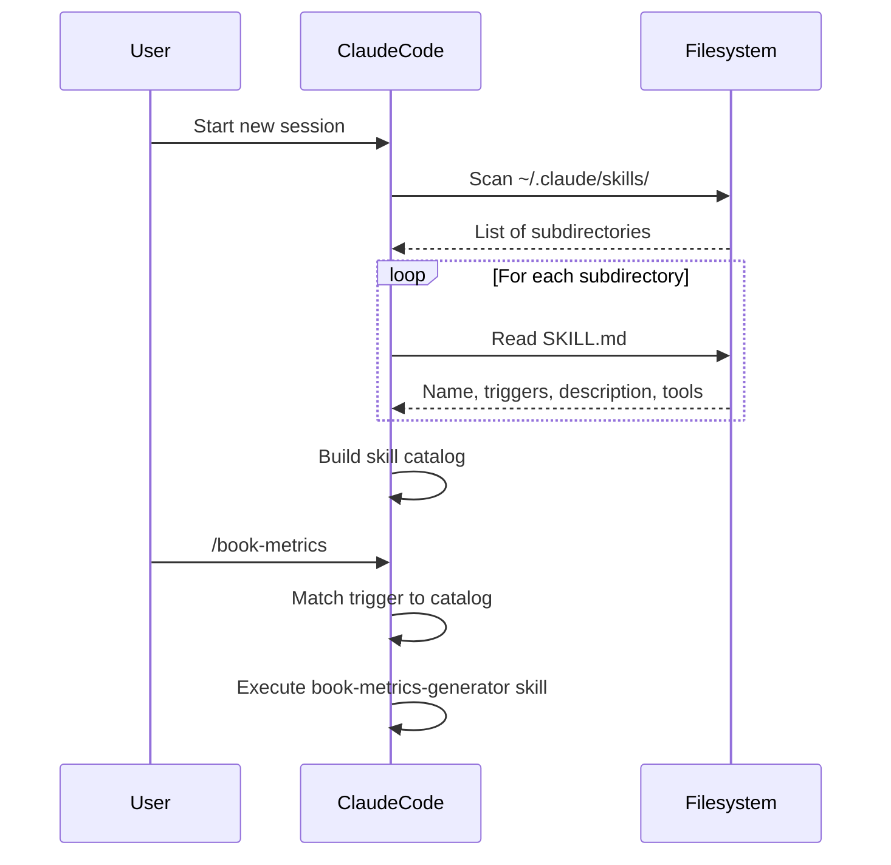

# Chapter 15: Installation and Registry

Skills are discovered, not declared. There is no central JSON manifest, no database, no registry service that Claude Code queries to learn what skills are available. Instead, skills are discovered at session start by reading the filesystem: Claude Code scans the `~/.claude/skills/` directory, reads the `SKILL.md` file in each subdirectory, and builds a working understanding of available skills from those files.

This architecture has important implications for how you install, manage, and think about skills. Installation is the act of making a skill visible to that filesystem scan. The filesystem is the registry.

This chapter covers global versus project-local installation, the symlink pattern and install script, how Claude Code discovers skills at session start, the listing system, and how to manage the 30-skill limit strategically.

---

## How Claude Code Discovers Skills

At the start of every Claude Code session, the agent reads `~/.claude/skills/`. For each subdirectory it finds, it reads the `SKILL.md` file and extracts:

- The `name` field from the YAML frontmatter
- The `description` field
- The `triggers` list (slash commands and keyword phrases)
- The `allowed-tools` list

These four pieces of information are sufficient to route a user's request to the correct skill. When a user types `/book-metrics` or says "analyze my learning graph," Claude Code matches the trigger against its catalog of loaded skills and activates the matching one.

The discovery process happens once at session start. If you install a new skill while a session is running, you need to start a new session (or reload the session context) for the new skill to be available.



---

## Global vs. Project-Local Installation

Skills can be installed at two scopes:

### Global Installation (`~/.claude/skills/`)

A globally installed skill is available in every Claude Code session, regardless of which project directory the session is started from. This is appropriate for:

- General-purpose utilities (microsim-generator, book-metrics, dag-validator)
- Skills you use across multiple projects
- Skills that belong to your personal workflow rather than a specific project

Global installation path:

```
~/.claude/skills/
  skill-name/
    SKILL.md
    (helper scripts, data files, etc.)
```

### Project-Local Installation (`.claude/skills/`)

A project-locally installed skill is only available when Claude Code is started from that project's directory (or a subdirectory). This is appropriate for:

- Skills that are specific to one project's conventions or data structures
- Skills that reference project-specific file paths
- Skills in active development that you do not want bleeding into other projects
- Skills that encode proprietary knowledge about a specific domain

Project-local installation path:

```
/your-project/
  .claude/
    skills/
      skill-name/
        SKILL.md
```

### Discovery Order

When both global and project-local skills exist, Claude Code loads project-local skills after global skills. If a project-local skill has the same trigger as a global skill, the project-local skill takes precedence. This allows you to override a global skill's behavior for a specific project without modifying the global installation.

---

## The Symlink Pattern

The most flexible installation architecture separates skill development from skill deployment. You develop skills in a version-controlled repository, then install them via symlinks that point from `~/.claude/skills/` to the development repository.

### Development Repository Structure

```
~/projects/my-skills/
  skills/
    book-metrics-generator/
      SKILL.md
      metrics.py
      README.md
    dag-validator/
      SKILL.md
      validate_dag.py
      README.md
    microsim-generator/
      SKILL.md
      template.html
      generate.py
      README.md
  install.sh
  uninstall.sh
  README.md
  .gitignore
```

### The Install Script

The install script creates symlinks from the development repository to `~/.claude/skills/`. Each symlink points to the entire skill directory, so when you update files in the development repository, the changes are immediately reflected in the installed skill without re-running the install script.

```bash
#!/usr/bin/env bash
# install.sh — Install all skills via symlinks to ~/.claude/skills/
# Usage: ./install.sh [--dry-run]

set -euo pipefail

SCRIPT_DIR="$(cd "$(dirname "${BASH_SOURCE[0]}")" && pwd)"
SKILLS_DIR="${SCRIPT_DIR}/skills"
TARGET_DIR="${HOME}/.claude/skills"
DRY_RUN=false

# Parse arguments
for arg in "$@"; do
  case $arg in
    --dry-run) DRY_RUN=true ;;
    *) echo "Unknown argument: $arg"; exit 1 ;;
  esac
done

# Create the target directory if it doesn't exist
if [ ! -d "${TARGET_DIR}" ]; then
  if [ "${DRY_RUN}" = false ]; then
    mkdir -p "${TARGET_DIR}"
    echo "Created directory: ${TARGET_DIR}"
  else
    echo "[dry-run] Would create: ${TARGET_DIR}"
  fi
fi

# Count skills for summary
installed=0
skipped=0
updated=0

# Install each skill directory
for skill_dir in "${SKILLS_DIR}"/*/; do
  skill_name="$(basename "${skill_dir}")"
  target_link="${TARGET_DIR}/${skill_name}"

  # Verify the skill has a SKILL.md
  if [ ! -f "${skill_dir}/SKILL.md" ]; then
    echo "WARNING: ${skill_name}/ has no SKILL.md — skipping"
    ((skipped++)) || true
    continue
  fi

  if [ -L "${target_link}" ]; then
    # Symlink already exists — check if it points to the right place
    existing_target="$(readlink "${target_link}")"
    if [ "${existing_target}" = "${skill_dir%/}" ]; then
      echo "  [ok]      ${skill_name} (already installed)"
      ((skipped++)) || true
    else
      if [ "${DRY_RUN}" = false ]; then
        ln -sfn "${skill_dir%/}" "${target_link}"
        echo "  [updated] ${skill_name} (relinked from ${existing_target})"
      else
        echo "  [dry-run] Would relink ${skill_name}"
      fi
      ((updated++)) || true
    fi
  elif [ -d "${target_link}" ]; then
    echo "WARNING: ${target_link} is a real directory, not a symlink — skipping"
    echo "         Remove it manually if you want to install via symlink."
    ((skipped++)) || true
  else
    if [ "${DRY_RUN}" = false ]; then
      ln -s "${skill_dir%/}" "${target_link}"
      echo "  [new]     ${skill_name}"
    else
      echo "  [dry-run] Would install ${skill_name}"
    fi
    ((installed++)) || true
  fi
done

echo ""
echo "Install complete: ${installed} new, ${updated} updated, ${skipped} unchanged/skipped"
echo "Skills directory: ${TARGET_DIR}"
```

### The Uninstall Script

```bash
#!/usr/bin/env bash
# uninstall.sh — Remove skill symlinks from ~/.claude/skills/
# Usage: ./uninstall.sh [skill-name]
#        ./uninstall.sh --all

set -euo pipefail

SCRIPT_DIR="$(cd "$(dirname "${BASH_SOURCE[0]}")" && pwd)"
SKILLS_DIR="${SCRIPT_DIR}/skills"
TARGET_DIR="${HOME}/.claude/skills"

if [ "${1:-}" = "--all" ]; then
  for skill_dir in "${SKILLS_DIR}"/*/; do
    skill_name="$(basename "${skill_dir}")"
    target_link="${TARGET_DIR}/${skill_name}"
    if [ -L "${target_link}" ]; then
      rm "${target_link}"
      echo "Removed: ${skill_name}"
    fi
  done
elif [ -n "${1:-}" ]; then
  target_link="${TARGET_DIR}/${1}"
  if [ -L "${target_link}" ]; then
    rm "${target_link}"
    echo "Removed: ${1}"
  else
    echo "No symlink found for: ${1}"
    exit 1
  fi
else
  echo "Usage: ./uninstall.sh [skill-name] | --all"
  exit 1
fi
```

---

## The Skill Listing System

Three mechanisms exist for listing available skills. Understanding all three helps you choose the right tool for each context.

### 1. The `/skills` Command

The most direct way to see what skills are loaded in the current session is to type `/skills` in the Claude Code prompt. Claude responds with a formatted list of all loaded skills, their descriptions, and their trigger phrases.

This is the runtime view — it shows exactly what Claude Code knows about right now.

### 2. `list-skills.sh`

For shell-level inspection (outside a Claude Code session), a listing script reads the `~/.claude/skills/` directory directly and extracts key metadata from each `SKILL.md`:

```bash
#!/usr/bin/env bash
# list-skills.sh — List all installed skills with names and descriptions

SKILLS_DIR="${HOME}/.claude/skills"

if [ ! -d "${SKILLS_DIR}" ]; then
  echo "No skills directory found at ${SKILLS_DIR}"
  exit 1
fi

echo "Installed Skills"
echo "================"
echo ""

for skill_dir in "${SKILLS_DIR}"/*/; do
  skill_name="$(basename "${skill_dir}")"
  skill_md="${skill_dir}/SKILL.md"

  if [ ! -f "${skill_md}" ]; then
    echo "  ${skill_name} (no SKILL.md)"
    continue
  fi

  # Extract name and description from YAML frontmatter
  # Using Python for reliable YAML parsing
  python3 - "${skill_md}" <<'PYEOF'
import sys, re

path = sys.argv[1]
with open(path) as f:
    content = f.read()

# Extract YAML frontmatter
fm_match = re.match(r'^---\n(.*?)\n---', content, re.DOTALL)
if not fm_match:
    print("  (no frontmatter)")
    sys.exit(0)

fm = fm_match.group(1)

name_match = re.search(r'^name:\s*(.+)$', fm, re.MULTILINE)
desc_match = re.search(r'^description:\s*\|?\n?(.*?)(?=\n\w|\Z)', fm, re.DOTALL)

name = name_match.group(1).strip() if name_match else "(unnamed)"
desc = desc_match.group(1).strip().split('\n')[0] if desc_match else "(no description)"

print(f"  {name}")
print(f"    {desc}")
print()
PYEOF

done
```

### 3. MCP Server Listing

When Claude Code is configured with an MCP (Model Context Protocol) server that exposes the skills directory as a resource, skills can be listed and managed through the MCP interface. This is the most advanced listing mechanism and enables programmatic skill management from external tools.

The MCP server for skills exposes:
- A resource for each installed skill (`skills://skill-name`)
- A tool for listing all skills (`list_skills`)
- A tool for reading a specific skill's SKILL.md (`read_skill`)

Configuration in `.claude/mcp-config.json`:

```json
{
  "mcpServers": {
    "skills": {
      "command": "node",
      "args": ["~/.claude/mcp-skills-server/index.js"],
      "env": {
        "SKILLS_DIR": "~/.claude/skills"
      }
    }
  }
}
```

---

## Managing the 30-Skill Limit

Claude Code loads skills at session start by reading all SKILL.md files in the skills directory. The practical limit for effective skill loading is approximately 30 skills — beyond this, the skill catalog occupies enough context that it competes with the actual work.

!!! warning "The 30-Skill Limit is a Practical Constraint"
    This is not a hard technical limit enforced by Claude Code, but a practical limit on how many skill descriptions can fit in the context window while leaving sufficient room for actual work. If you install 50 skills, all 50 are technically loaded, but the skill descriptions consume a significant fraction of the available context, reducing the quality of responses.

### Strategic Skill Management

The goal is to maintain a set of installed skills that is as small as possible while covering your current work. Three strategies help:

**1. Profile-based installation.** Maintain multiple profiles in your skills repository — one for textbook work, one for data engineering, one for job application portfolios. Each profile has its own install script that installs only the skills relevant to that context.

```bash
# install-textbook-profile.sh
TEXTBOOK_SKILLS=(
  "microsim-generator"
  "book-metrics-generator"
  "dag-validator"
  "concept-classifier"
  "course-description-assessor"
  "learning-graph-generator"
  "survey-to-chart-data"
)
```

**2. Project-local for active development.** Skills you are actively developing belong in `.claude/skills/` in your project directory, not in `~/.claude/skills/`. This prevents half-finished skills from cluttering your global catalog.

**3. Archive inactive skills.** Move skills you have not used in 30+ days to an `archive/` directory within your skills repository. They remain version-controlled and can be re-installed via symlink when needed, but they do not consume context.

### Skill Priority Matrix

| Skill Type | Install Globally? | Notes |
|------------|-------------------|-------|
| Daily-use utilities | Yes | Always have these available |
| Project-specific | No — use .claude/skills/ | Scope to the project |
| In-development | No — use .claude/skills/ | Too unstable for global |
| Domain-specific | Only when working in domain | Use profiles |
| Archived / rarely used | No | Restore when needed |

---

## Verifying Installation

After running the install script, verify the installation by checking the symlinks and reading one SKILL.md:

```bash
# Verify symlinks are correctly created
ls -la ~/.claude/skills/

# Check that a specific skill's SKILL.md is readable
cat ~/.claude/skills/book-metrics-generator/SKILL.md | head -20

# Count installed skills
ls ~/.claude/skills/ | wc -l
```

Then start a new Claude Code session and type `/skills` to confirm the skill catalog loaded correctly.

---

## The `CLAUDE.md` File and Skill Discovery Context

Claude Code also reads `~/.claude/CLAUDE.md` and `.claude/CLAUDE.md` in the project directory at session start. These files can provide skill-related context that does not belong in any individual SKILL.md — for example, project-wide conventions, default output directories, or which skill profile is active.

A typical `CLAUDE.md` entry for skill context:

```markdown
## Active Skill Profile

This project uses the textbook skill profile. The following skills are
installed and available:
- book-metrics-generator (/book-metrics)
- dag-validator (/validate-dag)
- microsim-generator (/microsim)

Output conventions for this project:
- Generated MicroSims go in: docs/sims/
- Metrics reports go in: reports/
- Learning graphs go in: data/
```

This CLAUDE.md entry is not required for skill discovery — Claude Code will discover the skills through the filesystem scan regardless. But it provides useful context that helps Claude route ambiguous requests correctly when a user says "generate a sim" without using the exact trigger phrase.

---

## Confirming Installation After Setup

After running the install script, three verification steps confirm everything is working:

**Step 1: Verify the symlinks exist**

```bash
ls -la ~/.claude/skills/ | grep "^l"
```

Every installed skill should appear as a symlink (lines starting with `l`). If a skill appears as a regular directory, it was manually copied rather than symlinked — updates to the source repository will not propagate.

**Step 2: Verify the SKILL.md is readable through the symlink**

```bash
head -10 ~/.claude/skills/book-metrics-generator/SKILL.md
```

If this command fails with "No such file or directory," the symlink is broken — the target directory was moved or deleted.

**Step 3: Start a new session and list skills**

```
/skills
```

Claude Code will list all loaded skills. If an expected skill is missing from the list, return to step 1 and check the symlink.

---

## Summary

The filesystem is the registry. Skills are discovered by reading `~/.claude/skills/` at session start — there is no manifest file to maintain, no service to query, no configuration to update. The symlink pattern separates development from deployment: you develop in a version-controlled repository and install via symlinks that update automatically when you edit files. The 30-skill practical limit requires strategic thinking about which skills are globally installed versus project-local, and profile-based install scripts let you switch between context-appropriate skill sets quickly. Verification after installation follows three steps: check symlinks with `ls -la`, verify the SKILL.md is readable through the link, and confirm discovery with `/skills` in a new session.
