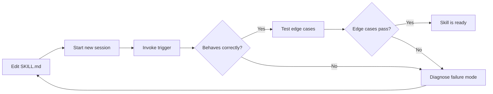

# Chapter 16: Testing and Debugging

Skills are not software in the traditional sense — there are no unit tests, no CI pipelines, no type checkers. A skill is a natural language document that directs Claude's behavior, and its "correctness" is measured by whether Claude behaves as intended when the skill is active. Testing is therefore fundamentally observational: you invoke the skill, watch what happens, and iterate.

This chapter covers the manual testing workflow for skills, the most common failure modes and how to diagnose them, techniques for debugging with session logs, and the test-iterate-refine loop that turns a rough skill into a reliable one.

---

## The Manual Testing Workflow

The testing loop for a skill has five steps:

1. **Install the skill** (or verify it is already installed via symlink)
2. **Start a fresh session** — skills are loaded at session start
3. **Invoke the trigger** — use the exact slash command or phrase the skill defines
4. **Observe the behavior** — does Claude do what the SKILL.md specifies?
5. **Edit and repeat** — update SKILL.md, restart session, try again

The most important discipline in skill testing is starting a fresh session for each iteration. Skills are loaded once at session start. If you edit a SKILL.md while a session is running, the running session sees the old version. This is a frequent source of confusion: you fix the skill, try it again, and the problem persists — because you are still in the old session.



---

## Test Case Design

Before testing, define what "correct behavior" looks like for each trigger. A test case has three parts:

**Input:** The exact message or command the user will type, including any parameters.

**Expected behavior:** What steps the skill should take. Not the output verbatim, but the structural behavior — which tools are called, in what order, what is written to disk, what is reported to the user.

**Pass criteria:** The specific observable signals that indicate the test passed.

### Example Test Cases for `book-metrics-generator`

```
Test 1: Basic invocation with no arguments
Input: /book-metrics
Expected: Skill reads mkdocs.yml from current directory, scans all chapter
          files, produces metrics.json in project root, reports summary table
Pass criteria:
  - metrics.json exists in project root after invocation
  - Summary table shows total_chapters, avg_word_count, overall_score
  - No Python errors in session output
  - Execution time < 30 seconds

Test 2: Missing mkdocs.yml
Input: /book-metrics (run from a directory with no mkdocs.yml)
Expected: Skill reports "No mkdocs.yml found" and asks user to specify path
Pass criteria:
  - Skill does NOT crash or produce a partial metrics.json
  - User receives a clear error message with suggested resolution

Test 3: Project with some missing chapter files
Input: /book-metrics (run from a project where 3 chapters are in nav but missing)
Expected: Skill reports missing chapters as errors in the issues array
Pass criteria:
  - metrics.json includes issues array with file-not-found entries
  - Summary shows complete_chapters count correctly excluding missing files
  - Report is complete (does not stop early due to missing file)

Test 4: Empty project (only mkdocs.yml, no chapter files)
Input: /book-metrics
Expected: Skill reports 0 chapters complete, 0 word count, score of 0
Pass criteria:
  - metrics.json is valid JSON with zeroed summary fields
  - Skill does not raise Python exceptions
  - Recommendations section lists "Create chapter files" as first action
```

Designing test cases before you write the SKILL.md is a useful discipline — it forces you to specify the skill's behavior precisely, which makes the workflow section of SKILL.md easier to write.

---

## Common Failure Modes

### Failure Mode 1: Skill Not Discovered

**Symptom:** You type `/book-metrics` and Claude responds as if it is a general request — it tries to improvise rather than executing the structured workflow.

**Diagnosis checklist:**

```bash
# 1. Is the skill directory in the right place?
ls ~/.claude/skills/book-metrics-generator/

# 2. Does the SKILL.md exist?
ls ~/.claude/skills/book-metrics-generator/SKILL.md

# 3. Is the trigger spelled correctly in the frontmatter?
head -20 ~/.claude/skills/book-metrics-generator/SKILL.md

# 4. Are you in a new session? (Old sessions do not reload skills)
# Start a new Claude Code session and try again

# 5. How many skills are installed? (>30 may cause context issues)
ls ~/.claude/skills/ | wc -l
```

The most common cause of skill-not-discovered is a stale session. Start a new session and try again before investigating further.

**Less common causes:**
- The `triggers` list in frontmatter uses wrong YAML syntax (missing dash, wrong indentation)
- The trigger string contains special characters that do not match how the user typed the command
- The skills directory has wrong permissions (`chmod 755 ~/.claude/skills/`)
- A symlink is broken (the target directory was moved)

```bash
# Check for broken symlinks
find ~/.claude/skills -maxdepth 1 -type l ! -exec test -e {} \; -print
```

### Failure Mode 2: Wrong Skill Routing

**Symptom:** The trigger fires, but a different skill activates — or Claude partially executes the wrong skill's workflow.

**Diagnosis:** Two skills have overlapping triggers. Check for trigger conflicts:

```bash
# Extract all triggers from all SKILL.md files
grep -h "  - " ~/.claude/skills/*/SKILL.md | sort | uniq -d
```

If you find duplicate triggers, either change one of the trigger phrases or use a more specific trigger for the skill that should take precedence.

**Resolution pattern:** Make triggers specific to the skill's domain. Instead of `/analyze`, use `/analyze-learning-graph`. Instead of `/generate`, use `/generate-microsim`. Specificity prevents routing conflicts.

### Failure Mode 3: Quality Gate Too Strict

**Symptom:** The skill produces output but then blocks the user with "Score: 58/100 — below minimum threshold. Correct the following issues before proceeding." The issues are minor or debatable.

**Diagnosis:** The scoring rubric assigns too many points to criteria that are either hard to meet or not actually important. Common examples:
- Requiring a minimum word count that excludes legitimate shorter content
- Requiring a specific section title that the author named differently
- Counting admonitions too aggressively (penalizing chapters that are procedural and do not need callout boxes)

**Resolution:** Lower the threshold or recalibrate the rubric. The rule of thumb: a gate threshold should be calibrated so that content you would be comfortable publishing passes, and content you would be embarrassed by fails. Run the scoring skill against 5-10 real artifacts you consider "acceptable" and set the threshold at the 20th percentile of those scores.

### Failure Mode 4: Quality Gate Too Loose

**Symptom:** The skill passes content that is clearly incomplete or broken. A chapter with 200 words and no code blocks gets a score of 71 and proceeds.

**Diagnosis:** The scoring rubric awards too many points for criteria that are easy to satisfy regardless of quality. Common examples:
- Awarding 15 points simply for having a title (every file has a title)
- Awarding 10 points for having any code block (even a one-liner)

**Resolution:** Weight the rubric toward criteria that distinguish good content from minimal content. Word count, concept coverage, and diagram presence are better discriminators than the presence of any heading or any code block.

### Failure Mode 5: Python Helper Fails Silently

**Symptom:** The skill's workflow says "run transform.py" and reports success, but the output file is wrong or missing. Claude does not notice.

**Diagnosis:** The Python script exited 0 even though it failed. Check the script's error handling:

```python
# BAD — silent failure
try:
    result = do_work()
    with open(output_path, 'w') as f:
        json.dump(result, f)
except Exception:
    pass  # This swallows all errors!

# GOOD — explicit failure with non-zero exit
import sys
try:
    result = do_work()
    with open(output_path, 'w') as f:
        json.dump(result, f)
except Exception as e:
    print(f"Error: {e}", file=sys.stderr)
    sys.exit(1)
```

Also check that the skill's SKILL.md workflow reads the output file after running the script and validates it, rather than assuming success:

```markdown
### Step 3: Run the transformation
Execute: python3 transform.py <input> <output>

### Step 4: Verify the output
Read the output file and confirm it is valid JSON.
If the file is missing or empty, report the error and stop.
DO NOT proceed to Step 5 if the output file is not valid.
```

### Failure Mode 6: Skill Produces Unexpected Output Format

**Symptom:** The skill runs and produces output, but the format differs from what the workflow specified. Field names are different, the structure is nested differently, or the output is prose instead of JSON.

**Diagnosis:** The workflow instructions are ambiguous about the output format. Claude is making reasonable choices that differ from your intent.

**Resolution:** Show, do not tell. Include an example of the exact output format in the SKILL.md:

```markdown
## Output Format

Produce a JSON object exactly matching this structure:

```json
{
  "score": 84,
  "passed": true,
  "dimensions": {
    "completeness": 90,
    "density": 78,
    "diagrams": 85
  },
  "issues": [],
  "recommendations": []
}
```

Do not add fields not shown above. Do not rename fields.
Do not wrap the JSON in prose — output raw JSON only.
```

Explicit examples eliminate ambiguity more effectively than any amount of prose description.

---

## Debugging with Session Logs

Claude Code session logs capture every action taken during a session: tool calls, file reads, Bash executions, and Claude's reasoning. These logs are invaluable for diagnosing skill failures after the fact.

### Enabling Session Logging

Session logging is configured in `~/.claude/settings.json`:

```json
{
  "session_logging": {
    "enabled": true,
    "log_directory": "~/.claude/logs/",
    "include_tool_calls": true,
    "include_reasoning": false
  }
}
```

### Reading a Session Log

A session log for a failed skill invocation might look like this (simplified):

```
[2026-02-20 14:23:11] User: /book-metrics
[2026-02-20 14:23:11] Skill matched: book-metrics-generator (trigger: /book-metrics)
[2026-02-20 14:23:12] Tool: Read — path: ./mkdocs.yml
[2026-02-20 14:23:12] Tool result: (file content, 2847 chars)
[2026-02-20 14:23:13] Tool: Bash — command: python3 ~/.claude/skills/book-metrics-generator/metrics.py ./mkdocs.yml
[2026-02-20 14:23:14] Tool result: exit_code=1, stderr="FileNotFoundError: docs/chapters/06/index.md"
[2026-02-20 14:23:14] Claude response: "I encountered an error running the metrics script..."
```

This log shows exactly which tool failed and what error it produced. The skill's Python script exited 1 because it tried to read a chapter file that does not exist. The fix: update `metrics.py` to handle missing files gracefully rather than crashing.

### Diagnostic Questions to Ask the Log

When a skill fails, read the session log and answer:

1. Was the correct skill triggered? (Look for "Skill matched:")
2. Which step failed? (Find the first tool call that returned an error)
3. What was the exact error message? (Read the `stderr` or `Tool result`)
4. Did Claude attempt recovery? (Look for tool calls after the error)
5. Did Claude report the correct error to the user? (Compare the log's final Claude response to the actual error)

---

## The Test-Iterate-Refine Loop in Practice

A realistic debugging session for a new skill might progress through several iterations:

**Iteration 1: First invocation**
- Trigger fires correctly, skill loads
- Python helper crashes with `ModuleNotFoundError: No module named 'yaml'`
- Fix: add `import sys; sys.path.insert(0, ...)` or switch from `yaml` to `json` for config parsing
- Edit SKILL.md to note the dependency, update the Python script

**Iteration 2: Second invocation**
- Python helper runs, output JSON is produced
- But Claude reports "4 issues found" when there are actually 0 issues
- Log shows Claude read a cached version of the output file from before the script ran
- Fix: in SKILL.md workflow, add explicit instruction: "Read the output file AFTER running the script, not before"

**Iteration 3: Third invocation**
- Correct output reported for the happy path
- Test edge case: empty project directory
- Skill crashes — Python script throws `ZeroDivisionError` when computing average word count of 0 chapters
- Fix: add guard clause in metrics.py: `avg = total / count if count > 0 else 0`

**Iteration 4: Fourth invocation**
- Happy path passes, empty project passes
- Test edge case: project with circular symlinks in docs directory
- Skill hangs indefinitely — `os.walk()` follows symlinks into an infinite loop
- Fix: pass `followlinks=False` to `os.walk()`

**Iteration 5: Fifth invocation**
- All test cases pass
- Run against a real project for acceptance testing
- Skill produces plausible metrics for a known project

This progression — happy path, then each failure mode, then edge cases, then acceptance — is the standard pattern for validating a skill before publishing it.

---

## Edge Cases to Test for Every Skill

| Edge Case | What to Test |
|-----------|--------------|
| Empty input | Does the skill fail gracefully or crash? |
| Missing file | Does it report a clear error or throw an unhandled exception? |
| Very large input | Does it handle a 10,000-line CSV without timing out? |
| Special characters | Does it handle Unicode, paths with spaces, or single quotes? |
| Conflicting triggers | Does `/analyze` route correctly when two skills share a prefix? |
| No permissions | Does it fail gracefully if it cannot write to the output directory? |
| Malformed JSON | Does it handle corrupt input files with a useful error message? |
| Already-exists output | Does it ask before overwriting or silently overwrite? |

---

## Summary

Testing skills is a manual, observational discipline. The workflow is: install, start a fresh session, invoke the trigger, observe, edit, repeat. The most common failures are stale sessions, overlapping triggers, miscalibrated quality gates, silent Python failures, and ambiguous output format specifications. Session logs provide a deterministic record of what happened during a failed invocation. The test-iterate-refine loop progresses from happy path to failure modes to edge cases to acceptance testing against real projects. Skills are ready for publication when they pass all documented test cases reliably across fresh sessions.
